### 0. 多体系统拓扑构型的描述
&emsp;任意两个物体之间的路为唯一的多体系统称为树系统；反之称为带回路的系统，或者非树系统。

&emsp;运动已知的系统外物体的物体记为$B_{0}$。

&emsp;约定：

(1) 与$B_{0}$邻接物体记为$B_{1}$

(2) 每个物体与其内接铰的序号相同

(3) 每个物体的序号大于其内接物体的序号

(4) 每个铰的指向一律背离$B_{0}$方向

### 一、单刚体的牛顿–欧拉方程

刚体在空间中的运动可以分解为质心的平动和刚体绕质心的转动。平动由牛顿方程描述，转动由欧拉方程描述：

$$
\begin{aligned}
m_i\ddot{\boldsymbol{r}}_i &= \boldsymbol{F}_i,
&&\text{在全局坐标系中}, \\
\boldsymbol{J}_i\dot{\boldsymbol{\omega}}_i
+
\widetilde{\boldsymbol{\omega}}_i
\boldsymbol{J}_i\boldsymbol{\omega}_i &= \boldsymbol{\tau}_i,
&&\text{在刚体连体坐标系中}.
\end{aligned}
$$

式中：

- $m_i$ 为刚体 $i$ 的质量；
- $\boldsymbol{r}_i$ 为刚体 $i$ 的质心在全局坐标系中的位置向量；
- $\boldsymbol{F}_i$ 为作用在刚体 $i$ 上的合外力，用全局坐标系分量表示；
- $\boldsymbol{J}_i$ 为刚体关于质心的转动惯量张量，用刚体连体坐标系分量表示；
- $\boldsymbol{\omega}_i$ 为刚体绕质心转动的角速度，用刚体连体坐标系分量表示；
- $\boldsymbol{\tau}_i$ 为关于质心的合外力矩，用刚体连体坐标系分量表示；
- $\dot{(\,)}$ 和 $\ddot{(\,)}$ 分别表示对时间的一阶导数和二阶导数；
- $\widetilde{\boldsymbol{\omega}}_i$ 为 $\boldsymbol{\omega}_i$ 的反对称矩阵，满足

$$
\widetilde{\boldsymbol{\omega}}_i\boldsymbol{a}
  =
  \boldsymbol{\omega}_i\times\boldsymbol{a}.
$$

引入欧拉四元数：

$$
\begin{aligned}
\boldsymbol{\Lambda}_i &= \begin{bmatrix}
\lambda_{0,i} & \lambda_{1,i} & \lambda_{2,i} & \lambda_{3,i}
\end{bmatrix}^{T} \\
\boldsymbol{\Lambda}_i^{T}\boldsymbol{\Lambda}_i &= 1.
\end{aligned}
$$

得到用欧拉四元数表示的单刚体转动方程：

$$
2\boldsymbol{J}_i\boldsymbol{L}_i\ddot{\boldsymbol{\Lambda}}_i
=
-4\boldsymbol{L}_i\dot{\boldsymbol{L}}_i^{T}
\boldsymbol{J}_i\boldsymbol{L}_i\dot{\boldsymbol{\Lambda}}_i
+
\boldsymbol{\tau}_i.
$$

左乘 $2\boldsymbol{L}_i^{T}$ 得到：

$$
4\boldsymbol{L}_i^{T}\boldsymbol{J}_i\boldsymbol{L}_i
\ddot{\boldsymbol{\Lambda}}_i
=
-8\boldsymbol{L}_i^{T}\boldsymbol{L}_i
\dot{\boldsymbol{L}}_i^{T}\boldsymbol{J}_i\boldsymbol{L}_i
\dot{\boldsymbol{\Lambda}}_i
+
2\boldsymbol{L}_i^{T}\boldsymbol{\tau}_i.
$$

考虑欧拉四元数的单位范数约束，单刚体动力学方程写为：

$$
\begin{aligned}
\begin{bmatrix}
m_i\boldsymbol{I}_3 & \boldsymbol{0}_{3\times4} \\
\boldsymbol{0}_{4\times3}
& 4\boldsymbol{L}_i^{T}\boldsymbol{J}_i\boldsymbol{L}_i
\end{bmatrix}
\begin{bmatrix}
\ddot{\boldsymbol{r}}_i \\
\ddot{\boldsymbol{\Lambda}}_i
\end{bmatrix}
+
\left(\boldsymbol{\Phi}_{\boldsymbol{q},i}^{\Lambda}\right)^{T}
\sigma_i^{\Lambda} &= \begin{bmatrix}
\boldsymbol{0}_{3\times1} \\
-8\boldsymbol{L}_i^{T}\boldsymbol{L}_i
\dot{\boldsymbol{L}}_i^{T}\boldsymbol{J}_i\boldsymbol{L}_i
\dot{\boldsymbol{\Lambda}}_i
\end{bmatrix}
+
\begin{bmatrix}
\boldsymbol{F}_i \\
2\boldsymbol{L}_i^{T}\boldsymbol{\tau}_i
\end{bmatrix}, \\
\Phi_i^{\Lambda} &= \boldsymbol{\Lambda}_i^{T}\boldsymbol{\Lambda}_i-1 \\
&= 0, \\
\boldsymbol{\Phi}_{\boldsymbol{q},i}^{\Lambda} &= \begin{bmatrix}
0 & 0 & 0
& 2\lambda_{0,i} & 2\lambda_{1,i}
& 2\lambda_{2,i} & 2\lambda_{3,i}
\end{bmatrix}.
\end{aligned}
$$

### 二、方向余弦矩阵
&emsp;方向余弦矩阵用于描述两个坐标系之间的姿态关系，假设$\boldsymbol{e}^{r}$为参考坐标系、$\boldsymbol{e}^{b}$为连体坐标系，$\begin{bmatrix}A^{rb}\end{bmatrix}$为方向余弦矩阵，则方向余弦矩阵与参考坐标系、连体坐标系之间的关系为：

$$
\begin{aligned}
\begin{bmatrix}A^{rb}\end{bmatrix} &= \begin{pmatrix}
A_{11} & A_{12} & A_{13}\\
A_{21} & A_{22} & A_{23}\\
A_{31} & A_{32} & A_{33}
\end{pmatrix} \\
&= \begin{pmatrix}
\boldsymbol{e}_{1}^{r}\cdot\boldsymbol{e}_{1}^{b} & \boldsymbol{e}_{1}^{r}\cdot\boldsymbol{e}_{2}^{b} & \boldsymbol{e}_{1}^{r}\cdot\boldsymbol{e}_{3}^{b}\\
\boldsymbol{e}_{2}^{r}\cdot\boldsymbol{e}_{1}^{b} & \boldsymbol{e}_{2}^{r}\cdot\boldsymbol{e}_{2}^{b} & \boldsymbol{e}_{2}^{r}\cdot\boldsymbol{e}_{3}^{b}\\
\boldsymbol{e}_{3}^{r}\cdot\boldsymbol{e}_{1}^{b} & \boldsymbol{e}_{3}^{r}\cdot\boldsymbol{e}_{2}^{b} & \boldsymbol{e}_{3}^{r}\cdot\boldsymbol{e}_{3}^{b}
\end{pmatrix}
\end{aligned}
$$

&emsp; 两个坐标系$\boldsymbol{e}^{r}$与$\boldsymbol{e}^{b}$之间的关系为：

$$
\boldsymbol{e}^{r}=[A^{rb}]\boldsymbol{e}^{b}
$$

&emsp; 设有两个连体坐标系$\boldsymbol{e}^{\alpha}$与$\boldsymbol{e}^{\beta}$,即

$$
\begin{aligned}
\boldsymbol{e}^{r} &= [A^{r\alpha}]\boldsymbol{e}^{\alpha} \\
\boldsymbol{e}^{r} &= [A^{r\beta}]\boldsymbol{e}^{\beta}
\end{aligned}
$$

则有：

$$
\begin{aligned}
\boldsymbol{e}^{\alpha} &= {[A^{r\alpha}]}^{T}[A^{r\beta}]\boldsymbol{e}^{\beta} \\
&= [A^{\alpha\beta}]\boldsymbol{e}^{\beta}
\end{aligned}
$$

#### 方向余弦矩阵与欧拉四元数的关系
定义两个矩阵：

$$
\begin{aligned}
\begin{bmatrix}R\end{bmatrix} &= \begin{bmatrix}-\boldsymbol{\lambda}&\tilde{\lambda}+\lambda_{0}I_{3}\end{bmatrix} \\
\begin{bmatrix}L\end{bmatrix} &= \begin{bmatrix}-\boldsymbol{\lambda}&-\tilde{\lambda}+\lambda_{0}I_{3}\end{bmatrix}
\end{aligned}
$$

则有

$$
\begin{aligned}
\begin{bmatrix}A^{rb}\end{bmatrix} &= \begin{bmatrix}R\end{bmatrix}\begin{bmatrix}L\end{bmatrix}^{T} \\
&= \boldsymbol{\lambda}\boldsymbol{\lambda}^{T}+(\tilde{\lambda}+\lambda_{0}I_{3})(\tilde{\lambda}+\lambda_{0}I_{3}) \\
&= \boldsymbol{\lambda}\boldsymbol{\lambda}^{T}+\tilde{\lambda}\tilde{\lambda}+\lambda_{0}^{2}I_{3}+2\lambda_{0}\tilde{\lambda}
\end{aligned}
$$

#### 角速度与欧拉四元数的关系

$$
\begin{aligned}
\begin{Bmatrix}\omega_{x}\\\omega_{y}\\\omega_{z}\end{Bmatrix}^{b} &= 2\begin{bmatrix}L\end{bmatrix}\begin{Bmatrix}\dot{\lambda}_{0}\\\dot{\lambda}_{1}\\\dot{\lambda}_{2}\\\dot{\lambda}_{3}\end{Bmatrix} \\
&= 2(-\lambda\dot{\lambda}_{0}+(-\tilde{\lambda}+\lambda_{0}I_{3})\dot{\lambda}) \\
&= 2\begin{Bmatrix}-\lambda_{1}\dot{\lambda_{0}}+\lambda_{0}\dot{\lambda_{1}}-\lambda_{2}\dot{\lambda_{3}}+\lambda_{3}\dot{\lambda_{2}}\\
-\lambda_{2}\dot{\lambda_{0}}+\lambda_{0}\dot{\lambda_{2}}-\lambda_{3}\dot{\lambda_{1}}+\lambda_{1}\dot{\lambda_{3}}\\
-\lambda_{3}\dot{\lambda_{0}}+\lambda_{0}\dot{\lambda_{3}}-\lambda_{1}\dot{\lambda_{2}}+\lambda_{2}\dot{\lambda_{1}}
\end{Bmatrix}
\end{aligned}
$$

### 三、基本约束方程

p为刚体$\alpha$上的点，q为刚体$\beta$上的点，p、q相对于质心的矢径分别为$\boldsymbol{u}_{p}$与$\boldsymbol{u}_{q}$，刚体质心在全局坐标系中的位置矢量分别为$\boldsymbol{r}_{\alpha}$、$\boldsymbol{r}_{\beta}$，则p、q在全局坐标系中的位置向量为：

$$
\begin{aligned}
\boldsymbol{r}_{p} &= \boldsymbol{r}_{\alpha}+\boldsymbol{u}_{p} \\
\boldsymbol{r}_{q} &= \boldsymbol{r}_{\beta}+\boldsymbol{u}_{q}
\end{aligned}
$$

&emsp;在全局坐标系中为：

$$
\begin{aligned}
\boldsymbol{r}_{p} &= \begin{Bmatrix}x_{\alpha}\\y_{\alpha}\\z_{\alpha}\end{Bmatrix}+\begin{bmatrix}A^{r\alpha}\end{bmatrix}\begin{Bmatrix}u_{x}^{\alpha}\\u_{y}^{\alpha}\\u_{z}^{\alpha}\end{Bmatrix} \\
\boldsymbol{r}_{q} &= \begin{Bmatrix}x_{\beta}\\y_{\beta}\\z_{\beta}\end{Bmatrix}+\begin{bmatrix}A^{r\beta}\end{bmatrix}\begin{Bmatrix}u_{x}^{\beta}\\u_{y}^{\beta}\\u_{z}^{\beta}\end{Bmatrix}
\end{aligned}
$$

$$
\begin{aligned}
\dot{\boldsymbol{h}} &= {\begin{Bmatrix}\dot{r}_{x}\\\dot{r}_{y}\\\dot{r}_{z}\end{Bmatrix}}^{\beta}+(\dot{\boldsymbol{\lambda}}\boldsymbol{\lambda}^{T}+\boldsymbol{\lambda}\dot{\boldsymbol{\lambda}}^{T}+\tilde{\dot{\lambda}}\tilde{\lambda}+\tilde{\lambda}\tilde{\dot{\lambda}}+2\lambda_{0}\dot{\lambda_{0}}I_{3}+2\dot{\lambda}_{0}\tilde{\lambda}+2\lambda_{0}\tilde{\dot{\lambda}})^{\beta}\begin{Bmatrix}u_{x}\\u_{y}\\u_{z}\end{Bmatrix}^{\beta}-{\begin{Bmatrix}\dot{r}_{x}\\\dot{r}_{y}\\\dot{r}_{z}\end{Bmatrix}}^{\alpha}-(\dot{\boldsymbol{\lambda}}\boldsymbol{\lambda}^{T}+\boldsymbol{\lambda}\dot{\boldsymbol{\lambda}}^{T}+\tilde{\dot{\lambda}}\tilde{\lambda}+\tilde{\lambda}\tilde{\dot{\lambda}}+2\lambda_{0}\dot{\lambda_{0}}I_{3}+2\dot{\lambda}_{0}\tilde{\lambda}+2\lambda_{0}\tilde{\dot{\lambda}})^{\alpha}\begin{Bmatrix}u_{x}\\u_{y}\\u_{z}\end{Bmatrix}^{\alpha} \\
 &= \begin{bmatrix}-1&0&0&-2\lambda_{0}^{\alpha}u_{x}^{\alpha}+2\lambda_{3}^{\alpha}u_{y}^{\alpha}-2\lambda_{2}^{\alpha}u_{z}^{\alpha}&-2\lambda_{1}^{\alpha}u_{x}^{\alpha}-2\lambda_{2}^{\alpha}u_{y}^{\alpha}-2\lambda_{3}^{\alpha}u_{z}^{\alpha}&2\lambda_{2}^{\alpha}u_{x}^{\alpha}-2\lambda_{1}^{\alpha}u_{y}^{\alpha}-2\lambda_{0}^{\alpha}u_{z}^{\alpha}&2\lambda_{3}^{\alpha}u_{x}^{\alpha}+2\lambda_{0}^{\alpha}u_{y}^{\alpha}-2\lambda_{1}^{\alpha}u_{z}^{\alpha}&1&0&0&2\lambda_{0}^{\beta}u_{x}^{\beta}-2\lambda_{3}^{\beta}u_{y}^{\beta}+2\lambda_{2}^{\beta}u_{z}^{\beta}&2\lambda_{1}^{\beta}u_{x}^{\beta}+2\lambda_{2}^{\beta}u_{y}^{\beta}+2\lambda_{3}^{\beta}u_{z}^{\beta}&-2\lambda_{2}^{\beta}u_{x}^{\beta}+2\lambda_{1}^{\beta}u_{y}^{\beta}+2\lambda_{0}^{\beta}u_{z}^{\beta}&-2\lambda_{3}^{\beta}u_{x}^{\beta}-2\lambda_{0}^{\beta}u_{y}^{\beta}+2\lambda_{1}^{\beta}u_{z}^{\beta}\\0&-1&0&-2\lambda_{3}^{\alpha}u_{x}^{\alpha}-2\lambda_{0}^{\alpha}u_{y}^{\alpha}+2\lambda_{1}^{\alpha}u_{z}^{\alpha}&-2\lambda_{2}^{\alpha}u_{x}^{\alpha}+2\lambda_{1}^{\alpha}u_{y}^{\alpha}+2\lambda_{0}^{\alpha}u_{z}^{\alpha}&-2\lambda_{1}^{\alpha}u_{x}^{\alpha}-2\lambda_{2}^{\alpha}u_{y}^{\alpha}-2\lambda_{3}^{\alpha}u_{z}^{\alpha}&-2\lambda_{0}^{\alpha}u_{x}^{\alpha}+2\lambda_{3}^{\alpha}u_{y}^{\alpha}-2\lambda_{2}^{\alpha}u_{z}^{\alpha}&0&1&0&2\lambda_{3}^{\beta}u_{x}^{\beta}+2\lambda_{0}^{\beta}u_{y}^{\beta}-2\lambda_{1}^{\beta}u_{z}^{\beta}&2\lambda_{2}^{\beta}u_{x}^{\beta}-2\lambda_{1}^{\beta}u_{y}^{\beta}-2\lambda_{0}^{\beta}u_{z}^{\beta}&2\lambda_{1}^{\beta}u_{x}^{\beta}+2\lambda_{2}^{\beta}u_{y}^{\beta}+2\lambda_{3}^{\beta}u_{z}^{\beta}&2\lambda_{0}^{\beta}u_{x}^{\beta}-2\lambda_{3}^{\beta}u_{y}^{\beta}+2\lambda_{2}^{\beta}u_{z}^{\beta}\\0&0&-1&2\lambda_{2}^{\alpha}u_{x}^{\alpha}-2\lambda_{1}^{\alpha}u_{y}^{\alpha}-2\lambda_{0}^{\alpha}u_{z}^{\alpha}&-2\lambda_{3}^{\alpha}u_{x}^{\alpha}-2\lambda_{0}^{\alpha}u_{y}^{\alpha}+2\lambda_{1}^{\alpha}u_{z}^{\alpha}&2\lambda_{0}^{\alpha}u_{x}^{\alpha}-2\lambda_{3}^{\alpha}u_{y}^{\alpha}+2\lambda_{2}^{\alpha}u_{z}^{\alpha}&-2\lambda_{1}^{\alpha}u_{x}^{\alpha}-2\lambda_{2}^{\alpha}u_{y}^{\alpha}-2\lambda_{3}^{\alpha}u_{z}^{\alpha}&0&0&1&-2\lambda_{2}^{\beta}u_{x}^{\beta}+2\lambda_{1}^{\beta}u_{y}^{\beta}+2\lambda_{0}^{\beta}u_{z}^{\beta}&2\lambda_{3}^{\beta}u_{x}^{\beta}+2\lambda_{0}^{\beta}u_{y}^{\beta}-2\lambda_{1}^{\beta}u_{z}^{\beta}&-2\lambda_{0}^{\beta}u_{x}^{\beta}+2\lambda_{3}^{\beta}u_{y}^{\beta}-2\lambda_{2}^{\beta}u_{z}^{\beta}&2\lambda_{1}^{\beta}u_{x}^{\beta}+2\lambda_{2}^{\beta}u_{y}^{\beta}+2\lambda_{3}^{\beta}u_{z}^{\beta}\end{bmatrix}\begin{Bmatrix}\dot{r}_{x}^{\alpha}\\\dot{r}_{y}^{\alpha}\\\dot{r}_{z}^{\alpha}\\\dot{\lambda}_{0}^{\alpha}\\\dot{\lambda}_{1}^{\alpha}\\\dot{\lambda}_{2}^{\alpha}\\\dot{\lambda}_{3}^{\alpha}\\\dot{r}_{x}^{\beta}\\\dot{r}_{y}^{\beta}\\\dot{r}_{z}^{\beta}\\\dot{\lambda}_{0}^{\beta}\\\dot{\lambda}_{1}^{\beta}\\\dot{\lambda}_{2}^{\beta}\\\dot{\lambda}_{3}^{\beta}\end{Bmatrix}
\end{aligned}
$$

所以

$$
\boldsymbol{d}_{\beta}\cdot \dot{h}=\begin{bmatrix}R^{\beta}\end{bmatrix}\begin{bmatrix}L^{\beta}\end{bmatrix}^{T}\begin{Bmatrix}d_{\beta}\end{Bmatrix}\cdot\dot{h}
$$

#### 3.1 相对移动约束与相对移动驱动
p点与q点之间的相对位移$\boldsymbol{h}$为：

$$
\begin{aligned}
\boldsymbol{h} &= \boldsymbol{r}_{q}-\boldsymbol{r}_{p} \\
&= \boldsymbol{r}_{\beta}+\boldsymbol{u}_{q}-\boldsymbol{r}_{\alpha}-\boldsymbol{u}_{p} \\
&= {\begin{Bmatrix}r_{x}\\r_{y}\\r_{z}\end{Bmatrix}}^{\beta}+(\boldsymbol{\lambda}\boldsymbol{\lambda}^{T}+\tilde{\lambda}\tilde{\lambda}+\lambda_{0}^{2}I_{3}+2\lambda_{0}\tilde{\lambda})^{\beta}\begin{Bmatrix}u_{x}\\u_{y}\\u_{z}\end{Bmatrix}^{\beta}-{\begin{Bmatrix}r_{x}\\r_{y}\\r_{z}\end{Bmatrix}}^{\alpha}-(\boldsymbol{\lambda}\boldsymbol{\lambda}^{T}+\tilde{\lambda}\tilde{\lambda}+\lambda_{0}^{2}I_{3}+2\lambda_{0}\tilde{\lambda})^{\alpha}\begin{Bmatrix}u_{x}\\u_{y}\\u_{z}\end{Bmatrix}^{\alpha}
\end{aligned}
$$

相对速度为：

$$
\begin{aligned}
\dot{\boldsymbol{h}} &= \dot{\boldsymbol{r}}_{\beta}+\boldsymbol{\omega}_{\beta}\times\boldsymbol{u}_{q}-\dot{\boldsymbol{r}}_{\alpha}-\boldsymbol{\omega}_{\alpha}\times\boldsymbol{u}_{p} \\
&= {\begin{Bmatrix}\dot{r}_{x}\\\dot{r}_{y}\\\dot{r}_{z}\end{Bmatrix}}^{\beta}-\begin{bmatrix}R^{\beta}\end{bmatrix}\begin{bmatrix}L^{\beta}\end{bmatrix}^{T}(\begin{bmatrix}\tilde{u_{q}}\end{bmatrix}\begin{Bmatrix}\omega_{\beta}\end{Bmatrix})-{\begin{Bmatrix}\dot{r}_{x}\\\dot{r}_{y}\\\dot{r}_{z}\end{Bmatrix}}^{\alpha}+\begin{bmatrix}R^{\alpha}\end{bmatrix}\begin{bmatrix}L^{\alpha}\end{bmatrix}^{T}(\begin{bmatrix}\tilde{u_{p}}\end{bmatrix}\begin{Bmatrix}\omega_{p}\end{Bmatrix}) \\
 &= {\begin{Bmatrix}
\dot{r}_{x}\\
\dot{r}_{y}\\
\dot{r}_{z}
\end{Bmatrix}}^{\beta}-
\begin{bmatrix}
\lambda_{0}^{2}+\lambda_{1}^{2}-\lambda_{2}^{2}-\lambda_{3}^{2}&2\lambda_{1}\lambda_{2}-2\lambda_{0}\lambda_{3}&
2\lambda_{1}\lambda_{3}+2\lambda_{0}\lambda_{2}\\
2\lambda_{1}\lambda_{2}+2\lambda_{0}\lambda_{3}&
\lambda_{0}^{2}+\lambda_{2}^{2}-\lambda_{1}^{2}-\lambda_{3}^{2}&
2\lambda_{2}\lambda_{3}-2\lambda_{0}\lambda_{1}\\
2\lambda_{1}\lambda_{3}-2\lambda_{0}\lambda_{2}&
2\lambda_{2}\lambda_{3}+2\lambda_{0}\lambda_{1}&
\lambda_{0}^{2}+\lambda_{3}^{2}-\lambda_{1}^{2}-\lambda_{2}^{2}
\end{bmatrix}
(\begin{bmatrix}0&-u_{z}^{\beta}&u_{y}^{\beta}\\u_{z}^{\beta}&0&-u_{x}^{\beta}\\-u_{y}^{\beta}&u_{x}^{\beta}&0\end{bmatrix}\begin{Bmatrix}\omega_{x}^{\beta}\\\omega_{y}^{\beta}\\\omega_{z}^{\beta}\end{Bmatrix})-{\begin{Bmatrix}\dot{r}_{x}\\\dot{r}_{y}\\\dot{r}_{z}\end{Bmatrix}}^{\alpha}+
\begin{bmatrix}
\lambda_{0}^{2}+\lambda_{1}^{2}-\lambda_{2}^{2}-\lambda_{3}^{2}&2\lambda_{1}\lambda_{2}-2\lambda_{0}\lambda_{3}&
2\lambda_{1}\lambda_{3}+2\lambda_{0}\lambda_{2}\\
2\lambda_{1}\lambda_{2}+2\lambda_{0}\lambda_{3}&
\lambda_{0}^{2}+\lambda_{2}^{2}-\lambda_{1}^{2}-\lambda_{3}^{2}&
2\lambda_{2}\lambda_{3}-2\lambda_{0}\lambda_{1}\\
2\lambda_{1}\lambda_{3}-2\lambda_{0}\lambda_{2}&
2\lambda_{2}\lambda_{3}+2\lambda_{0}\lambda_{1}&
\lambda_{0}^{2}+\lambda_{3}^{2}-\lambda_{1}^{2}-\lambda_{2}^{2}
\end{bmatrix}
(\begin{bmatrix}0&-u_{z}^{\alpha}&u_{y}^{\alpha}\\u_{z}^{\alpha}&0&-u_{x}^{\alpha}\\-u_{y}^{\alpha}&u_{x}^{\alpha}&0\end{bmatrix}\begin{Bmatrix}\omega_{x}^{\alpha}\\\omega_{y}^{\alpha}\\\omega_{z}^{\alpha}\end{Bmatrix})
\end{aligned}
$$

$$
\begin{aligned}
\begin{bmatrix}0 &-u_{3}&u_{2}\\u_{3}&0&-u_{1}\\-u_{2}&u_{1}&0\end{bmatrix}\begin{Bmatrix}\omega_{1}\\\omega_{2}\\\omega_{3}\end{Bmatrix} &= \begin{Bmatrix}
-\omega_{2}u_{3}+\omega_{3}u_{2}\\\omega_{1}u_{3}-\omega_{3}u_{1}\\-\omega_{1}u_{2}+\omega_{2}u_{1}
\end{Bmatrix} \\
&= 2\begin{Bmatrix}
(\lambda_{2}u_{3}-\lambda_{3}u_{2})\dot{\lambda_{0}}+(\lambda_{3}u_{3}+\lambda_{2}u_{2})\dot{\lambda_{1}}-(\lambda_{1}u_{2}+\lambda_{0}u_{3})\dot{\lambda_{2}}+(\lambda_{0}u_{2}-\lambda_{1}u_{3})\dot{\lambda_{3}}\\
(\lambda_{3}u_{1}-\lambda_{1}u_{3})\dot{\lambda_{0}}+(\lambda_{0}u_{3}-\lambda_{2}u_{1})\dot{\lambda_{1}}+(\lambda_{3}u_{3}+\lambda_{1}u_{1})\dot{\lambda_{2}}-(\lambda_{2}u_{3}+\lambda_{0}u_{1})\dot{\lambda_{3}}\\
(\lambda_{1}u_{2}-\lambda_{2}u_{1})\dot{\lambda_{0}}-(\lambda_{0}u_{2}+\lambda_{3}u_{1})\dot{\lambda_{1}}+(\lambda_{0}u_{1}-\lambda_{3}u_{2})\dot{\lambda_{2}}+(u_{2}\lambda_{2}+\lambda_{1}u_{1})\dot{\lambda_{3}}
\end{Bmatrix}
\end{aligned}
$$

$$
\begin{aligned}
\begin{bmatrix}R\end{bmatrix}\begin{bmatrix}L\end{bmatrix}^{T}(\begin{bmatrix}\tilde{u}\end{bmatrix}\begin{Bmatrix}\omega\end{Bmatrix}) &= 2
\begin{Bmatrix}
A_{11}[(\lambda_{2}u_{3}-\lambda_{3}u_{2})\dot{\lambda_{0}}+(\lambda_{3}u_{3}+\lambda_{2}u_{2})\dot{\lambda_{1}}-(\lambda_{1}u_{2}+\lambda_{0}u_{3})\dot{\lambda_{2}}+(\lambda_{0}u_{2}-\lambda_{1}u_{3})\dot{\lambda_{3}}]+
A_{12}[(\lambda_{3}u_{1}-\lambda_{1}u_{3})\dot{\lambda_{0}}+(\lambda_{0}u_{3}-\lambda_{2}u_{1})\dot{\lambda_{1}}+(\lambda_{3}u_{3}+\lambda_{1}u_{1})\dot{\lambda_{2}}-(\lambda_{2}u_{3}+\lambda_{0}u_{1})\dot{\lambda_{3}}]+
A_{13}[(\lambda_{1}u_{2}-\lambda_{2}u_{1})\dot{\lambda_{0}}-(\lambda_{0}u_{2}+\lambda_{3}u_{1})\dot{\lambda_{1}}+(\lambda_{0}u_{1}-\lambda_{3}u_{2})\dot{\lambda_{2}}+(u_{2}\lambda_{2}+\lambda_{1}u_{1})\dot{\lambda_{3}}]\\
A_{21}[(\lambda_{2}u_{3}-\lambda_{3}u_{2})\dot{\lambda_{0}}+(\lambda_{3}u_{3}+\lambda_{2}u_{2})\dot{\lambda_{1}}-(\lambda_{1}u_{2}+\lambda_{0}u_{3})\dot{\lambda_{2}}+(\lambda_{0}u_{2}-\lambda_{1}u_{3})\dot{\lambda_{3}}]+
A_{22}[(\lambda_{3}u_{1}-\lambda_{1}u_{3})\dot{\lambda_{0}}+(\lambda_{0}u_{3}-\lambda_{2}u_{1})\dot{\lambda_{1}}+(\lambda_{3}u_{3}+\lambda_{1}u_{1})\dot{\lambda_{2}}-(\lambda_{2}u_{3}+\lambda_{0}u_{1})\dot{\lambda_{3}}]+
A_{23}[(\lambda_{1}u_{2}-\lambda_{2}u_{1})\dot{\lambda_{0}}-(\lambda_{0}u_{2}+\lambda_{3}u_{1})\dot{\lambda_{1}}+(\lambda_{0}u_{1}-\lambda_{3}u_{2})\dot{\lambda_{2}}+(u_{2}\lambda_{2}+\lambda_{1}u_{1})\dot{\lambda_{3}}]\\
A_{31}[(\lambda_{2}u_{3}-\lambda_{3}u_{2})\dot{\lambda_{0}}+(\lambda_{3}u_{3}+\lambda_{2}u_{2})\dot{\lambda_{1}}-(\lambda_{1}u_{2}+\lambda_{0}u_{3})\dot{\lambda_{2}}+(\lambda_{0}u_{2}-\lambda_{1}u_{3})\dot{\lambda_{3}}]+
A_{32}[(\lambda_{3}u_{1}-\lambda_{1}u_{3})\dot{\lambda_{0}}+(\lambda_{0}u_{3}-\lambda_{2}u_{1})\dot{\lambda_{1}}+(\lambda_{3}u_{3}+\lambda_{1}u_{1})\dot{\lambda_{2}}-(\lambda_{2}u_{3}+\lambda_{0}u_{1})\dot{\lambda_{3}}]+
A_{33}[(\lambda_{1}u_{2}-\lambda_{2}u_{1})\dot{\lambda_{0}}-(\lambda_{0}u_{2}+\lambda_{3}u_{1})\dot{\lambda_{1}}+(\lambda_{0}u_{1}-\lambda_{3}u_{2})\dot{\lambda_{2}}+(u_{2}\lambda_{2}+\lambda_{1}u_{1})\dot{\lambda_{3}}]
\end{Bmatrix} \\
&= 2\begin{bmatrix}
A_{11}(\lambda_{2}u_{3}-\lambda_{3}u_{2})+A_{12}(\lambda_{3}u_{1}-\lambda_{1}u_{3})+A_{13}(\lambda_{1}u_{2}-\lambda_{2}u_{1})&A_{11}(\lambda_{3}u_{3}+\lambda_{2}u_{2})+A_{12}(\lambda_{0}u_{3}-\lambda_{2}u_{1})-A_{13}(\lambda_{0}u_{2}+\lambda_{3}u_{1})&-A_{11}(\lambda_{1}u_{2}+\lambda_{0}u_{3})+A_{12}(\lambda_{3}u_{3}+\lambda_{1}u_{1})+A_{13}(\lambda_{0}u_{1}-\lambda_{3}u_{2})&A_{11}(\lambda_{0}u_{2}-\lambda_{1}u_{3})-A_{12}(\lambda_{2}u_{3}+\lambda_{0}u_{1})+A_{13}(u_{2}\lambda_{2}+\lambda_{1}u_{1})\\
A_{21}(\lambda_{2}u_{3}-\lambda_{3}u_{2})+A_{22}(\lambda_{3}u_{1}-\lambda_{1}u_{3})+A_{23}(\lambda_{1}u_{2}-\lambda_{2}u_{1})&A_{21}(\lambda_{3}u_{3}+\lambda_{2}u_{2})+A_{22}(\lambda_{0}u_{3}-\lambda_{2}u_{1})-A_{23}(\lambda_{0}u_{2}+\lambda_{3}u_{1})&-A_{21}(\lambda_{1}u_{2}+\lambda_{0}u_{3})+A_{22}(\lambda_{3}u_{3}+\lambda_{1}u_{1})+A_{23}(\lambda_{0}u_{1}-\lambda_{3}u_{2})&A_{21}(\lambda_{0}u_{2}-\lambda_{1}u_{3})-A_{22}(\lambda_{2}u_{3}+\lambda_{0}u_{1})+A_{23}(u_{2}\lambda_{2}+\lambda_{1}u_{1})\\
A_{31}(\lambda_{2}u_{3}-\lambda_{3}u_{2})+A_{32}(\lambda_{3}u_{1}-\lambda_{1}u_{3})+A_{33}(\lambda_{1}u_{2}-\lambda_{2}u_{1})&A_{31}(\lambda_{3}u_{3}+\lambda_{2}u_{2})+A_{32}(\lambda_{0}u_{3}-\lambda_{2}u_{1})-A_{33}(\lambda_{0}u_{2}+\lambda_{3}u_{1})&-A_{31}(\lambda_{1}u_{2}+\lambda_{0}u_{3})+A_{32}(\lambda_{3}u_{3}+\lambda_{1}u_{1})+A_{33}(\lambda_{0}u_{1}-\lambda_{3}u_{2})&A_{31}(\lambda_{0}u_{2}-\lambda_{1}u_{3})-A_{32}(\lambda_{2}u_{3}+\lambda_{0}u_{1})+A_{33}(u_{2}\lambda_{2}+\lambda_{1}u_{1})
\end{bmatrix}\begin{Bmatrix}\dot{\lambda_{0}}\\\dot{\lambda_{1}}\\\dot{\lambda_{2}}\\\dot{\lambda_{3}}\end{Bmatrix} \\
&= 2(\begin{bmatrix}R\end{bmatrix}\begin{bmatrix}L\end{bmatrix}^{T}\begin{bmatrix}\lambda_{2}u_{3}-\lambda_{3}u_{2}&\lambda_{3}u_{3}+\lambda_{2}u_{2}&-(\lambda_{1}u_{2}+\lambda_{0}u_{3})&\lambda_{0}u_{2}-\lambda_{1}u_{3}\\\lambda_{3}u_{1}-\lambda_{1}u_{3}&\lambda_{0}u_{3}-\lambda_{2}u_{1}&\lambda_{3}u_{3}+\lambda_{1}u_{1}&-(\lambda_{2}u_{3}+\lambda_{0}u_{1})\\\lambda_{1}u_{2}-\lambda_{2}u_{1}&-(\lambda_{0}u_{2}+\lambda_{3}u_{1})&\lambda_{0}u_{2}+\lambda_{3}u_{1}&u_{2}\lambda_{2}+\lambda_{1}u_{1}\end{bmatrix})\begin{Bmatrix}\dot{\lambda_{0}}\\\dot{\lambda_{1}}\\\dot{\lambda_{2}}\\\dot{\lambda_{3}}\end{Bmatrix}
\end{aligned}
$$

$$
\begin{aligned}
\dot{d_{\beta}} &= \omega_{\beta}\times d_{\beta} \\
&= -\tilde{d_{\beta}}\omega_{\beta}
\end{aligned}
$$

相对加速度为:

$$
\ddot{\boldsymbol{h}}=\ddot{\boldsymbol{r}}_{\beta}+\dot{\boldsymbol{\omega}}_{\beta}\times\boldsymbol{u}_{q}+\boldsymbol{\omega}_{\beta}\times(\boldsymbol{\omega}_{\beta}\times\boldsymbol{u}_{q})-\ddot{\boldsymbol{r}}_{\alpha}-\dot{\boldsymbol{\omega}}_{\alpha}\times\boldsymbol{u}_{p}-\boldsymbol{\omega}_{\alpha}\times(\boldsymbol{\omega}_{\alpha}\times\boldsymbol{u}_{p})
$$

定义矢量$\boldsymbol{d}_{\beta}$与刚体$\beta$固结，则刚体$\alpha$与$\beta$在$\boldsymbol{d}_{\beta}$方向上的相对移动约束为：

$$
\begin{aligned}
\phi &= \boldsymbol{d}_{\beta}\cdot\boldsymbol{h} \\
&= 0
\end{aligned}
$$

用欧拉四元数表示：

$$
\begin{aligned}
\phi &= \begin{bmatrix}d_{x}^{\beta} & d_{y}^{\beta} & d_{z}^{\beta}\end{bmatrix}
{\begin{bmatrix}A^{\beta}\end{bmatrix}}^{T}(\begin{Bmatrix}
x_{\beta}\\
y_{\beta}\\
z_{\beta}
\end{Bmatrix}+\begin{bmatrix}A^{\beta}\end{bmatrix}\begin{Bmatrix}
u_{x}^{\beta}\\
u_{y}^{\beta}\\
u_{z}^{\beta}
\end{Bmatrix}-\begin{Bmatrix}
x_{\alpha}\\
y_{\alpha}\\
z_{\alpha}
\end{Bmatrix}-\begin{bmatrix}A^{\alpha}\end{bmatrix}\begin{Bmatrix}
u_{x}^{\alpha}\\
u_{y}^{\alpha}\\
u_{z}^{\alpha}
\end{Bmatrix}) \\
&= 0
\end{aligned}
$$

求导得到速度约束方程：

$$
\begin{aligned}
\dot{\phi} &= \frac{{}^{r}d}{\,\mathrm{d}t}\boldsymbol{d}_{\beta}\cdot\boldsymbol{h}+\boldsymbol{d}_{\beta}\cdot\frac{{}^{r}d}{\,\mathrm{d}t}\boldsymbol{h} \\
&= 0
\end{aligned}
$$

$$
\frac{{}^{r}d}{\,\mathrm{d}t}\boldsymbol{d}_{\beta}=
\begin{bmatrix}
2\lambda_{0}^{\beta}d_{x}^{\beta}-2\lambda_{3}^{\beta}d_{y}^{\beta}+2\lambda_{2}^{\beta}d_{z}^{\beta}
&
2\lambda_{1}^{\beta}d_{x}^{\beta}+2\lambda_{2}^{\beta}d_{y}^{\beta}+2\lambda_{3}^{\beta}d_{z}^{\beta}
&
-2\lambda_{2}^{\beta}d_{x}^{\beta}+2\lambda_{1}^{\beta}d_{y}^{\beta}+2\lambda_{0}^{\beta}d_{z}^{\beta}
&
-2\lambda_{3}^{\beta}d_{x}^{\beta}-2\lambda_{0}^{\beta}d_{y}^{\beta}+2\lambda_{1}^{\beta}d_{z}^{\beta}
\\2\lambda_{3}^{\beta}d_{x}^{\beta}+2\lambda_{0}^{\beta}d_{y}^{\beta}-2\lambda_{1}^{\beta}d_{z}^{\beta}
&
2\lambda_{2}^{\beta}d_{x}^{\beta}-2\lambda_{1}^{\beta}d_{y}^{\beta}-2\lambda_{0}^{\beta}d_{z}^{\beta}
&
2\lambda_{1}^{\beta}d_{x}^{\beta}+2\lambda_{2}^{\beta}d_{y}^{\beta}+2\lambda_{3}^{\beta}d_{z}^{\beta}
&
2\lambda_{0}^{\beta}d_{x}^{\beta}-2\lambda_{3}^{\beta}d_{y}^{\beta}+2\lambda_{2}^{\beta}d_{z}^{\beta}
\\
-2\lambda_{2}^{\beta}d_{x}^{\beta}+2\lambda_{1}^{\beta}d_{y}^{\beta}+2\lambda_{0}^{\beta}d_{z}^{\beta}
&
2\lambda_{3}^{\beta}d_{x}^{\beta}+2\lambda_{0}^{\beta}d_{y}^{\beta}-2\lambda_{1}^{\beta}d_{z}^{\beta}
&
-2\lambda_{0}^{\beta}d_{x}^{\beta}+2\lambda_{3}^{\beta}d_{y}^{\beta}-2\lambda_{2}^{\beta}d_{z}^{\beta}
&
2\lambda_{1}^{\beta}d_{x}^{\beta}+2\lambda_{2}^{\beta}d_{y}^{\beta}+2\lambda_{3}^{\beta}d_{z}^{\beta}
\end{bmatrix}
\begin{Bmatrix}
\dot{\lambda}_{0}^{\beta}\\
\dot{\lambda}_{1}^{\beta}\\
\dot{\lambda}_{2}^{\beta}\\
\dot{\lambda}_{3}^{\beta}\\
\end{Bmatrix}
$$

$$
\frac{{}^{r}d}{\,\mathrm{d}t}\boldsymbol{d}_{\beta}\cdot h=\begin{Bmatrix}
(2\lambda_{0}^{\beta}d_{x}^{\beta}-2\lambda_{3}^{\beta}d_{y}^{\beta}+2\lambda_{2}^{\beta}d_{z}^{\beta})\dot{\lambda}_{0}^{\beta}
+
(2\lambda_{1}^{\beta}d_{x}^{\beta}+2\lambda_{2}^{\beta}d_{y}^{\beta}+2\lambda_{3}^{\beta}d_{z}^{\beta})\dot{\lambda}_{1}^{\beta}
+
(-2\lambda_{2}^{\beta}d_{x}^{\beta}+2\lambda_{1}^{\beta}d_{y}^{\beta}+2\lambda_{0}^{\beta}d_{z}^{\beta})\dot{\lambda}_{2}^{\beta}
+
(-2\lambda_{3}^{\beta}d_{x}^{\beta}-2\lambda_{0}^{\beta}d_{y}^{\beta}+2\lambda_{1}^{\beta}d_{z}^{\beta})\dot{\lambda}_{3}^{\beta}\\
(2\lambda_{3}^{\beta}d_{x}^{\beta}+2\lambda_{0}^{\beta}d_{y}^{\beta}-2\lambda_{1}^{\beta}d_{z}^{\beta})\dot{\lambda}_{0}^{\beta}
+
(2\lambda_{2}^{\beta}d_{x}^{\beta}-2\lambda_{1}^{\beta}d_{y}^{\beta}-2\lambda_{0}^{\beta}d_{z}^{\beta})\dot{\lambda}_{1}^{\beta}
+
(2\lambda_{1}^{\beta}d_{x}^{\beta}+2\lambda_{2}^{\beta}d_{y}^{\beta}+2\lambda_{3}^{\beta}d_{z}^{\beta})\dot{\lambda}_{2}^{\beta}
+
(2\lambda_{0}^{\beta}d_{x}^{\beta}-2\lambda_{3}^{\beta}d_{y}^{\beta}+2\lambda_{2}^{\beta}d_{z}^{\beta})\dot{\lambda}_{3}^{\beta}\\
(-2\lambda_{2}^{\beta}d_{x}^{\beta}+2\lambda_{1}^{\beta}d_{y}^{\beta}+2\lambda_{0}^{\beta}d_{z}^{\beta})\dot{\lambda}_{0}^{\beta}
+
(2\lambda_{3}^{\beta}d_{x}^{\beta}+2\lambda_{0}^{\beta}d_{y}^{\beta}-2\lambda_{1}^{\beta}d_{z}^{\beta})\dot{\lambda}_{1}^{\beta}
+
(-2\lambda_{0}^{\beta}d_{x}^{\beta}+2\lambda_{3}^{\beta}d_{y}^{\beta}-2\lambda_{2}^{\beta}d_{z}^{\beta})\dot{\lambda}_{2}^{\beta}
+
(2\lambda_{1}^{\beta}d_{x}^{\beta}+2\lambda_{2}^{\beta}d_{y}^{\beta}+2\lambda_{3}^{\beta}d_{z}^{\beta})\dot{\lambda}_{3}^{\beta}
\end{Bmatrix}\cdot h
$$

所以

$$
\frac{{}^{r}d}{\,\mathrm{d}t}\boldsymbol{d}_{\beta}\cdot h=\begin{bmatrix}(2\lambda_{0}^{\beta}d_{x}^{\beta}-2\lambda_{3}^{\beta}d_{y}^{\beta}+2\lambda_{2}^{\beta}d_{z}^{\beta})h_{1}+(2\lambda_{3}^{\beta}d_{x}^{\beta}+2\lambda_{0}^{\beta}d_{y}^{\beta}-2\lambda_{1}^{\beta}d_{z}^{\beta})h_{2}+(-2\lambda_{2}^{\beta}d_{x}^{\beta}+2\lambda_{1}^{\beta}d_{y}^{\beta}+2\lambda_{0}^{\beta}d_{z}^{\beta})h_{3}&\cdots \end{bmatrix}\begin{Bmatrix}
\dot{\lambda}_{0}^{\beta}\\
\dot{\lambda}_{1}^{\beta}\\
\dot{\lambda}_{2}^{\beta}\\
\dot{\lambda}_{3}^{\beta}\\
\end{Bmatrix}
$$

$$
\begin{aligned}
\dot{\phi} &= \begin{bmatrix}
\Phi_{q}
\end{bmatrix}
\begin{Bmatrix}
\dot{r}_{\alpha}
\\\dot{\Lambda}_{\alpha}
\\\dot{r}_{\beta}
\\\dot{\Lambda}_{\beta}
\end{Bmatrix} \\
&= 0 \\
\begin{bmatrix}
\Phi_{q}
\end{bmatrix} &= \begin{Bmatrix}
-\begin{bmatrix}A^{\beta}\end{bmatrix}\begin{Bmatrix}{d}^{\beta}\end{Bmatrix}\\
-2(\begin{bmatrix}L^{\alpha}\end{bmatrix}^{T}\begin{bmatrix}\tilde{u^{\alpha}}\end{bmatrix}){\begin{bmatrix}A^{\alpha}\end{bmatrix}}^{T}\begin{bmatrix}A^{\beta}\end{bmatrix}\begin{Bmatrix}{d}^{\beta}\end{Bmatrix}\\
\begin{bmatrix}A^{\beta}\end{bmatrix}\begin{Bmatrix}{d}^{\beta}\end{Bmatrix}\\
2(\begin{bmatrix}L^{\beta}\end{bmatrix}^{T}\begin{bmatrix}\tilde{u^{\beta}}\end{bmatrix}){\begin{bmatrix}A^{\beta}\end{bmatrix}}^{T}\begin{bmatrix}A^{\beta}\end{bmatrix}\begin{Bmatrix}{d}^{\beta}\end{Bmatrix}+2(\begin{bmatrix}L^{\beta}\end{bmatrix}^{T}\begin{bmatrix}\tilde{d^{\beta}}\end{bmatrix}){\begin{bmatrix}A^{\beta}\end{bmatrix}}^{T}\begin{Bmatrix}h\end{Bmatrix}
\end{Bmatrix}^{T}
\end{aligned}
$$

$$
\frac{\partial}{\partial q}\begin{Bmatrix}\Phi_{q}^{T}\end{Bmatrix}=\begin{bmatrix}
\frac{\partial\Phi_{q,\alpha}^{T}}{\partial x_{\alpha}}&\frac{\partial\Phi_{q,\alpha}^{T}}{\partial y_{\alpha}}&\frac{\partial\Phi_{q,\alpha}^{T}}{\partial z_{\alpha}}&\frac{\partial\Phi_{q,\alpha}^{T}}{\partial \lambda_0^{\alpha}}&\frac{\partial\Phi_{q,\alpha}^{T}}{\partial \lambda_{1}^{\alpha}}&\frac{\partial\Phi_{q,\alpha}^{T}}{\partial \lambda_{2}^{\alpha}}&\frac{\partial\Phi_{q,\alpha}^{T}}{\partial \lambda_{3}^{\alpha}}&\frac{\partial\Phi_{q,\alpha}^{T}}{\partial x_{\beta}}&\frac{\partial\Phi_{q,\alpha}^{T}}{\partial y_{\beta}}&\frac{\partial\Phi_{q,\alpha}^{T}}{\partial z_{\beta}}&\frac{\partial\Phi_{q,\alpha}^{T}}{\partial \lambda_0^{\beta}}&\frac{\partial\Phi_{q,\alpha}^{T}}{\partial \lambda_{1}^{\beta}}&\frac{\partial\Phi_{q,\alpha}^{T}}{\partial \lambda_{2}^{\beta}}&\frac{\partial\Phi_{q,\alpha}^{T}}{\partial \lambda_{3}^{\beta}}\\
\frac{\partial\Phi_{q,\beta}^{T}}{\partial x_{\alpha}}&\frac{\partial\Phi_{q,\beta}^{T}}{\partial y_{\alpha}}&\frac{\partial\Phi_{q,\beta}^{T}}{\partial z_{\alpha}}&\frac{\partial\Phi_{q,\beta}^{T}}{\partial \lambda_0^{\alpha}}&\frac{\partial\Phi_{q,\beta}^{T}}{\partial \lambda_{1}^{\alpha}}&\frac{\partial\Phi_{q,\beta}^{T}}{\partial \lambda_{2}^{\alpha}}&\frac{\partial\Phi_{q,\beta}^{T}}{\partial \lambda_{3}^{\alpha}}&\frac{\partial\Phi_{q,\beta}^{T}}{\partial x_{\beta}}&\frac{\partial\Phi_{q,\beta}^{T}}{\partial y_{\beta}}&\frac{\partial\Phi_{q,\beta}^{T}}{\partial z_{\beta}}&\frac{\partial\Phi_{q,\beta}^{T}}{\partial \lambda_0^{\beta}}&\frac{\partial\Phi_{q,\beta}^{T}}{\partial \lambda_{1}^{\beta}}&\frac{\partial\Phi_{q,\beta}^{T}}{\partial \lambda_{2}^{\beta}}&\frac{\partial\Phi_{q,\beta}^{T}}{\partial \lambda_{3}^{\beta}}\end{bmatrix}
$$

特殊情况(1):刚体$\beta$为地面，则$d_{\beta}$在空间的位置不发生变化，其对时间的导数亦然为零，同时刚体$\beta$的信息不参与计算。涉及的简化计算为：

$$
\Phi_{q}=\begin{bmatrix}\end{bmatrix}
$$

特殊情况(2)：刚体$\beta$为地面：

p点与q点之间的相对位移$\boldsymbol{h}$为：

$$
\begin{aligned}
\boldsymbol{h} &= \boldsymbol{r}_{q}-\boldsymbol{r}_{p} \\
&= \boldsymbol{r}_{q}-\boldsymbol{r}_{\alpha}-\boldsymbol{u}_{p}
\end{aligned}
$$

相对速度为：

$$
\dot{\boldsymbol{h}} = -\dot{\boldsymbol{r}}_{\alpha}-\boldsymbol{\omega}_{\alpha}\times\boldsymbol{u}_{p}
$$

相对加速度为:

$$
\ddot{\boldsymbol{h}}=-\ddot{\boldsymbol{r}}_{\alpha}-\dot{\boldsymbol{\omega}}_{\alpha}\times\boldsymbol{u}_{p}-\boldsymbol{\omega}_{\alpha}\times(\boldsymbol{\omega}_{\alpha}\times\boldsymbol{u}_{p})
$$

用欧拉四元数描述为：

$$
\begin{aligned}
\boldsymbol{h} &= {\begin{Bmatrix}r_{x}\\r_{y}\\r_{z}\end{Bmatrix}}^{q}-{\begin{Bmatrix}r_{x}\\r_{y}\\r_{z}\end{Bmatrix}}^{\alpha}-(\boldsymbol{\lambda}\boldsymbol{\lambda}^{T}+\tilde{\lambda}\tilde{\lambda}+\lambda_{0}^{2}I_{3}+2\lambda_{0}\tilde{\lambda})\begin{Bmatrix}u_{x}\\u_{y}\\u_{z}\end{Bmatrix} \\
\dot{\boldsymbol{h}} &= -{\begin{Bmatrix}\dot{r}_{x}\\\dot{r}_{y}\\\dot{r}_{z}\end{Bmatrix}}^{\alpha}-(\dot{\boldsymbol{\lambda}}\boldsymbol{\lambda}^{T}+\boldsymbol{\lambda}\dot{\boldsymbol{\lambda}}^{T}+\tilde{\dot{\lambda}}\tilde{\lambda}+\tilde{\lambda}\tilde{\dot{\lambda}}+2\lambda_{0}\dot{\lambda_{0}}I_{3}+2\dot{\lambda}_{0}\tilde{\lambda}+2\lambda_{0}\tilde{\dot{\lambda}})\begin{Bmatrix}u_{x}\\u_{y}\\u_{z}\end{Bmatrix} \\
 &= -{\begin{Bmatrix}\dot{r}_{x}\\\dot{r}_{y}\\\dot{r}_{z}\end{Bmatrix}}^{\alpha}-
\begin{bmatrix}2\lambda_{0}\dot{\lambda}_{0}+2\lambda_{1}\dot{\lambda}_{1}-2(\lambda_{3}\dot{\lambda}_{3}+\lambda_{2}\dot{\lambda}_{2})&2(\dot{\lambda}_{2}\lambda_{1}+\dot{\lambda}_{1}\lambda_{2})-2(\dot{\lambda}_{3}\lambda_{0}+\dot{\lambda}_{0}\lambda_{3})&2(\dot{\lambda}_{3}\lambda_{1}+\dot{\lambda}_{1}\lambda_{3})+2(\dot{\lambda}_{2}\lambda_{0}+\dot{\lambda}_{0}\lambda_{2})\\2(\dot{\lambda}_{1}\lambda_{2}+\dot{\lambda}_{2}\lambda_{1})+2(\dot{\lambda}_{3}\lambda_{0}+\dot{\lambda}_{0}\lambda_{3})&2\lambda_{0}\dot{\lambda}_{0}+2\lambda_{2}\dot{\lambda}_{2}-2(\lambda_{3}\dot{\lambda}_{3}+\lambda_{1}\dot{\lambda}_{1})&2(\lambda_{2}\dot{\lambda}_{3}+\lambda_{3}\dot{\lambda}_{2})-2(\dot{\lambda}_{1}\lambda_{0}+\dot{\lambda}_{0}\lambda_{1})\\2(\dot{\lambda}_{1}\lambda_{3}+\dot{\lambda}_{3}\lambda_{1})-2(\dot{\lambda}_{2}\lambda_{0}+\dot{\lambda}_{0}\lambda_{2})&2(\dot{\lambda}_{2}\lambda_{3}+\dot{\lambda}_{3}\lambda_{2})+2(\dot{\lambda}_{1}\lambda_{0}+\dot{\lambda}_{0}\lambda_{1})&2\lambda_{0}\dot{\lambda}_{0}+2\lambda_{3}\dot{\lambda}_{3}-2(\lambda_{1}\dot{\lambda}_{1}+\lambda_{2}\dot{\lambda}_{2})\end{bmatrix}\begin{Bmatrix}u_{x}\\u_{y}\\u_{z}\end{Bmatrix} \\
 &= -\begin{bmatrix}1&0&0&2\lambda_{0}u_{x}-2\lambda_{3}u_{y}+2\lambda_{2}u_{z}&2\lambda_{1}u_{x}+2\lambda_{2}u_{y}+2\lambda_{3}u_{z}&-2\lambda_{2}u_{x}+2\lambda_{1}u_{y}+2\lambda_{0}u_{z}&-2\lambda_{3}u_{x}-2\lambda_{0}u_{y}+2\lambda_{1}u_{z}\\0&1&0&2\lambda_{3}u_{x}+2\lambda_{0}u_{y}-2\lambda_{1}u_{z}&2\lambda_{2}u_{x}-2\lambda_{1}u_{y}-2\lambda_{0}u_{z}&2\lambda_{1}u_{x}+2\lambda_{2}u_{y}+2\lambda_{3}u_{z}&2\lambda_{0}u_{x}-2\lambda_{3}u_{y}+2\lambda_{2}u_{z}\\0&0&1&-2\lambda_{2}u_{x}+2\lambda_{1}u_{y}+2\lambda_{0}u_{z}&2\lambda_{3}u_{x}+2\lambda_{0}u_{y}-2\lambda_{1}u_{z}&-2\lambda_{0}u_{x}+2\lambda_{3}u_{y}-2\lambda_{2}u_{z}&2\lambda_{1}u_{x}+2\lambda_{2}u_{y}+2\lambda_{3}u_{z}\end{bmatrix}\begin{Bmatrix}\dot{r}_{x}^{\alpha}\\\dot{r}_{y}^{\alpha}\\\dot{r}_{z}^{\alpha}\\\dot{\lambda}_{0}\\\dot{\lambda}_{1}\\\dot{\lambda}_{2}\\\dot{\lambda}_{3}\\\end{Bmatrix}
\end{aligned}
$$

$$
\Delta \Phi_{q}=\frac{\partial \Phi_{q}}{\partial \lambda_{0}}\Delta\lambda_{0}+\frac{\partial \Phi_{q}}{\partial \lambda_{1}}\Delta\lambda_{1}+\frac{\partial \Phi_{q}}{\partial \lambda_{2}}\Delta\lambda_{2}+\frac{\partial \Phi_{q}}{\partial \lambda_{13}}\Delta\lambda_{3}+\frac{\partial \Phi_{q}}{\partial \lambda_{2}}\Delta\lambda_{2}+\frac{\partial \Phi_{q}}{\partial \lambda_{3}}\Delta\lambda_{3}
$$

同理，刚体$\alpha$与$\beta$在$\boldsymbol{d}_{\beta}$方向上的相对移动驱动为：

$$
\boldsymbol{d}_{\beta}\cdot\boldsymbol{h}=s(t)
$$

式中，$s(t)$为驱动函数。

加速度约束方程为：

$$
\ddot{\boldsymbol{d}}_{\beta}\cdot\boldsymbol{h}+2\dot{\boldsymbol{d}}_{\beta}\cdot\dot{\boldsymbol{h}}+\boldsymbol{d}_{\beta}\cdot\ddot{\boldsymbol{h}}=0
$$

其中，

$$
\ddot{\boldsymbol{h}}=\ddot{\boldsymbol{r}}_{\beta}+\boldsymbol{\omega}_{\beta}\times\boldsymbol{\omega}_{\beta}\times\boldsymbol{u}_{\beta}+\dot{\boldsymbol{\omega}}_{\beta}\times\boldsymbol{u}_{\beta}-\ddot{\boldsymbol{r}}_{\alpha}-\boldsymbol{\omega}_{\alpha}\times\boldsymbol{\omega}_{\alpha}\times\boldsymbol{u}_{\alpha}-\dot{\boldsymbol{\omega}}_{\alpha}\times\boldsymbol{u}_{\alpha}
$$

$$
\ddot{\boldsymbol{d}}_{\beta}=\boldsymbol{\omega}_{\beta}\times\boldsymbol{\omega}_{\beta}\times\boldsymbol{d}_{\beta}+\dot{\boldsymbol{\omega}}_{\beta}\times\boldsymbol{d}_{\beta}
$$

$$
\dot{d}_{\beta}\cdot\dot{\boldsymbol{h}}=(\boldsymbol{\omega}_{\beta}\times\boldsymbol{u}_{\beta})\cdot(\dot{r}_{\beta}+\boldsymbol{\omega}_{\beta}\times\boldsymbol{u}_{\beta}-\dot{r}_{\alpha}-\boldsymbol{\omega}_{\alpha}\times\boldsymbol{u}_{\alpha})
$$

加速度约束方程可以重写为：

$$
\begin{aligned}
-\boldsymbol{d}_{\beta}\cdot(\boldsymbol{\omega}_{\beta}\times\boldsymbol{\omega}_{\beta}\times\boldsymbol{u}_{\beta})+\boldsymbol{d}_{\beta}\cdot(\boldsymbol{\omega}_{\alpha}\times\boldsymbol{\omega}_{\alpha}\times\boldsymbol{u}_{\alpha})-(\boldsymbol{\omega}_{\beta}\times\boldsymbol{\omega}_{\beta}\times\boldsymbol{d}_{\beta})\cdot\boldsymbol{h}-2(\boldsymbol{\omega}_{\beta}\times\boldsymbol{d}_{\beta})\cdot(\dot{r}_{\beta}+\boldsymbol{\omega}_{\beta}\times\boldsymbol{u}_{\beta}-\dot{r}_{\alpha}-\boldsymbol{\omega}_{\alpha}\times\boldsymbol{u}_{\alpha})
\end{aligned}
$$

#### 3.2 相对转动约束
定义矢量$\boldsymbol{d}_{\beta}$与刚体$\beta$固结、矢量$\boldsymbol{d}_\alpha$与刚体$\alpha$固结，则转动约束可以表示为：

$$
\begin{aligned}
\phi &= \boldsymbol{d}_{\beta}\cdot\boldsymbol{d}_{\alpha} \\
&= 0
\end{aligned}
$$

用欧拉四元数表示：

$$
\begin{bmatrix}d_{x}^{\beta} & d_{y}^{\beta} & d_{z}^{\beta}\end{bmatrix}
\begin{bmatrix}L^{\beta}\end{bmatrix}{\begin{bmatrix}R^{\beta}\end{bmatrix}}^{T}\begin{bmatrix}R^{\alpha}\end{bmatrix}{\begin{bmatrix}L^{\alpha}\end{bmatrix}}^{T}\begin{Bmatrix}
d_{x}^{\alpha}\\
d_{y}^{\alpha}\\
d_{z}^{\alpha}
\end{Bmatrix}=0
$$

速度约束方程为：

$$
\begin{aligned}
\dot{\phi} &= \dot{\boldsymbol{d}}_{\beta}\cdot\boldsymbol{d}_{\alpha}+\boldsymbol{d}_{\beta}\cdot\dot{\boldsymbol{d}}_{\alpha} \\
&= 0
\end{aligned}
$$

用欧拉四元数表示为：

$$
\begin{aligned}
\dot{\phi} &= -2\begin{bmatrix}R^{\beta}\end{bmatrix}{\begin{bmatrix}L^{\beta}\end{bmatrix}}^{T}(\begin{bmatrix}\tilde{d^{\beta}}\end{bmatrix}\begin{bmatrix}L^{\beta}\end{bmatrix}\begin{Bmatrix}\dot{\Lambda}_{\beta}\end{Bmatrix})\cdot\begin{bmatrix}R^{\alpha}\end{bmatrix}{\begin{bmatrix}L^{\alpha}\end{bmatrix}}^{T}\begin{Bmatrix}
d_{x}^{\alpha}\\
d_{y}^{\alpha}\\
d_{z}^{\alpha}
\end{Bmatrix}-2\begin{bmatrix}R^{\beta}\end{bmatrix}{\begin{bmatrix}L^{\beta}\end{bmatrix}}^{T}\begin{Bmatrix}
d_{x}^{\beta}\\
d_{y}^{\beta}\\
d_{z}^{\beta}
\end{Bmatrix}\cdot\begin{bmatrix}R^{\alpha}\end{bmatrix}{\begin{bmatrix}L^{\alpha}\end{bmatrix}}^{T}(\begin{bmatrix}\tilde{d^{\alpha}}\end{bmatrix}\begin{bmatrix}L^{\alpha}\end{bmatrix}\begin{Bmatrix}\dot{\Lambda}_{\alpha}\end{Bmatrix}) \\
&= 0
\end{aligned}
$$

即：

$$
\begin{aligned}
\dot{\phi} &= \begin{bmatrix}\Phi_{q}\end{bmatrix}\begin{Bmatrix}\dot{r}_{\alpha}\\
\dot{\Lambda}_{\alpha}\\\dot{r}_{\beta}\\
\dot{\Lambda}_{\beta}\end{Bmatrix} \\
&= \begin{bmatrix}0&-2d_{\beta}^{T}{L^{\beta}}^{T}R^{\beta}R^{\alpha}{L^{\alpha}}^{T}(\tilde{d}^{\alpha}L^{\alpha})&0&-2d_{\alpha}^{T}{L^{\alpha}}^{T}R^{\alpha}R^{\beta}{L^{\beta}}^{T}(\tilde{d}^{\beta}L^{\beta})\end{bmatrix}\begin{Bmatrix}\dot{r}_{\alpha}\\
\dot{\Lambda}_{\alpha}\\\dot{r}_{\beta}\\
\dot{\Lambda}_{\beta}\end{Bmatrix}
\end{aligned}
$$

加速度约束方程为：

$$
\ddot{\boldsymbol{d}}_{\beta}\cdot\boldsymbol{d}_{\alpha} + 2\dot{\boldsymbol{d}}_{\beta}\cdot\dot{\boldsymbol{d}}_{\alpha} + \boldsymbol{d}_{\beta}\cdot\ddot{\boldsymbol{d}}_{\alpha}=0
$$

$$
\begin{aligned}
\ddot{d}_{\beta} &= \frac{d}{\,\mathrm{d}t}(\boldsymbol{\omega}_{\beta}\times\boldsymbol{d}_{\beta}) \\
&= \dot{\boldsymbol{\omega}}_{\beta}\times\boldsymbol{d}_{\beta}+\boldsymbol{\omega}_{\beta}\times(\boldsymbol{\omega}_{\beta}\times\boldsymbol{d}_{\beta})
\end{aligned}
$$

$$
\begin{aligned}
\ddot{d}_{\alpha} &= \frac{d}{\,\mathrm{d}t}(\boldsymbol{\omega}_{\alpha}\times\boldsymbol{d}_{\alpha}) \\
&= \dot{\boldsymbol{\omega}}_{\alpha}\times\boldsymbol{d}_{\alpha}+\boldsymbol{\omega}_{\alpha}\times(\boldsymbol{\omega}_{\alpha}\times\boldsymbol{d}_{\alpha})
\end{aligned}
$$

所以加速度约束方程可以改写为：

$$
\begin{aligned}
[\dot{\boldsymbol{\omega}}_{\beta}\times\boldsymbol{d}_{\beta}]\cdot\boldsymbol{d}_{\alpha}+[\dot{\boldsymbol{\omega}}_{\alpha}\times\boldsymbol{d}_{\alpha}]\cdot\boldsymbol{d}_{\beta} &= -[\boldsymbol{\omega}_{\beta}\times(\boldsymbol{\omega}_{\beta}\times\boldsymbol{d}_{\beta})]\cdot\boldsymbol{d}_{\alpha} \\
&quad {}- [\boldsymbol{\omega}_{\alpha}\times(\boldsymbol{\omega}_{\alpha}\times\boldsymbol{d}_{\alpha})]\cdot\boldsymbol{d}_{\beta} \\
&quad {}- 2\dot{\boldsymbol{d}}_{\beta}\cdot\dot{\boldsymbol{d}}_{\alpha}
\end{aligned}
$$

用欧拉四元数表示为：

$$
{\begin{Bmatrix}d_{\beta}\end{Bmatrix}}^{T}\begin{bmatrix}\tilde{\omega}_{\beta}\end{bmatrix}\begin{bmatrix}\tilde{\omega}_{\beta}\end{bmatrix}\begin{bmatrix}L_{\beta}\end{bmatrix}{\begin{bmatrix}R_{\beta}\end{bmatrix}}^{T}\begin{bmatrix}R_{\alpha}\end{bmatrix}{\begin{bmatrix}L_{\alpha}\end{bmatrix}}^{T}\begin{Bmatrix}d_{\alpha}\end{Bmatrix}
$$

$$
{\begin{Bmatrix}d_{\alpha}\end{Bmatrix}}^{T}\begin{bmatrix}\tilde{\omega}_{\alpha}\end{bmatrix}\begin{bmatrix}\tilde{\omega}_{\alpha}\end{bmatrix}\begin{bmatrix}L_{\alpha}\end{bmatrix}{\begin{bmatrix}R_{\alpha}\end{bmatrix}}^{T}\begin{bmatrix}R_{\alpha}\end{bmatrix}{\begin{bmatrix}L_{\beta}\end{bmatrix}}^{T}\begin{Bmatrix}d_{\beta}\end{Bmatrix}
$$

特殊情况：$\beta$为地面，则$d_{\beta}$为在空间方向与大小的不变的常矢量，则约束方程为：

$$
d_{\beta}\cdot d_{\alpha}=0
$$

速度约束方程为：

$$
d_{\beta}\cdot(\omega_{\alpha}\times d_{\alpha})=0
$$

加速度约束方程为：

$$
d_{\beta}\cdot[\dot{\omega_{\alpha}}\times d_{\alpha}+\omega_{\alpha}\times(\omega_{\alpha}\times d_{\alpha})]=0
$$

#### 3.3 相对转动驱动

设转动轴为$z$轴，

$$
\begin{aligned}
i_{x}^{\beta} &= \cos\theta i_{x}^{\alpha}+\sin\theta i_{y}^{\alpha} \\
i_{y}^{\beta} &= -\sin\theta i_{x}^{\alpha}+\cos\theta i_{y}^{\alpha}
\end{aligned}
$$

则相对转动驱动方程为：

$$
\begin{aligned}
\phi &= (i_{x}^{\beta}\cdot i_{x}^{\alpha})\sin\theta+(i_{y}^{\beta}\cdot i_{x}^{\alpha})\cos\theta \\
&= 0
\end{aligned}
$$

相对转动驱动的速度方程为：

$$
\begin{aligned}
\dot{\phi} &= \frac{d}{\,\mathrm{d}t}(i_{x}^{\beta}\cdot i_{x}^{\alpha})\sin\theta+\frac{d}{\,\mathrm{d}t}(i_{y}^{\beta}\cdot i_{x}^{\alpha})\cos\theta+(i_{x}^{\beta}\cdot i_{x}^{\alpha})\cos\theta\dot{\theta}-(i_{y}^{\beta}\cdot i_{x}^{\alpha})\sin\theta\dot{\theta} \\
&= 0
\end{aligned}
$$

即

$$
\frac{d}{\,\mathrm{d}t}(i_{x}^{\beta}\cdot i_{x}^{\alpha})\sin\theta+\frac{d}{\,\mathrm{d}t}(i_{y}^{\beta}\cdot i_{x}^{\alpha})\cos\theta=-(i_{x}^{\beta}\cdot i_{x}^{\alpha})\cos\theta\dot{\theta}+(i_{y}^{\beta}\cdot i_{x}^{\alpha})\sin\theta\dot{\theta}
$$

相对转动驱动的加速度方程为：

$$
[(\dot{\omega_{\beta}}\times i_{x}^{\beta}+\omega_{\beta}\times \omega_{\beta} \times i_{x}^{\beta})\cdot i_{x}^{\alpha}+2\frac{d}{\,\mathrm{d}t}i_{x}^{\beta}\cdot\frac{d}{\,\mathrm{d}t}i_{x}^{\alpha}+i_{x}^{\beta}\cdot (\dot{\omega_{\alpha}}\times i_{x}^{\alpha}+\omega_{\alpha}\times \omega_{\alpha} \times i_{x}^{\alpha})]\sin\theta+2\frac{d}{\,\mathrm{d}t}(i_{x}^{\beta}\cdot i_{x}^{\alpha})\cos\theta\dot{\theta}+(i_{x}^{\beta}\cdot i_{x}^{\alpha})(-\sin\theta\dot{\theta}^{2}+\cos\theta\ddot{\theta})+[(\dot{\omega_{\beta}}\times i_{y}^{\beta}+\omega_{\beta}\times\omega_{\beta}\times i_{y}^{\beta})\cdot i_{x}^{\alpha}+2\frac{d}{\,\mathrm{d}t}i_{y}^{\beta}\cdot \frac{d}{\,\mathrm{d}t}i_{x}^{\alpha}+i_{y}^{\beta}\cdot (\dot{\omega_{\alpha}}\times i_{x}^{\alpha}+\omega_{\alpha}\times\omega_{\alpha}\times i_{x}^{\alpha})]\cos\theta-2\frac{d}{\,\mathrm{d}t}(i_{y}^{\beta}\cdot i_{x}^{\alpha})\sin\theta\dot{\theta}-(i_{y}^{\beta}\cdot i_{x}^{\alpha})(\cos\theta\dot{\theta}^{2}+\sin\theta\ddot{\theta})=0
$$

改写为：

$$
\begin{aligned}
[(\dot{\omega_{\beta}}\times i_{x}^{\beta})\cdot i_{x}^{\alpha}+i_{x}^{\beta}\cdot (\dot{\omega_{\alpha}}\times i_{x}^{\alpha})]\sin\theta+[(\dot{\omega_{\beta}}\times i_{y}^{\beta})\cdot i_{x}^{\alpha}+i_{y}^{\beta}\cdot (\dot{\omega_{\alpha}}\times i_{x}^{\alpha})]\cos\theta &= -[(\omega_{\beta}\times \omega_{\beta} \times i_{x}^{\beta})\cdot i_{x}^{\alpha} + 2\frac{d}{\,\mathrm{d}t}i_{x}^{\beta}\cdot\frac{d}{\,\mathrm{d}t}i_{x}^{\alpha} \\
&quad {}+ i_{x}^{\beta}\cdot (\omega_{\alpha}\times \omega_{\alpha} \times i_{x}^{\alpha})]\sin\theta \\
&quad {}- 2\frac{d}{\,\mathrm{d}t}(i_{x}^{\beta}\cdot i_{x}^{\alpha})\cos\theta\dot{\theta} - (i_{x}^{\beta}\cdot i_{x}^{\alpha})(-\sin\theta\dot{\theta}^{2} \\
&quad {}+ \cos\theta\ddot{\theta}) - [(\omega_{\beta}\times\omega_{\beta}\times i_{y}^{\beta})\cdot i_{x}^{\alpha} \\
&quad {}+ 2\frac{d}{\,\mathrm{d}t}i_{y}^{\beta}\cdot \frac{d}{\,\mathrm{d}t}i_{x}^{\alpha} \\
&quad {}+ i_{y}^{\beta}\cdot (\omega_{\alpha}\times\omega_{\alpha}\times i_{x}^{\alpha})]\cos\theta \\
&quad {}+ 2\frac{d}{\,\mathrm{d}t}(i_{y}^{\beta}\cdot i_{x}^{\alpha})\sin\theta\dot{\theta} + (i_{y}^{\beta}\cdot i_{x}^{\alpha})(\cos\theta\dot{\theta}^{2} \\
&quad {}+ \sin\theta\ddot{\theta})
\end{aligned}
$$

驱动函数的表示形式为：

1. 角度驱动

2. 角速度驱动

3. 角加速度驱动

#### 3.4 运动副
&emsp;通过相对移动移动约束与相对转动约束的组合即得到各种基本运动副的约束库

|joint|$\Delta_{1}$|$\Delta_{2}$|$\Delta_{3}$|$\phi_{1}$|$\phi_{2}$|$\phi_{3}$|
|-----|------------|------------|------------|---------|------|------|
|Revolute Joint|&#10004;|&#10004;|&#10004;|&#10004;|&#10004;|&#x2716;|
|Translational Joint|&#10004;|&#10004;|&#x2716;|&#10004;|&#10004;|&#10004;|
|Spherical Joint|&#10004;|&#10004;|&#10004;|&#x2716;|&#x2716;|&#x2716;|
|Cylindrical Joint|&#10004;|&#10004;|&#x2716;|&#10004;|&#10004;|&#x2716;|
|Planar Joint|&#x2716;|&#x2716;|&#10004;|&#10004;|&#10004;|&#x2716;|
|Screw Joint|&#10004;|&#10004;|$p\phi_{3}$|&#10004;|&#10004;|&#x2716;|
|Fixed Joint|&#10004;|&#10004;|&#10004;|&#10004;|&#10004;|&#10004;|
表格中，$p$表示为节距。

##### 3.4.1 摩擦
###### 3.4.1.1 旋转副
&emsp;&emsp;摩擦力矩的计算公式为（Sliding Friction）：

$$
\begin{aligned}
F^{\prime\prime}_{R} &= \mu(N_{R}^{\prime\prime}+P_{R}) \\
F^{\prime\prime}_{A} &= \mu(N_{A}^{\prime\prime}+P_{A}) \\
T_{f}^{\prime\prime} &= \alpha_{1} \times F_{R}^{\prime\prime}+\frac{\alpha_{1}+\alpha_{2}}{2}\times F_{A}^{\prime\prime} \\
T_{f}^{\prime\prime} &= \min(T_{f}^{\prime\prime},T_{max})
\end{aligned}
$$

  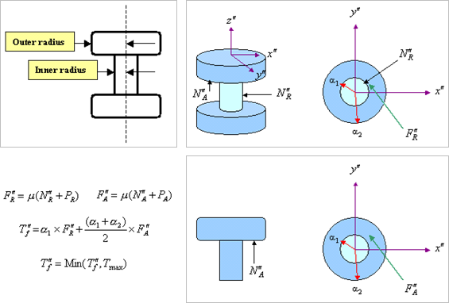

式中，各个物理量的含义为：

|符号|释义|
|-----|------------|
|$\alpha_{1}$|内部圆柱面的半径|
|$\alpha_{2}$|外部圆柱面的半径|
|$N_{A}^{\prime\prime}$|轴向力|
|$N_{R}^{\prime\prime}$|径向力|
|$P_{A}$|轴向预载荷|
|$P_{R}$|径向预载荷|
|$F_{A}^{\prime\prime}$|轴向摩擦力|
|$F_{R}^{\prime\prime}$|径向摩擦力|
|$\mu$|当前摩擦系数|

&emsp;&emsp;摩擦系数与相对转动的关系如图

  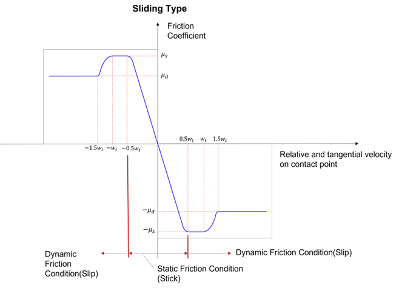

&emsp;&emsp;摩擦力矩的计算公式（Sliding&Stiction Friction）为：

$$
F_{\mathrm{friction}}
=
\mu\left(
F_{\mathrm{reaction}}
+\frac{T_{\mathrm{torsional}}}{R_{\mathrm{arm}}}
+\frac{T_{\mathrm{bending}}}{X_s}
+\frac{F_{\mathrm{preload}}}{\mu_s}
\right)
$$

其中，

$$
\begin{aligned}
\mu
&:\ \text{摩擦系数}, \\
\mu_s
&:\ \text{静摩擦系数}, \\
F_{\mathrm{preload}}
&:\ \text{预载荷}, \\
F_{\mathrm{reaction}}
&:\ \text{计算得到的反力}, \\
T_{\mathrm{torsional}}
&:\ \text{计算得到的扭矩}, \\
R_{\mathrm{arm}}
&:\ \text{从平移轴到作用点的平均距离或半径}, \\
T_{\mathrm{bending}}
&:\ \text{弯矩}.
\end{aligned}
$$

  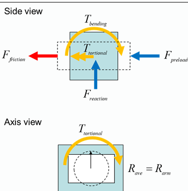

###### 3.4.1.2 移动副
###### 3.4.1.3 圆柱副

#### 3.5 Gear Element
##### 3.5.1 Simple gear element

##### 3.5.2 3D gear element
&emsp;&emsp;two gear wheels with center A and B, their location in initial coordinate system noted as $x_{A}$ and $x_{B}$.

  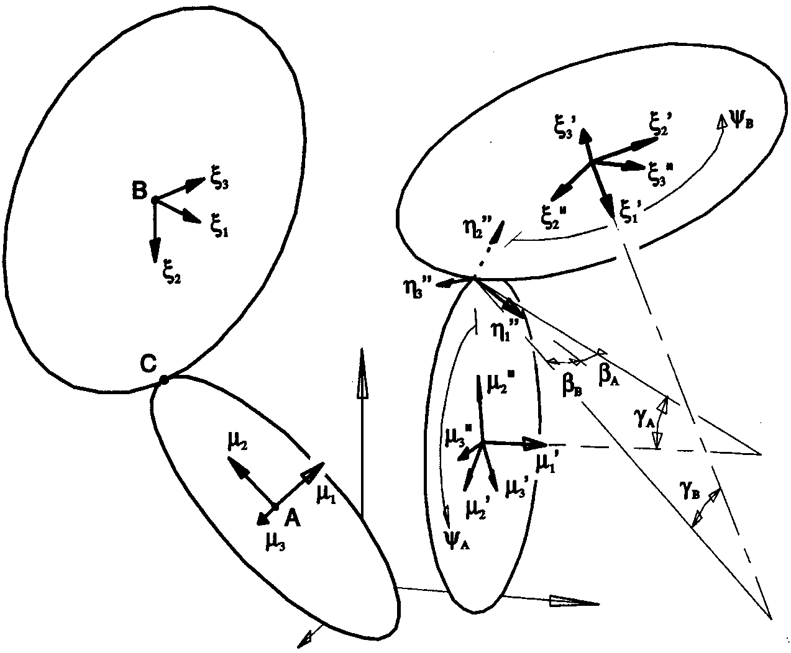

#### 3.6 Initial Conditions Correction

约束方程为：

$$
\Phi(q)=0
$$

约束方程对时间的导数为：

$$
\dot{\Phi}(q,\dot{q})=0
$$

取Moore-Penrose广义逆：

$$
D^{+}=\Phi_{q}^{T}(\Phi_{q}\Phi_{q}^{T})^{-1}
$$

$$
\delta q = -\Phi_{q}^{T}(\Phi_{q}\Phi_{q}^{T})^{-1}\Phi(q_{0})
$$

更新

$$
q=q+\delta q
$$

$$
\delta v = -\Phi_{q}^{T}(\Phi_{q}\Phi_{q}^{T})^{-1}\dot{\Phi}
$$

更新

$$
v=v+\delta v
$$

### 四、力与力矩
#### 只受到力的作用
假设在刚体$\alpha$上施加一个力$\begin{Bmatrix}\boldsymbol{F}\end{Bmatrix}$，力的作用点在刚体连体坐标系中的坐标向量为$\begin{Bmatrix}\boldsymbol{u}\end{Bmatrix}$,对应的用欧拉四元数表示的广义力为：
1. 如果力的表示是在全局坐标系，即

$$
\begin{Bmatrix}\boldsymbol{F}\end{Bmatrix}=\begin{bmatrix}F_{x}&F_{y}&F_{z}\end{bmatrix}\boldsymbol{e}^{r}
$$

则

$$
\begin{Bmatrix}Q_{ext}\end{Bmatrix}=\begin{Bmatrix}F_{x}\\F_{y}\\F_{z}\\2{L^{\alpha}}^{T}[u\times(L^{\alpha}{R^{\alpha}}^{T}
\begin{bmatrix}
F_{x}\\
F_{y}\\
F_{z}
\end{bmatrix})]
\end{Bmatrix}
$$

2. 如果力的表示是在连体坐标系，即

$$
\begin{Bmatrix}\boldsymbol{F}\end{Bmatrix}=\begin{bmatrix}F_{x}&F_{y}&F_{z}\end{bmatrix}\boldsymbol{e}^{b}
$$

则

$$
\begin{Bmatrix}Q_{ext}\end{Bmatrix}=\begin{Bmatrix}R^{\alpha}L^{\alpha}\begin{bmatrix}
F_{x}\\
F_{y}\\
F_{z}
\end{bmatrix}\\2{L^{\alpha}}^{T}(u\times\begin{bmatrix}
F_{x}\\
F_{y}\\
F_{z}
\end{bmatrix})
\end{Bmatrix}
$$

#### 只受到力矩的作用
假设在刚体$\alpha$上施加一个力矩$\begin{Bmatrix}\boldsymbol{M}_{t}\end{Bmatrix}$,对应的用欧拉四元数表示的广义力为：
1. 如果力矩的表示是在全局坐标系，即

$$
\begin{Bmatrix}\boldsymbol{M}_{t}\end{Bmatrix}=\begin{bmatrix}M_{x}&M_{y}&M_{z}\end{bmatrix}\boldsymbol{e}^{r}
$$

则

$$
\begin{aligned}
\begin{Bmatrix}Q_{ext}\end{Bmatrix} &= \begin{Bmatrix}0\\0\\0\\2{L^{\alpha}}^{T}[L^{\alpha}{R^{\alpha}}^{T}
\begin{bmatrix}
M_{x}\\
M_{y}\\
M_{z}
\end{bmatrix}]
\end{Bmatrix} \\
&= \begin{Bmatrix}0\\0\\0\\2{R^{\alpha}}^{T}
\begin{bmatrix}
M_{x}\\
M_{y}\\
M_{z}
\end{bmatrix}
\end{Bmatrix}
\end{aligned}
$$

(?)

2. 如果力矩的表示是在连体坐标系，即

$$
\begin{Bmatrix}\boldsymbol{F}\end{Bmatrix}=\begin{bmatrix}M_{x}&M_{y}&M_{z}\end{bmatrix}\boldsymbol{e}^{b}
$$

则

$$
\begin{Bmatrix}Q_{ext}\end{Bmatrix}=\begin{Bmatrix}0\\2{L^{\alpha}}^{T}\begin{bmatrix}
M_{x}\\
M_{y}\\
M_{z}
\end{bmatrix}
\end{Bmatrix}
$$

#### Line-In-Sight Force
考虑两个刚体$\alpha$、$\beta$之间的相互作用，P、Q分别为固定在刚体$\alpha$、$\beta$上的点，力的作用沿着P、Q点的连线，即力$\boldsymbol{F}$为：

$$
\begin{Bmatrix}
\boldsymbol{F}
\end{Bmatrix}=F\frac{\vec{PQ}}{\|PQ\|}
$$

约定：正的力值将两个点相互拉近，负的力值将两个点相互推离。

$$
\begin{Bmatrix}\begin{Bmatrix}F\end{Bmatrix}\\2{L^{\alpha}}^{T}({u^{\alpha}\times(L^{\alpha}R^{\alpha}}^{T}\begin{Bmatrix}F\end{Bmatrix}))\\-\begin{Bmatrix}F\end{Bmatrix}\\-2{L^{\beta}}^{T}({u^{\beta}\times(L^{\beta}R^{\beta}}^{T}\begin{Bmatrix}F\end{Bmatrix}))\end{Bmatrix}
$$

$$
\begin{aligned}
\vec{PQ} &= \begin{Bmatrix}x_{\beta}\\y_{\beta}\\z_{\beta}\end{Bmatrix} \\
&quad {}+ \begin{bmatrix}R^{\beta}\end{bmatrix}{\begin{bmatrix}L^{\beta}\end{bmatrix}}^{T}\begin{Bmatrix}u_{x}^{\beta}\\u_{y}^{\beta}\\u_{z}^{\beta}\end{Bmatrix} \\
&quad {}- \begin{Bmatrix}x_{\alpha}\\y_{\alpha}\\z_{\alpha}\end{Bmatrix} \\
&quad {}- \begin{bmatrix}R^{\alpha}\end{bmatrix}{\begin{bmatrix}L^{\alpha}\end{bmatrix}}^{T}\begin{Bmatrix}u_{x}^{\alpha}\\u_{y}^{\alpha}\\u_{z}^{\alpha}\end{Bmatrix}
\end{aligned}
$$

$$
|PQ|=\sqrt{(x_{\beta}+\sum A_{0,i}^{\beta}u_{i}^{\beta}-x_{\alpha}-\sum A_{0,i}^{\alpha}u_{i}^{\alpha})^{2}+(y_{\beta}+\sum A_{1,i}u_{i}^{\beta}-y_{\alpha}-\sum A_{1,i}^{\alpha}u_{i}^{\alpha})^{2}+(z_{\beta}+\sum A_{2,i}u_{i}^{\beta}-z_{\alpha}-\sum A_{2,i}^{\alpha}u_{i}^{\alpha})^{2}}
$$

$$
\frac{\partial}{\partial x_{\beta}}\frac{{\vec{PQ}}}{|PQ|}=\frac{\begin{Bmatrix}1\\0\\0\end{Bmatrix}|PQ|-\begin{Bmatrix}x_{\beta}\\y_{\beta}\\z_{\beta}\end{Bmatrix}\frac{\partial|PQ|}{\partial x_{\beta}}}{|PQ|^{2}}
$$

$$
\frac{\partial}{\partial \lambda_{i}}\frac{{\vec{PQ}}}{|PQ|}=(\frac{\partial{\vec{PQ}}}{\partial \lambda_{i}}|PQ|-\vec{PQ}\frac{\partial{|PQ|}}{\partial \lambda_{i}})\frac{1}{|PQ|{^{2}}}
$$

#### 线弹簧
刚体$\alpha$上的点与刚体$\beta$上的点通过弹簧连接，弹簧力作用在两个体上，弹簧的初始长度为$L_{0}$，两个点之间的相对距离与相对速度为(在全局坐标系)：

$$
\begin{aligned}
d &= \begin{Bmatrix}x_{\beta}\\y_{\beta}\\z_{\beta}\end{Bmatrix} - \begin{Bmatrix}x_{\alpha}\\y_{\alpha}\\z_{\alpha}\end{Bmatrix} \\
&quad {}+ \begin{bmatrix}R^{\beta}\end{bmatrix}{\begin{bmatrix}L^{\beta}\end{bmatrix}}^{T}\begin{Bmatrix}u_x^{\beta}\\u_y^{\beta}\\u_z^{\beta}\end{Bmatrix} \\
&quad {}- \begin{bmatrix}R^{\alpha}\end{bmatrix}{\begin{bmatrix}L^{\alpha}\end{bmatrix}}^{T}\begin{Bmatrix}u_x^{\alpha}\\u_y^{\alpha}\\u_z^{\alpha}\end{Bmatrix}
\end{aligned}
$$

$$
\begin{aligned}
\dot{d} &= \begin{Bmatrix}\dot{x_{\beta}}\\\dot{y_{\beta}}\\\dot{z_{\beta}}\end{Bmatrix} \\
&quad {}- \begin{Bmatrix}\dot{x_{\alpha}}\\\dot{y_{\alpha}}\\\dot{z_{\alpha}}\end{Bmatrix} \\
&quad {}- \begin{bmatrix}R^{\beta}\end{bmatrix}{\begin{bmatrix}L^{\beta}\end{bmatrix}}^{T}(\begin{bmatrix}\tilde{u^{\beta}}\end{bmatrix}\begin{Bmatrix}\omega^{\beta}\end{Bmatrix}) \\
&quad {}+ \begin{bmatrix}R^{\alpha}\end{bmatrix}{\begin{bmatrix}L^{\alpha}\end{bmatrix}}^{T}(\begin{bmatrix}\tilde{u^{\alpha}}\end{bmatrix}\begin{Bmatrix}\omega^{\alpha}\end{Bmatrix})
\end{aligned}
$$

弹簧力为：

$$
\begin{aligned}
F &= -k\Delta-c\dot{d} \\
&= [-k(\|d\|-L_{0})-c\dot{d}\cdot\frac{d}{\|d\|}]\frac{d}{\|d\|}
\end{aligned}
$$

  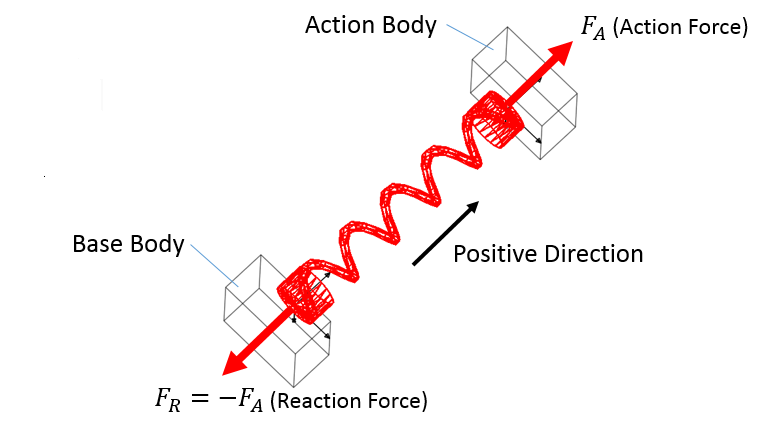

#### 线性弹簧连接两个集中质量点

集中质量点$\alpha$与集中质量点$\beta$通过弹簧连接，弹簧力作用在两个集中质量点上，弹簧的初始长度为$L_{0}$，两个点之间的相对距离与相对速度为(在全局坐标系)：

$$
d=\begin{Bmatrix}x_{\beta}\\y_{\beta}\\z_{\beta}\end{Bmatrix}-\begin{Bmatrix}x_{\alpha}\\y_{\alpha}\\z_{\alpha}\end{Bmatrix}
$$

$$
\dot{d}=\begin{Bmatrix}\dot{x_{\beta}}\\\dot{y_{\beta}}\\\dot{z_{\beta}}\end{Bmatrix}-\begin{Bmatrix}\dot{x_{\alpha}}\\\dot{y_{\alpha}}\\\dot{z_{\alpha}}\end{Bmatrix}
$$

弹簧力为：

$$
\begin{aligned}
F &= -k\Delta-c\dot{d} \\
&= [-k(\|d\|-L_{0})-c\dot{d}\cdot\frac{d}{\|d\|}]\frac{d}{\|d\|}
\end{aligned}
$$

式中，

$$
\|d\|=\sqrt{(x_{\beta}-x_{\alpha})^{2}+(y_{\beta}-y_{\alpha})^{2}+(z_{\beta}-z_{\alpha})^{2}}
$$

$$
\frac{\partial F}{\partial x_{\beta}}=-\frac{\partial \|d\|}{\partial x_{\beta}}\frac{d}{\|d\|}+[-k(\|d\|-L_{0})]\frac{\frac{\partial d}{\partial x_{\beta}}\|d\|-d\frac{\partial \|d\|}{\partial x_{\beta}}}{\|d\|^{2}}
$$

#### 油气弹簧
将外筒与活塞坐标系的相对位置定义为缓冲器行程，空气弹簧力表达式为：

$$
F_{a} = A_{a}[P_{a0}(\frac{V_{0}}{V_{0}+A_{a}S})^{n}-P_{atm}]
$$

式中，$P_{a0}$为初始气体压力，$P_{atm}$为大气压力，$V_{0}$为初始气体体积，$A_{a}$为压力面积，$S$为缓冲器行程，$n$为空气变异指数。

油液阻尼力的计算公式为：

$$
F_{h} = \frac{\rho_{h}A_{oil}^{3}\dot{S}}{2C_{d}^{2}A_{d}^{2}}|\dot{S}|
$$

式中，$\rho_{h}$为油液密度，$A_{oil}$为有效压油面积，$A_{d}$为油孔面积，$C_{d}$为油液缩流系数，$\dot{S}$为活塞杆相对于支柱外筒的速度。

  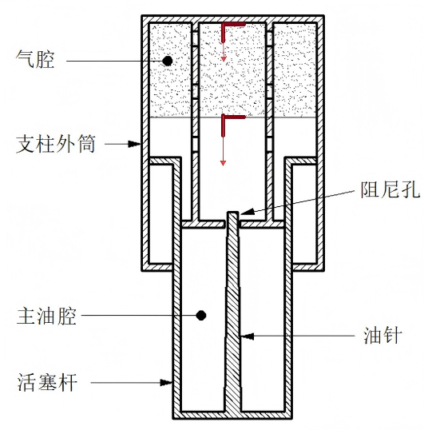

$$
\frac{\partial F_{a}}{\partial S}=A_{a}P_{a0}n(\frac{V_{0}}{V_{0}+A_{a}S})^{n-1}\frac{V_{0}A_{a}}{(V_{0}+A_{a}S)^{2}}
$$

选择支柱外筒作为Body I，活塞杆为Body J，活塞杆与外筒之间用移动副（或者圆柱副）连接，Marker i与Marker j分别位于初始气腔的两个面中心、Marker i与Body i固结、Marker j与Body j固结、Z轴与活塞杆的移动方向平行，方向由支柱外筒指向活塞杆。

缓冲器行程$S$的计算方法为：

$$
S = (r_{Marker_J}-r_{Marker_I})\cdot Marker_J^{z}-l_{0}
$$

$$
S=(r_{\beta}+R^{\beta}{L^{\beta}}^{T}u^{\beta}-r^{\alpha}-R^{\alpha}{L^{\alpha}}^{T}u^{\alpha})\cdot(R^{\beta}{L^{\beta}}^{T}d^{\beta})-l_{0}
$$

$$
\begin{aligned}
\dot{S} &= (\dot{r_{\beta}}-R^{\beta}{L^{\beta}}^{T}(\begin{bmatrix}\tilde{u}^{\beta}\end{bmatrix}\begin{Bmatrix}\omega^{\beta}\end{Bmatrix})-\dot{r_{\alpha}}+R^{\alpha}{L^{\alpha}}^{T}(\begin{bmatrix}\tilde{u}^{\alpha}\end{bmatrix}\begin{Bmatrix}\omega^{\alpha}\end{Bmatrix}))\cdot(R^{\beta}{L^{\beta}}^{T}d^{\beta})+ \\
(r_{\beta}+R^{\beta}{L^{\beta}}^{T}u^{\beta}-r^{\alpha}-R^{\alpha}{L^{\alpha}}^{T}u^{\alpha})\cdot(R^{\beta}{L^{\beta}}^{T}(-\begin{bmatrix}\tilde{d}^{\beta}\end{bmatrix}\begin{Bmatrix}\omega^{\beta}\end{Bmatrix}))
\end{aligned}
$$

#### 扭转弹簧
&nbsp;&nbsp;&nbsp;&nbsp;刚体$\alpha$与刚体$\beta$分别在P点(在刚体$\alpha$上)与Q点（在刚体$\beta$上）通过扭转弹簧连接，假设P点与Q点坐标系的初始夹角即初始扭转角为$\theta_{0}$,初始扭转角速度为0，则两个刚体之间的作用力矩为$\boldsymbol{M}=[k(\theta-\theta_{0})+c\dot{\theta}]i_{z}$

$$
\begin{aligned}
\cos\theta &= i_{x}^{\beta}\cdot i_{x}^{\alpha} \\
\sin\theta &= i_{x}^{\beta}\cdot i_{y}^{\alpha} \\
\theta &= \arccos(i_{x}^{\beta}\cdot i_{x}^{\alpha}) \\
\theta &= arctan(\frac{i_{x}^{\beta}\cdot i_{y}^{\alpha}}{i_{x}^{\beta}\cdot i_{x}^{\alpha}})
\end{aligned}
$$

$$
\begin{aligned}
\dot{\theta} &= -\frac{\dot{i_{x}^{\beta}}\cdot i_{x}^{\alpha}+i_{x}^{\beta}\cdot \dot{i_{x}^{\alpha}}}{i_{x}^{\beta}\cdot i_{y}^{\alpha}} \\
&= \frac{(\begin{bmatrix}\tilde{i_{x}^{\beta}}\end{bmatrix}\begin{Bmatrix}\omega_\beta\end{Bmatrix})\cdot i_{x}^{\alpha}+i_{x}^{\beta}\cdot(\begin{bmatrix}\tilde{i_{x}^{\alpha}}\end{bmatrix}\begin{Bmatrix}\omega_\alpha\end{Bmatrix})}{i_{x}^{\beta}\cdot i_{y}^{\alpha}}
\end{aligned}
$$

$$
\begin{aligned}
\dot{\theta} &= -\frac{(\omega_{\beta}\times i_{x}^{\beta})\cdot i_{x}^{\alpha}+i_{x}^{\beta}\cdot(\omega_{\alpha}\times i_{x}^{\alpha})}{i_{x}^{\beta}\cdot i_{y}^{\alpha}} \\
 &= \frac{(\begin{bmatrix}\tilde{i_{x}^{\beta}}\end{bmatrix}\begin{Bmatrix}\omega_{\beta}\end{Bmatrix})\cdot i_{x}^{\alpha}+i_{x}^{\beta}\cdot(\begin{bmatrix}\tilde{i_{x}^{\alpha}}\end{bmatrix}\begin{Bmatrix}\omega_{\alpha}\end{Bmatrix})}{i_{x}^{\beta}\cdot i_{y}^{\alpha}}
\end{aligned}
$$

对应的广义力为：

$$
\begin{Bmatrix}0\\0\\0\\2\cdot (k(\theta-\theta_{0})+c\dot{\theta}){L^{\alpha}}^{T}\begin{Bmatrix}d_{\alpha}^{x}\\d_{\alpha}^{y}\\d_{\alpha}^{z}\end{Bmatrix}\\0\\0\\0\\-2\cdot (k(\theta-\theta_{0})+c\dot{\theta}){L^{\beta}}^{T}\begin{Bmatrix}d_{\beta}^{x}\\d_{\beta}^{y}\\d_{\beta}^{z}\end{Bmatrix}\end{Bmatrix}
$$

$$
\frac{\partial \theta}{\partial \lambda_{0}}=\frac{\partial}{\partial \lambda_{0}}(i_{x}^{\beta}\cdot i_{y}^{\alpha})(i_{x}^{\beta}\cdot i_{x}^{\alpha})-\frac{\partial}{\partial \lambda_{0}}(i_{x}^{\beta}\cdot i_{x}^{\alpha})(i_{x}^{\beta}\cdot i_{y}^{\alpha})
$$

#### 柔性梁单元

&nbsp;&nbsp;&nbsp;&nbsp;设梁的长度为$l$,杨氏模量为$E$,截面积为$A$，当两个刚体$\alpha$、$\beta$用该梁连接时，轴向刚度可以将该梁等效为无质量的弹簧，弹簧的初始长度为$l$、刚度为：$\frac{EA}{l}$

同样的梁，剪切模量为$G$，截面极惯性矩为$J$,扭转刚度可以等效为无质量的扭转弹簧，扭转弹簧的初始角度为$\theta_{0}$、刚度为$\frac{GJ}{l}$

在局部坐标系下的刚度矩阵为：

$$
K=\begin{bmatrix}\frac{EA}{L}&0&0&-\frac{EA}{L}&0&0\\
0&\frac{12EI}{L^{3}}&\frac{6EI}{L^{2}}&0&-\frac{12EI}{L^{3}}&-\frac{6EI}{L^{2}}\\
0&\frac{6EI}{L^{2}}&\frac{4EI}{L}&0&-\frac{6EI}{L^{2}}&-\frac{4EI}{L}\\
-\frac{EA}{L}&0&0&\frac{EA}{L}&0&0\\
0&-\frac{12EI}{L^{3}}&-\frac{6EI}{L^{2}}&0&\frac{12EI}{L^{3}}&\frac{6EI}{L^{2}}\\
0&-\frac{6EI}{L^{2}}&-\frac{4EI}{L}&0&\frac{6EI}{L^{2}}&\frac{4EI}{L}
\end{bmatrix}
$$

#### 非线性轮胎动力学模型
&nbsp;&nbsp;&nbsp;&nbsp;英国布里斯托大学Thota提出的双轮飞机前起落架轮胎动力学方程：

$$
\begin{aligned}
\dot{\lambda}_{L}+\frac{V}{\sigma}\lambda_{L}-Vsin(\theta_{s})-l_{g}\dot{\delta}\cos(\delta)-(e_{eff}-h)\cos(\theta_{s})\dot{\psi}\cos(\phi)-\frac{D}{2}\dot{\psi}\sin(\theta)\cos(\phi) &= 0 \\
\dot{\lambda}_{R}+\frac{V}{\sigma}\lambda_{R}-Vsin(\theta_{s})-l_{g}\dot{\delta}\cos(\delta)-(e_{eff}-h)\cos(\theta_{s})\dot{\psi}\cos(\phi)+\frac{D}{2}\dot{\psi}\sin(\theta)\cos(\phi) &= 0
\end{aligned}
$$

  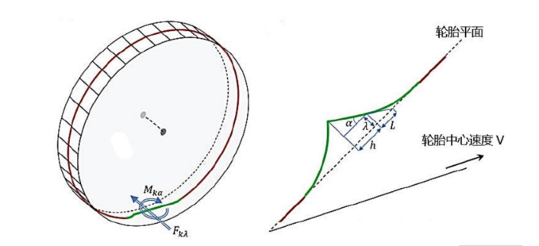

$$
\alpha_{L/R}=\tan^{-1}(\frac{\lambda_{L/R}}{L})
$$

轮胎的回正力矩采用分段函数表示，在轮胎的极限侧滑角$\alpha_{m}$内，回正力矩随侧滑角按正弦规律变化；在极限侧滑角外，轮胎发生了侧滑，回正力矩为0:

$$
M_{K}=
\begin{cases}
K_{\alpha}\frac{\alpha_{m}}{\pi}\sin(\alpha_{L/R})F_{yL/R},&\text{if} |\alpha_{L/R}|\le\alpha_{m}\\
0,&\text{if} |\alpha_{L/R}|>\alpha_{m}
\end{cases}
$$

由于轮胎阻尼引起的力矩为

$$
M_{D}=\frac{c_{\lambda}\dot{\psi}\cos\phi}{V}
$$

因轮胎侧向变形引起的侧向恢复力，采用实验数据拟合的轮胎侧向力经验公式：

$$
F_{K}=k_{\lambda}\tan^{-1}(7.0tan(\alpha_{L/R}))\cos(0.95tan^{-1}(7.0tan(\alpha_{L/R})))F_{yL/R}
$$

前起落架上的总垂直力$F_{z}$按左右机轮非对称分为两个力$F_{zL}$和$F_{zR}$:

$$
F_{zL/R} = \frac{F_{z}}{2}(1\mp(\frac{k_{v}D}{F_{z}})\sin(\gamma+\delta))
$$

力矩$M_{\lambda_{\delta L/R}}$是轮胎侧向变形产生的力的结果：

$$
M_{\lambda_{\delta L/R}}=l_{g}F_{K_{\lambda L/R}}\cos(\theta_{s})\cos(\phi)
$$

#### 吉林大学RTDTire模型
&nbsp;&nbsp;&nbsp;&nbsp;RTDTire采用质量点、弹性阻尼元件以及均布载荷表达轮胎各部分的力学特性，要点为：

(1). 轮胎圆周方向均匀分布的$N_{m}$个质量点$m_{i}$,模拟带束和部分胎侧的质量；

(2). 圆形刚性轮辋，模拟轮辋以及部分胎侧的质量和转动惯量；

(3). 位移弹簧$k_{btcx2}$、$k_{btcz2}$，该类元件连接相邻质量点，模拟带束拉伸特性；

(4). 弯曲弹簧$k_{bci2}$，该类元件对相邻带束段施加弹性约束，模拟带束面内弯曲特性；

(5). 位移弹簧$k_{sr2}$、$k_{st2}$以及阻尼元件$c_{sr2}$、$c_{st2}$，该类元件连接质量点与轮辋刚体边缘，模拟胎侧和腔内空气的弹性阻尼特性。

(6). 接触单元：需要结合目前的接触搜索算法定义与细化。

#### 气动力单元
考虑作用在二维翼型上(作用点为1/4弦长位置)的升力与阻力，假设自由来流的速度为$V_{\infty}$,攻角为$\alpha$，空气密度为$\rho_{air}$。

  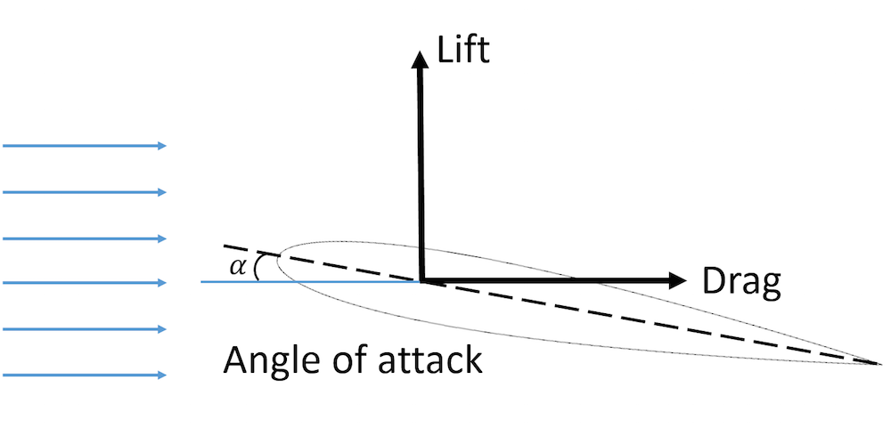

单位翼展上的升力、阻力以及俯仰力矩为：

$$
\begin{aligned}
L &= \frac{1}{2}\rho_{air}V_{rel}^{2}cc_{l} \\
D &= \frac{1}{2}\rho_{air}V_{rel}^{2}cc_{d} \\
M &= \frac{1}{2}\rho_{air}V_{rel}^{2}c^{2}c_{m}
\end{aligned}
$$

式中，$V_{rel}$为来流相对于翼型的速度。

作用在刚体上的广义力为：

$$
\begin{Bmatrix}Q_{ext}\end{Bmatrix}=
\begin{Bmatrix}D\\
L\\
0\\
2{L^{\alpha}}^{T}[u_{1/4c}\times(L^{\alpha}{R^{\alpha}}^{T}
\begin{bmatrix}
D\\
L\\
0
\end{bmatrix})]+2{R^{\alpha}}^{T}
\begin{bmatrix}
0\\
0\\
M_{z}
\end{bmatrix}
\end{Bmatrix}
$$

刚体姿态变化导致攻角变化->攻角查表->升力、阻力、俯仰力矩

### 五、柔性体建模
#### 5.1 模态叠加法
&nbsp;&nbsp;&nbsp;&nbsp;采用有限单元法对柔性体进行离散，基于小变形理论假设，使用浮动坐标法建模,柔性体body i上的单元j中任一点在空间中的位置为：

$$
\begin{aligned}
\boldsymbol{r}^{ij} &= r^{i}+A^{i}\bar{u}^{ij} \\
&= r^{i}+R^{i}{L^{i}}^{T}\bar{u}^{ij}
\end{aligned}
$$

其中，$\boldsymbol{r}^{i}$为柔性体连体坐标系在全局坐标系中的位置向量，为了简化计算，该连体坐标系建在柔性体的质心，姿态确认与前述刚体建模方法一致；$A^{i}$为连体坐标系相对于全局坐标系的方向余弦矩阵，与刚体建模一致，采用欧拉四元数描述。$\bar{u}^{ij}$为柔性体上任一点在连体坐标系中的位置向量。当柔性体发生变形后，该点在全局坐标的位置为：

$$
\boldsymbol{r}^{ij}=r^{i}+R^{i}{L^{i}}^{T}(\bar{u}^{ij}+u_{f})
$$

其中，$u_{f}=\begin{Bmatrix}u_{j,x}\\u_{j,y}\\u_{j,z}\end{Bmatrix}$

  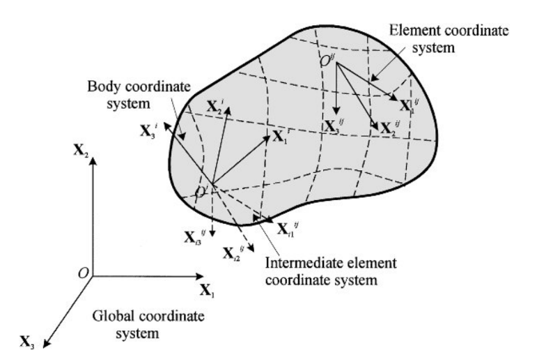 

&nbsp;&nbsp;&nbsp;&nbsp;质量矩阵采用集中质量法，单元$l$的单元质量矩阵为：

$$
\begin{aligned}
M^{l} &= \int_{V}\rho N^{l}\,\mathrm{d}V \\
&= \begin{bmatrix}\int_{V}\rho N^{l}_{1}\,\mathrm{d}V&0&\cdots&0\\
0&\int_{V}\rho N^{l}_{2}\,\mathrm{d}V&\cdots&0\\
\vdots&\vdots&\ddots&0\\
0&0&\cdots&\int_{V}\rho N^{l}_{n}\,\mathrm{d}V
\end{bmatrix}
\end{aligned}
$$

&nbsp;&nbsp;&nbsp;&nbsp;采用Craig-Bampton方法对变形场进行近似：

$$
\begin{Bmatrix}u_{f}\end{Bmatrix}=c_{1}(t)\begin{Bmatrix}\Psi_{1}\end{Bmatrix}+\cdots+c_{m}(t)\begin{Bmatrix}\Psi_{m}\end{Bmatrix}
$$

其中，$\Psi_{k}(k=1,\cdots,m)$为选择的$m$阶模态。

&nbsp;&nbsp;&nbsp;&nbsp;柔性体的动能为：

$$
\begin{aligned}
E_{k} &= \sum_{i}^{n_{nodes}}E_{k}^{i} \\
&= \sum_{i}^{n_{nodes}}\frac{1}{2}m_{i}\dot{r}_{ij}\dot{r}_{ij}^{T}
\end{aligned}
$$

其中，$\dot{r}_{ij}=\dot{r}^{i}+A^{i}[\omega\times(\bar{u}^{ij}+u_{f})]+A^{i}\dot{u}_{f}$

&nbsp;&nbsp;&nbsp;&nbsp;离散化为：

$$
\begin{aligned}
\dot{r}_{ij} &= \dot{r}^{i}+A^{i}[\omega\times(\bar{u}^{ij}+c_{1}(t)\begin{Bmatrix}\Psi_{1}^{3\cdot j}\\\Psi_{1}^{3\cdot j+1}\\\Psi_{1}^{3\cdot j+2}\end{Bmatrix}+\cdots+c_{m}(t)\begin{Bmatrix}\Psi_{m}^{3\cdot j}\\\Psi_{m}^{3\cdot j+1}\\\Psi_{m}^{3\cdot j+2}\end{Bmatrix})]+ \\
A^{i}(\dot{c_{1}}\begin{Bmatrix}\Psi_{1}^{3\cdot j}\\\Psi_{1}^{3\cdot j+1}\\\Psi_{1}^{3\cdot j+2}\end{Bmatrix}+\cdots+\dot{c_{m}}\begin{Bmatrix}\Psi_{m}^{3\cdot j}\\\Psi_{m}^{3\cdot j+1}\\\Psi_{m}^{3\cdot j+2}\end{Bmatrix}) \\
 &= \begin{bmatrix}\boldsymbol{I}&-2A^{i}\tilde{u}L^{i}&A^{i}S_{f}\end{bmatrix}\begin{Bmatrix}\dot{\boldsymbol{r}}_{i}\\\dot{\Lambda}_{i}\\\begin{Bmatrix}\dot{c_{1}}\\\vdots\\\dot{c_{m}}\end{Bmatrix}\end{Bmatrix} \\
&= \begin{bmatrix}\boldsymbol{I}&-2A^{i}\tilde{u}L^{i}&A^{i}S_{f}\end{bmatrix}\begin{Bmatrix}\dot{q}\end{Bmatrix}
\end{aligned}
$$

式中，

$$
S_{f}=\begin{bmatrix}
\Psi_{1}^{3\cdot j}&\cdots&\Psi_{m}^{3\cdot j}\\
\Psi_{1}^{3\cdot j+1}&\cdots&\Psi_{m}^{3\cdot j+1}\\
\Psi_{1}^{3\cdot j+2}&\cdots&\Psi_{m}^{3\cdot j+2}
\end{bmatrix}
$$

&nbsp;&nbsp;&nbsp;&nbsp;该点的动能为：

$$
E_{k}^{ij}=\frac{1}{2}\begin{Bmatrix}{\dot{q}}\end{Bmatrix}^{T}\begin{bmatrix}M^{ij}\end{bmatrix}\begin{Bmatrix}\dot{q}\end{Bmatrix}
$$

$$
\begin{aligned}
M^{ij} &= m_{j}\begin{bmatrix}
I&-2A^{i}\tilde{u}L^{i}&A^{i}S_{f}\\
 &4{L^{i}}^{T}{\tilde{u}}^{T}\tilde{u}L^{i}&2{L^{i}}^{T}\tilde{u}S_{f}\\
 & &S_{f}^{T}S_{f}
\end{bmatrix} \\
&= \begin{bmatrix}
m_{RR} & m_{R\theta} & m_{Rf}\\
& m_{\theta\theta} & m_{\theta f}\\
& & m_{ff}
\end{bmatrix}^{ij}
\end{aligned}
$$

$$
m_{RR}^{ij}=m_{j}\boldsymbol{I}_{3\times3}
$$

$$
\begin{aligned}
m_{R\theta}^{ij} &= -2m_{j}A^{i}\tilde{u} \\
&= -2m_{j}A^{i}
\begin{bmatrix}0 & -u_{z}^{ij} &u_{y}^{ij}\\
u_{z}^{ij} & 0 & -u_{x}^{ij}\\
-u_{y}^{ij} & u_{x}^{ij} & 0
\end{bmatrix}
\end{aligned}
$$

$$
m_{Rf}^{ij}=m_{j}A^{i}S_{f}
$$

$$
\begin{aligned}
m_{\theta\theta}^{ij} &= 4m_{j}{L^{i}}^{T}\tilde{u}^{T}\tilde{u}L^{i} \\
&= 4m_{j}{L^{i}}^{T}
\begin{bmatrix}
u_{3}^{2}+u_{2}^{2}&-u_{1}u_{2}&-u_{1}u_{3}\\
-u_{1}u_{2}&u_{3}^{2}+u_{1}^{2}&-u_{2}u_{3}\\
-u_{1}u_{3}&-u_{2}u_{3}&u_{1}^{2}+u_{2}^{2}
\end{bmatrix}L^{i}
\end{aligned}
$$

$$
\begin{Bmatrix}
u_{1}^{ij}\\
u_{2}^{ij}\\
u_{3}^{ij}
\end{Bmatrix}=\begin{Bmatrix}u_{x}^{ij}\\u_{y}^{ij}\\u_{z}^{ij}\end{Bmatrix}+\begin{bmatrix}S_{f}^{ij}\end{bmatrix}\begin{Bmatrix}c_{1}\\c_{2}\\\vdots\\c_{m}\end{Bmatrix}
$$

$$
\begin{aligned}
u_{k}u_{l} &= (u_{k}^{ij}+S_{f}^{k}\begin{Bmatrix}c\end{Bmatrix})(u_{l}^{ij}+S_{f}^{l}\begin{Bmatrix}c\end{Bmatrix}) \\
&= u_{k}^{ij}u_{l}^{ij}+u_{k}^{ij}S_{f}^{l}\begin{Bmatrix}c\end{Bmatrix}+u_{l}^{ij}S_{f}^{k}\begin{Bmatrix}c\end{Bmatrix}+\begin{Bmatrix}c\end{Bmatrix}^{T}{S_{f}^{k}}^{T}S_{f}^{l}\begin{Bmatrix}c\end{Bmatrix}
\end{aligned}
$$

&nbsp;&nbsp;&nbsp;&nbsp;柔性体的质量矩阵为：

$$
M^{i}=\begin{bmatrix}
m_{RR} & m_{R\theta} & m_{Rf}\\
& m_{\theta\theta} & m_{\theta f}\\
& & m_{ff}
\end{bmatrix}
$$

$$
m_{RR}=m \boldsymbol{I}_{3\times3}
$$

式中，$m$为柔性体的质量

$$
m_{R\theta}^{i}=-2A^{i}
(\begin{bmatrix}0 & -S_{z} &S_{y}\\
S_{z} & 0 & -S_{x}\\
-S_{y} & S_{x} & 0
\end{bmatrix}+\begin{bmatrix}0 & -S_{z}^{f} &S_{y}^{f}\\
S_{z}^{f} & 0 & -S_{x}^{f}\\
-S_{y}^{f} & S_{x}^{f} & 0
\end{bmatrix})
$$

式中，$S_{x}=\sum_{j=1}^{Nn}m_{j}u^{ij}_{x},S_{y}=\sum_{j=1}^{Nn}m_{j}u^{ij}_{y},S_{z}=\sum_{j=1}^{Nn}m_{j}u^{ij}_{z}$,$Nn$为节点数。

$$
\begin{aligned}
S_x^{f} &= \begin{bmatrix}c_{1}&c_{2}&\cdots&c_{m}\end{bmatrix}
\begin{Bmatrix}
\sum_{j=1}^{Nn}m_{j}\Psi_{1}^{3\cdot (j-1)+1}\\
\vdots\\
\sum_{j=1}^{Nn}m_{j}\Psi_{m}^{3\cdot (j-1)+1}
\end{Bmatrix} \\
S_y^{f} &= \begin{bmatrix}c_{1}&c_{2}&\cdots&c_{m}\end{bmatrix}
\begin{Bmatrix}
\sum_{j=1}^{Nn}m_{j}\Psi_{1}^{3\cdot (j-1)+2}\\
\vdots\\
\sum_{j=1}^{Nn}m_{j}\Psi_{m}^{3\cdot (j-1)+2}
\end{Bmatrix} \\
S_z^{f} &= \begin{bmatrix}c_{1}&c_{2}&\cdots&c_{m}\end{bmatrix}
\begin{Bmatrix}
\sum_{j=1}^{Nn}m_{j}\Psi_{1}^{3\cdot (j-1)+3}\\
\vdots\\
\sum_{j=1}^{Nn}m_{j}\Psi_{m}^{3\cdot (j-1)+3}
\end{Bmatrix}
\end{aligned}
$$

$$
m_{Rf}^{i}=A^{i}\sum_{j=1}^{Nn}m_{j}\begin{bmatrix}
\Psi_{1}^{3\cdot (j-1)+1}&\Psi_{2}^{3\cdot (j-1)+1}&\cdots&\Psi_{m}^{3\cdot (j-1)+1}\\
\Psi_{1}^{3\cdot (j-1)+2}&\Psi_{2}^{3\cdot (j-1)+2}&\cdots&\Psi_{m}^{3\cdot (j-1)+2}\\
\Psi_{1}^{3\cdot (j-1)+3}&\Psi_{2}^{3\cdot (j-1)+3}&\cdots&\Psi_{m}^{3\cdot (j-1)+3}
\end{bmatrix}
$$

$$
\begin{aligned}
m_{ff}^{i} &= \sum_{j=1}^{Nn}m_{j}\begin{bmatrix}
\Psi_{1}^{3\cdot (j-1)+1}&\Psi_{1}^{3\cdot (j-1)+2}&\Psi_{1}^{3\cdot (j-1)+3}\\
\Psi_{2}^{3\cdot (j-1)+1}&\Psi_{2}^{3\cdot (j-1)+2}&\Psi_{2}^{3\cdot (j-1)+3}\\
\vdots&\vdots&\vdots\\
\Psi_{m}^{3\cdot (j-1)+1}&\Psi_{m}^{3\cdot (j-1)+2}&\Psi_{m}^{3\cdot (j-1)+3}
\end{bmatrix}
\begin{bmatrix}
\Psi_{1}^{3\cdot (j-1)+1}&\Psi_{2}^{3\cdot (j-1)+1}&\cdots&\Psi_{m}^{3\cdot (j-1)+1}\\
\Psi_{1}^{3\cdot (j-1)+2}&\Psi_{2}^{3\cdot (j-1)+2}&\cdots&\Psi_{m}^{3\cdot (j-1)+2}\\
\Psi_{1}^{3\cdot (j-1)+3}&\Psi_{2}^{3\cdot (j-1)+3}&\cdots&\Psi_{m}^{3\cdot (j-1)+3}
\end{bmatrix} \\
 &= \begin{bmatrix}
\sum_{j=1}^{Nn}m_{j}\sum_{k=1}^{3}(\Psi_{1}^{3\cdot (j-1)+k})^{2}&\sum_{j=1}^{Nn}m_{j}\sum_{k=1}^{3}\Psi_{1}^{3\cdot (j-1)+k}\Psi_{2}^{3\cdot (j-1)+k}&\cdots&\sum_{j=1}^{Nn}m_{j}\sum_{k=1}^{3}\Psi_{1}^{3\cdot (j-1)+k}\Psi_{m}^{3\cdot (j-1)+k}\\
&\sum_{j=1}^{Nn}m_{j}\sum_{k=1}^{3}(\Psi_{2}^{3\cdot (j-1)+k})^{2}&\cdots&\sum_{j=1}^{Nn}m_{j}\sum_{k=1}^{3}\Psi_{2}^{3\cdot (j-1)+k}\Psi_{m}^{3\cdot (j-1)+k}\\
\vdots&\vdots&\ddots&\vdots\\
&&&\sum_{j=1}^{Nn}m_{j}\sum_{k=1}^{3}(\Psi_{m}^{3\cdot (j-1)+k})^{2}
\end{bmatrix}
\end{aligned}
$$

$$
\begin{aligned}
m_{\theta f}^{i} &= 2{L^{i}}^{T}\sum_{j=1}^{Nn}\tilde{u}S_{f}=2{L^{i}}^{T}\sum_{j=1}^{Nn}
\begin{Bmatrix}
S_{f}^{3}u_{2}-S_{f}^{2}u_{3}\\
S_{f}^{1}u_{3}-S_{f}^{3}u_{1}\\
S_{f}^{2}u_{1}-S_{f}^{1}u_{2}
\end{Bmatrix}=2{L^{i}}^{T}\sum_{j=1}^{Nn}
(\begin{Bmatrix}
S_{f}^{3}u_{y}^{ij}-S_{f}^{2}u_{z}^{ij}\\
S_{f}^{1}u_{z}^{ij}-S_{f}^{3}u_{x}^{ij}\\
S_{f}^{2}u_{x}^{ij}-S_{f}^{1}u_{y}^{ij}
\end{Bmatrix}+\begin{Bmatrix}
S_{f}^{3}u_{2}-S_{f}^{2}u_{3}\\
S_{f}^{1}u_{3}-S_{f}^{3}u_{1}\\
S_{f}^{2}u_{1}-S_{f}^{1}u_{2}
\end{Bmatrix}) \\
 &= 2{L^{i}}^{T}\sum_{j=1}^{Nn}
(\begin{Bmatrix}
S_{f}^{3}u_{y}^{ij}-S_{f}^{2}u_{z}^{ij}\\
S_{f}^{1}u_{z}^{ij}-S_{f}^{3}u_{x}^{ij}\\
S_{f}^{2}u_{x}^{ij}-S_{f}^{1}u_{y}^{ij}
\end{Bmatrix}+\begin{Bmatrix}
\sum_{k=1}^{m}(S_{f}^{3}\Psi_{k}^{3\cdot (j-1)+2}-S_{f}^{2}\Psi_{k}^{3\cdot (j-1)+3})\begin{Bmatrix}c_{1}\\c_{2}\\\vdots\\c_{m}\end{Bmatrix}\\
\sum_{k=1}^{m}(S_{f}^{1}\Psi_{k}^{3\cdot (j-1)+3}-S_{f}^{3}\Psi_{k}^{3\cdot (j-1)+1})\begin{Bmatrix}c_{1}\\c_{2}\\\vdots\\c_{m}\end{Bmatrix}\\
\sum_{k=1}^{m}(S_{f}^{2}\Psi_{k}^{3\cdot (j-1)+1}-S_{f}^{1}\Psi_{k}^{3\cdot (j-1)+2})\begin{Bmatrix}c_{1}\\c_{2}\\\vdots\\c_{m}\end{Bmatrix}
\end{Bmatrix})
\end{aligned}
$$

$$
m_{Rf}^{i}=A^{i}\sum_{j=1}^{Nn}m_{j}\begin{bmatrix}S_{f}^{1}\\S_{f}^{2}\\S_{f}^{3}\end{bmatrix}
$$

$$
m_{\theta\theta}^{i}=\begin{bmatrix}
I_{xx}+\begin{Bmatrix}c\end{Bmatrix}^{T}I_{xx}^{f}\begin{Bmatrix}c\end{Bmatrix}+2(S_{yy}^{f}+S_{zz})\begin{Bmatrix}c\end{Bmatrix}&-I_{xy}-(I_{xy}^{f}+I_{yx}^{f})\begin{Bmatrix}c\end{Bmatrix}-\begin{Bmatrix}c\end{Bmatrix}S_{xy}^{f}\begin{Bmatrix}c\end{Bmatrix}^{T}&-I_{xz}-(I_{xz}^{f}+I_{zx}^{f})\begin{Bmatrix}c\end{Bmatrix}-\begin{Bmatrix}c\end{Bmatrix}S_{xz}^{f}\begin{Bmatrix}c\end{Bmatrix}^{T}\\
&I_{yy}+\begin{Bmatrix}c\end{Bmatrix}^{T}I_{yy}^{f}\begin{Bmatrix}c\end{Bmatrix}+2(S_{xx}^{f}+S_{zz})\begin{Bmatrix}c\end{Bmatrix}&-I_{yz}-(I_{yz}^{f}+I_{zy}^{f})\begin{Bmatrix}c\end{Bmatrix}-\begin{Bmatrix}c\end{Bmatrix}S_{yz}^{f}\begin{Bmatrix}c\end{Bmatrix}^{T}\\
&&I_{zz}+\begin{Bmatrix}c\end{Bmatrix}^{T}I_{zz}^{f}\begin{Bmatrix}c\end{Bmatrix}+2(S_{xx}^{f}+S_{yy})\begin{Bmatrix}c\end{Bmatrix}
\end{bmatrix}
$$

$$
\begin{aligned}
I_{xx} &= \sum_{j=1}^{Nn}m_{j}({u_{y}^{ij}}^{2}+{u_{z}^{ij}}^{2}),I_{yy}=\sum_{j=1}^{Nn}m_{j}({u_{x}^{ij}}^{2}+{u_{z}^{ij}}^{2}),I_{zz}=\sum_{j=1}^{Nn}m_{j}({u_{x}^{ij}}^{2}+{u_{y}^{ij}}^{2}) \\
I_{xy} &= \sum_{j=1}^{Nn}m_{j}u_{x}^{ij}u_{y}^{ij},I_{xz}=\sum_{j=1}^{Nn}m_{j}u_{x}^{ij}u_{z}^{ij},I_{yz}=\sum_{j=1}^{Nn}m_{j}u_{y}^{ij}u_{z}^{ij} \\
I_{xx}^{f} &= \sum_{j=1}^{Nn}m_{j}({S_{f}^{2}}^{T}S_{f}^{2}+{S_{f}^{3}}^{T}S_{f}^{3}),I_{yy}^{f}=\sum_{j=1}^{Nn}m_{j}({S_{f}^{1}}^{T}S_{f}^{1}+{S_{f}^{3}}^{T}S_{f}^{3}),I_{zz}^{f}=\sum_{j=1}^{Nn}m_{j}({S_{f}^{1}}^{T}S_{f}^{1}+{S_{f}^{2}}^{T}S_{f}^{2})
\end{aligned}
$$

$$
u_{k}^{2}=(u_{k}^{ij})^{2}+2u_{k}^{ij}S_{f}^{k}\begin{Bmatrix}c\end{Bmatrix}+\begin{Bmatrix}c\end{Bmatrix}^{T}{S_{f}^{k}}^{T}S_{f}^{k}\begin{Bmatrix}c\end{Bmatrix}
$$

$$
u_{k}u_{l}=u_{k}^{ij}u_{l}^{ij}+u_{k}^{ij}S_{f}^{l}\begin{Bmatrix}c\end{Bmatrix}+u_{l}^{ij}S_{f}^{k}\begin{Bmatrix}c\end{Bmatrix}+\begin{Bmatrix}c\end{Bmatrix}^{T}{S_{f}^{k}}^{T}S_{f}^{l}\begin{Bmatrix}c\end{Bmatrix}
$$

##### 一致质量矩阵与集中质量矩阵
一致质量矩阵

$$
eM=\int_{V}\rho N^{T}NdV
$$

##### 特征值与特征问题
###### Lanczos算法
设$A$为一对称矩阵，将$A$分解成如下形式：

$$
A=QTQ^{T}
$$

其中，$Q$由一组正交基组成,$T$为一三对角矩阵：

$$
Q=\begin{bmatrix}q_{1}&q_{2}&\cdots q_{n}\end{bmatrix}
$$

,

$$
T=\begin{bmatrix}\alpha_{1}&\beta_{1}&0&\cdots &0\\
\beta_{1}&\alpha_{2}\\
0& & & &0\\
 & & & &\beta_{n}\\
0& \cdots  0& &\beta_{n}&\alpha_{n}\end{bmatrix}
$$

上述方程可以转换为：

$$
AQ=QT
$$

即：

$$
\begin{aligned}
Aq_{1} &= \alpha_{1}q_{1}+\beta_{1}q_{2} \\
Aq_{2} &= \beta_{1}q_{1}+\alpha_{2}q_{2}+\beta_{2}q_{3} \\
\cdots
\end{aligned}
$$

三对角矩阵参数的求解过程：

(1) $\alpha_{1}=q_{1}\cdot(Aq_{1})$,$\beta_{1}=||Aq_{1}-\alpha_{1}q_{1}||$,$q_{2}=\frac{Aq_{1}-\alpha_{1}q_{1}}{||Aq_{1}-\alpha_{1}q_{1}||}$

(2) $\alpha_{2}=q_{2}\cdot(Aq_{2})$,$\beta_{2}=||Aq_{2}-\alpha_{2}q_{2}-\beta_{1}q_{1}||$,$q_{3}=\frac{Aq_{2}-\alpha_{2}q_{2}-\beta_{1}q_{1}}{||Aq_{2}-\alpha_{2}q_{2}-\beta_{1}q_{1}||}$

(3) 第二步迭代进行

Lanczos算法的过程：

1. 引入移频参数$\delta$
2. 分解质量矩阵和刚度矩阵
3. 选择初始向量$v_{0}$，执行$m$次($m \le n$)Lanczos循环
4. 运用二分法以求得三对角矩阵的特征值

$$
TQ=\lambda Q
$$

#### 有限单元法

##### 5.1 总述
&nbsp;&nbsp;&nbsp;&nbsp;采用有限单元法对柔性体进行离散，基于小变形理论假设，使用浮动坐标法建模,柔性体body i上的单元j中任一点在空间中的位置为：

$$
\begin{aligned}
\boldsymbol{r}^{ij} &= r^{i}+A^{i}\bar{u}^{ij} \\
&= r^{i}+R^{i}{L^{i}}^{T}\bar{u}^{ij}
\end{aligned}
$$

其中，$\boldsymbol{r}^{i}$为柔性体连体坐标系在全局坐标系中的位置向量，为了简化计算，该连体坐标系建在柔性体的质心，姿态确认与前述刚体建模方法一致；$A^{i}$为连体坐标系相对于全局坐标系的方向余弦矩阵，与刚体建模一致，采用欧拉四元数描述。$\bar{u}^{ij}$为柔性体上任一点在连体坐标系中的位置向量。当柔性体发生变形后，该点在全局坐标的位置为：

$$
\boldsymbol{r}^{ij}=r^{i}+R^{i}{L^{i}}^{T}(\bar{u}^{ij}+u_{f})
$$

   

##### 5.2 柔性体的动能
假设将柔性体划分成$N_{e}$个单元，则柔性体的动能为：

$$
E_{i}=\sum_{j=1}^{N_{e}}T^{ij}
$$

式中，$T^{ij}$为单元$j$的动能。

$$
T^{ij}=\frac{1}{2}\int_{V^{ij}}\rho^{ij}{\dot{\boldsymbol{r}}^{ij}}^{T}\dot{\boldsymbol{r}}^{ij}\,\mathrm{d}V^{ij}
$$

$$
\dot{\boldsymbol{r}}^{ij}=\dot{r}^{i}+A^{i}[\omega\times(\bar{u}^{ij}+u_{f})]+A^{i}\dot{u}_{f}
$$

$$
\dot{\boldsymbol{r}}=\begin{bmatrix}\boldsymbol{I}&-2A^{i}\tilde{u}L^{i}&A^{i}S_{f}\end{bmatrix}\begin{Bmatrix}\dot{\boldsymbol{r}}_{i}\\\dot{\Lambda}_{i}\\\dot{q}_{f}^{j}\end{Bmatrix}
$$

其中，$u^{ij}=\bar{u}^{ij}+u_{f}$,$S_{f}$为形函数矩阵，$\dot{q}_{f}^{j}$为单元节点速度向量（相对于连体坐标系）。

以图示的8节点实体等参元为例，单元内任一点的变形向量为：

$$
\begin{aligned}
\bar{u}^{ij} &= \begin{Bmatrix}u\\v\\w\end{Bmatrix} \\
&= \begin{bmatrix}N_{1}&0&0&N_{2}&0&0&\cdots &N_{8}&0&0\\
0&N_{1}&0&0&N_{2}&0&\cdots &0&N_{8}&0\\
0&0&N_{1}&0&0&N_{2}&\cdots &0&0&N_{8}\end{bmatrix}\begin{Bmatrix}u_{1}\\v_{1}\\w_{1}\\.\\.\\.\\u_{8}\\v_{8}\\w_{8}\end{Bmatrix}
\end{aligned}
$$

$$
\begin{aligned}
N_{1} &= \frac{1}{8}(1-\xi)(1-\eta)(1-\zeta),N_{2}=\frac{1}{8}(1+\xi)(1-\eta)(1-\zeta) \\
N_{3} &= \frac{1}{8}(1+\xi)(1+\eta)(1-\zeta),N_{4}=\frac{1}{8}(1-\xi)(1+\eta)(1-\zeta) \\
N_{5} &= \frac{1}{8}(1-\xi)(1-\eta)(1+\zeta),N_{6}=\frac{1}{8}(1+\xi)(1-\eta)(1+\zeta) \\
N_{7} &= \frac{1}{8}(1+\xi)(1+\eta)(1+\zeta),N_{8}=\frac{1}{8}(1-\xi)(1+\eta)(1+\zeta)
\end{aligned}
$$

  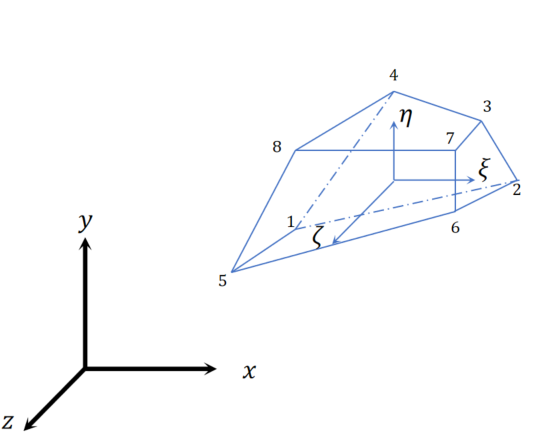

定义：

$$
\boldsymbol{q}^{i}=\begin{Bmatrix}\boldsymbol{r}_{i}\\\Lambda_{i}\\\boldsymbol{q}_{f}^{j}\end{Bmatrix}
$$

定义第$k$个单元的节点位移为$\boldsymbol{q}_{k}^{j}$,其与$\boldsymbol{q}_{f}^{j}$的关系为：

$$
\begin{aligned}
\boldsymbol{q}_{k}^{j} &= \begin{Bmatrix}
q_{x}^{j,1}\\
q_{y}^{j,1}\\
q_{y}^{j,1}\\
.\\
.\\
.\\
q_{x}^{j,8}\\
q_{y}^{j,8}\\
q_{y}^{j,8}
\end{Bmatrix} \\
&= \begin{bmatrix}
C
\end{bmatrix}
\begin{Bmatrix}
q_{x}^{1}\\
q_{y}^{1}\\
q_{z}^{1}\\
.\\
.\\
.\\
q_{x}^{NbOfDof}\\
q_{y}^{NbOfDof}\\
q_{z}^{NbOfDof}
\end{Bmatrix}
\end{aligned}
$$

则单元的动能为：

$$
T^{ij}=\frac{1}{2}{\dot{\boldsymbol{q}}^{i}}^{T}M^{ij}\dot{\boldsymbol{q}}^{i}
$$

$$
\begin{aligned}
M^{ij} &= \int_{\rho_{ij}}\begin{bmatrix}
I&-2A^{i}\tilde{u}L^{i}&A^{i}S_{f}\\
 &4{L^{i}}^{T}{\tilde{u}}^{T}\tilde{u}L^{i}&2{L^{i}}^{T}\tilde{u}S_{f}\\
 & &S_{f}^{T}S_{f}
\end{bmatrix}\,\mathrm{d}V^{ij} \\
&= \begin{bmatrix}
m_{RR} & m_{R\theta} & m_{Rf}\\
& m_{\theta\theta} & m_{\theta f}\\
& & m_{ff}
\end{bmatrix}^{ij}
\end{aligned}
$$

$$
\begin{aligned}
m_{RR} &= \int_{V^{ij}}\rho^{ij}\boldsymbol{I}\,\mathrm{d}V^{ij} \\
&= m^{ij}\boldsymbol{I}_{3\times3}
\end{aligned}
$$

$$
\begin{aligned}
m_{R\theta} &= -2A^{i}(\int_{V^{ij}}\rho^{ij}\tilde{u}\,\mathrm{d}V^{ij})L^{i} \\
&= -2A^{i}(\int_{V^{ij}}\rho^{ij}\tilde{\bar{u}^{ij}}\,\mathrm{d}V^{ij}+\int_{V^{ij}}\rho^{ij}\tilde{u_{f}}\,\mathrm{d}V^{ij})L^{i}
\end{aligned}
$$

$$
m_{Rf}=A^{i}\int_{V^{ij}}\rho^{ij}S_{f}\,\mathrm{d}V^{ij}
$$

$$
\begin{aligned}
m_{\theta\theta} &= \int_{V^{ij}}\rho^{ij}\tilde{u}^{T}\tilde{u}\,\mathrm{d}V^{ij} \\
&= \int_{V^{ij}}\rho^{ij}
\begin{bmatrix}
u_{3}^{2}+u_{2}^{2}&-u_{1}u_{2}&-u_{1}u_{3}\\
-u_{1}u_{2}&u_{3}^{2}+u_{1}^{2}&-u_{2}u_{3}\\
-u_{1}u_{3}&-u_{2}u_{3}&u_{1}^{2}+u_{2}^{2}
\end{bmatrix}\,\mathrm{d}V^{ij}
\end{aligned}
$$

其中，

$$
\begin{aligned}
\int_{V^{ij}}\rho^{ij}u_{k}^{2}\,\mathrm{d}V^{ij} &= \int_{V^{ij}}\rho^{ij}(\bar{u}^{ij}_{k}+\sum_{s=1}^{8}N_{s}q_{f}^{k})^{2}\,\mathrm{d}V^{ij} \\
&= \int_{V^{ij}}\rho^{ij} (\bar{u}^{ij}_{k})^{2}\,\mathrm{d}V^{ij}+\int_{V^{ij}}\rho^{ij}(\sum_{s=1}^{8}N_{s}q_{f}^{k})^{2}\,\mathrm{d}V^{ij}+2\int_{V^{ij}}\rho^{ij}\bar{u}^{ij}_{k}\sum_{s=1}^{8}N_{s}q_{f}^{k}\,\mathrm{d}V^{ij}
\end{aligned}
$$

$$
\int_{V^{ij}}\rho^{ij}u_{k}u_{l}\,\mathrm{d}V^{ij}=\int_{V^{ij}}\rho^{ij}(\bar{u}^{ij}_{k}+\sum_{s=1}^{8}N_{s}q_{f}^{k})(\bar{u}^{ij}_{l}+\sum_{s=1}^{8}N_{s}q_{f}^{l})\,\mathrm{d}V^{ij}
$$

$$
\begin{aligned}
m_{\theta f} &= 2{L^{i}}^{T}\int_{V^{ij}}\rho^{ij}\tilde{u}S_{f}\,\mathrm{d}V^{ij} \\
&= 2{L^{i}}^{T}\int_{V^{ij}}\rho^{ij}
\begin{Bmatrix}
S_{f}^{3}u_{2}-S_{f}^{2}u_{3}\\
S_{f}^{1}u_{3}-S_{f}^{3}u_{1}\\
S_{f}^{2}u_{1}-S_{f}^{1}u_{2}
\end{Bmatrix}\,\mathrm{d}V^{ij}
\end{aligned}
$$

其中，

$$
S_{f}^{3}u_{2}=S_{f}^{3}\bar{u}_{2}^{ij}+S_{f}^{3}(\sum_{k=1}^{8}N_{k}q_{f,2}^{k})
$$

##### 5.3 柔性体的势能
&nbsp;&nbsp;首先考虑线弹性材料的情况。

连续性方程：

$$
\begin{Bmatrix}\sigma\end{Bmatrix}=\begin{bmatrix}Q\end{bmatrix}\begin{Bmatrix}\epsilon\end{Bmatrix}
$$

应变与位移的关系：

$$
\begin{aligned}
\begin{Bmatrix}\epsilon\end{Bmatrix} &= \begin{Bmatrix}\epsilon_{x}\\\epsilon_{y}\\\epsilon_{z}\\\gamma_{xy}\\\gamma_{yz}\\\gamma_{zx}\end{Bmatrix} \\
&= \begin{bmatrix}B\end{bmatrix}\begin{Bmatrix}u_{1}\\v_{1}\\w_{1}\\.\\.\\.\\u_{8}\\v_{8}\\w_{8}\end{Bmatrix}
\end{aligned}
$$

$$
\begin{bmatrix}eK\end{bmatrix}^{j} = \int_{V^{ij}}\begin{bmatrix}B\end{bmatrix}^{T}\begin{bmatrix}Q\end{bmatrix}\begin{bmatrix}B\end{bmatrix}\,\mathrm{d}V^{ij}
$$

$$
K_{ff}=\sum_{j=1}^{n_{e}}\begin{bmatrix}eK\end{bmatrix}^{j}
$$

考虑到刚体移动与转动的坐标，刚度矩阵为：

$$
K=\begin{bmatrix}
0&0&0\\
0&0&0\\
0&0&K_{ff}
\end{bmatrix}
$$

##### 5.4 约束的处理
###### 5.4.1 俩柔性体之间的约束

$$
\begin{aligned}
\boldsymbol{r}^{ij}_{\alpha} &= r^{\alpha}+R^{\alpha}{L^{\alpha}}^{T}(\bar{u}^{ij}_{\alpha}+u_{f}^{\alpha}) \\
\boldsymbol{r}^{ij}_{\beta} &= r^{\beta}+R^{\beta}{L^{\beta}}^{T}(\bar{u}^{ij}_{\beta}+u_{f}^{\beta})
\end{aligned}
$$

$$
u_{f}^{\alpha}=\frac{1}{n_{slavenodes}}\sum_{k=1}^{n_{slavenodes}}u_{f,k}^{\alpha}
$$

$$
u_{f}^{\beta}=\frac{1}{n_{slavenodes}}\sum_{k=1}^{n_{slavenodes}}u_{f,k}^{\beta}
$$

  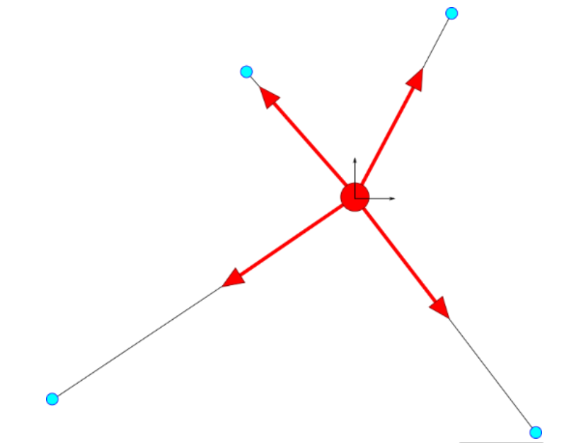

$$
\boldsymbol{h}=\boldsymbol{r}_{\beta}^{ij}-\boldsymbol{r}_{\alpha}^{ij}
$$

相对移动约束

$$
\boldsymbol{h}\cdot d_{\beta}=0
$$

相对移动速度约束

$$
\dot{\boldsymbol{h}}\cdot d_{\beta}+\boldsymbol{h}\cdot\dot{d_{\beta}}=0
$$

$$
(\dot{\boldsymbol{r}}_{\beta}+\omega_{\beta}\times(u_{\beta}+u_{f}^{\beta})+\dot{u}_{f}^{\beta}-\dot{{\boldsymbol{r}}}_{\alpha}-\omega_{\alpha}\times u_{\alpha})\cdot{\boldsymbol{d}}_{\beta}+\boldsymbol{h}\cdot \dot{d}_{\beta}=0
$$

$$
\begin{aligned}
\dot{u}_{f}^{\beta}\cdot d_{\beta} &= \frac{1}{s}\begin{bmatrix}
d_{\beta}^{1}&d_{\beta}^{2}&d_{\beta}^{3}\end{bmatrix}\begin{Bmatrix}
\dot{u}_{f,x}^{\beta}\\
\dot{u}_{f,y}^{\beta}\\
\dot{u}_{f,z}^{\beta}
\end{Bmatrix} \\
&= \frac{1}{s}\begin{bmatrix}
d_{\beta}^{1}&d_{\beta}^{2}&d_{\beta}^{3}\end{bmatrix}\begin{Bmatrix}
\dot{u}_{f,x}^{\beta,1}+\cdots +\dot{u}_{f,x}^{\beta,s}\\
\dot{u}_{f,y}^{\beta,1}+\cdots +\dot{u}_{f,y}^{\beta,s}\\
\dot{u}_{f,z}^{\beta,1}+\cdots +\dot{u}_{f,z}^{\beta,s}
\end{Bmatrix}
\end{aligned}
$$

###### 5.4.2 柔性体与刚性体之间的约束

##### 5.5 柔性体上载荷的处理

#### 拉格朗日方程

$$
\frac{d}{\,\mathrm{d}t}(\frac{\partial L}{\partial \dot{q}})-\frac{\partial L}{\partial q}=Q
$$

式中，$L=T-V$,$T$为系统动能，$V$为系统势能。

### 六、Geometrically Exact Beam Theory(GEBT)
GEBT supports full geometric nonlinearity and large deformation, with beding,torsion,shear and extension degree-of-freedom;anisotropic composite material couplings (using full $6\times6$ mass and stiffness matrices, including bending-twist coupling);and a reference axis that permits blades that not straight.

The blade geometry is defined through a curcilinear blade reference axis by a series of key points in three-dimensional space along with the initial twist angles at these points.

#### Modeling curved beam
A curve is the locus of the points generated by a single parameter, such that the position vector, $\begin{Bmatrix}p_{0}\end{Bmatrix}$ can be written as

$$
\begin{Bmatrix}p_{0}\end{Bmatrix}=\begin{Bmatrix}p_{0}(s)\end{Bmatrix}
$$

$$
\begin{aligned}
\bar{t} &= \frac{dp_{0}}{\,\mathrm{d}s},\bar{n} \\
&= \rho\frac{d\bar{t}}{\,\mathrm{d}s},1/\rho \text{ is the curvature ofthe curve},\frac{1}{\rho} \\
&= \|\frac{d\bar{t}}{\,\mathrm{d}s}\|
\end{aligned}
$$

  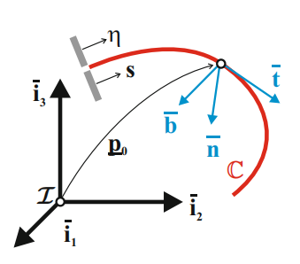

#### Governing equations

$$
\begin{aligned}
\begin{Bmatrix}\dot{h}\end{Bmatrix}-\begin{Bmatrix}F^{\prime}\end{Bmatrix} &= \begin{Bmatrix}f\end{Bmatrix} \\
\begin{Bmatrix}\dot{g}\end{Bmatrix}+\begin{bmatrix}\dot{\tilde{u}}\end{bmatrix}\begin{Bmatrix}h\end{Bmatrix}-\begin{Bmatrix}M^{\prime}\end{Bmatrix}-(\begin{bmatrix}\tilde{x}_{0}^{\prime}\end{bmatrix}+\begin{bmatrix}\tilde{u}^{\prime}\end{bmatrix})\begin{Bmatrix}F\end{Bmatrix} &= \begin{Bmatrix}m\end{Bmatrix}
\end{aligned}
$$

where,$\begin{Bmatrix}h\end{Bmatrix}$ and $\begin{Bmatrix}g\end{Bmatrix}$ are the linear and angular momenta resolved in the inertial coodinate system,respectively;$\begin{Bmatrix}F\end{Bmatrix}$ and $\begin{Bmatrix}M\end{Bmatrix}$ are the beam's sectioal force and moment resultants, respectively;$\begin{Bmatrix}u\end{Bmatrix}$ is the one-dimensional displacement of a point on the reference line;$\begin{Bmatrix}x_{0}\end{Bmatrix}$ is the position vector of a point along the beam's reference line; and $\begin{Bmatrix}f\end{Bmatrix}$ and $\begin{Bmatrix}m\end{Bmatrix}$ are the distributed force and moment applied to the beam structure.Notation $(\cdot)^{\prime}$ indicates a derivative with respect to bean axis $x_{1}$.

$$
\begin{aligned}
\begin{Bmatrix}
h\\
g
\end{Bmatrix} &= \begin{bmatrix}
M_{s}
\end{bmatrix}
\begin{Bmatrix}
\dot{u}\\
\omega\end{Bmatrix} \\
\begin{Bmatrix}
F\\
M
\end{Bmatrix} &= \begin{bmatrix}
S\end{bmatrix}
\begin{Bmatrix}
\epsilon\\
\kappa\end{Bmatrix}
\end{aligned}
$$

where,$M_{s}$ and $S$ are $6\times6$ scetional mass and stiffness matrices,respectively.$\epsilon$ and $\kappa$ are the strains and curvatures,respectively.$\omega$ is the augular velocity that is defined by the rotation tensor R as $\omega=\operatorname{axial}(\dot{R}R^{T})$.

$$
\begin{Bmatrix}
\epsilon\\
\kappa
\end{Bmatrix}=
\begin{Bmatrix}
x_{0}^{\prime}+u^{\prime}-(RR_{0})i_{1}\\
k
\end{Bmatrix}
$$

where, $k=\operatorname{axial}[(RR_{0})^{\prime}(RR_{0})^{T}]$,$R_{0}$ brings inertial reference frame to reference configuration,resolved in basis inertial frame;$R$ brings reference configuration to deformed configuration, resolved in basis inertial frame.

  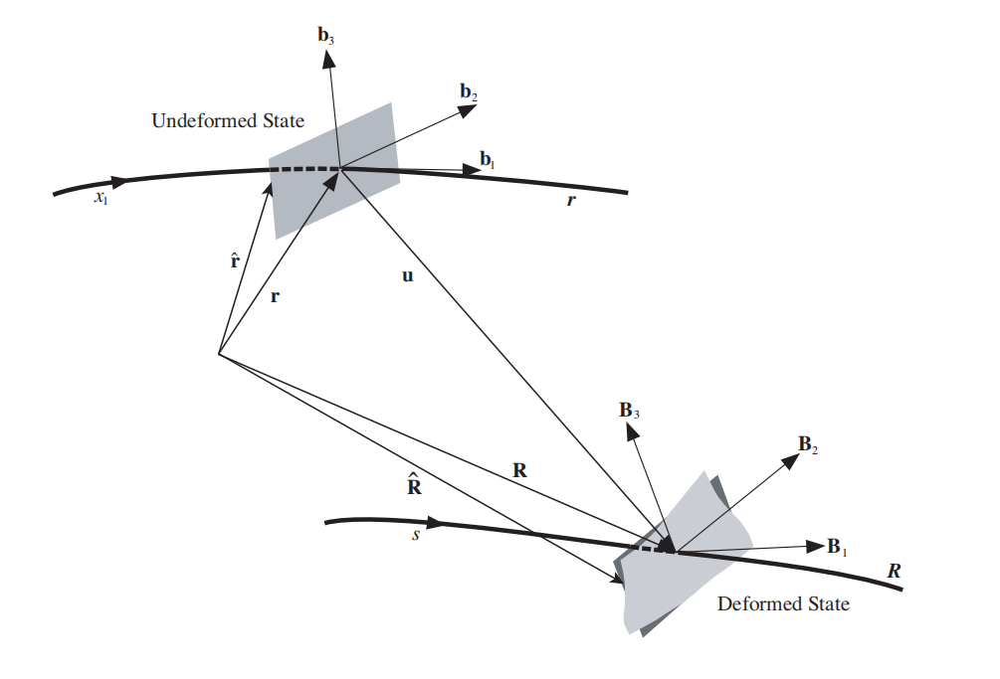

### 接触与碰撞

#### 接触检测
&ensp;&ensp;层次包围盒算法作为当前广泛认可且效果显著的碰撞检测技术，在虚拟仿真领域被广泛接受。该算法的核心理念是，利用体积较大但几何形状简化的包围盒来近似包络复杂几何物体，以此简化碰撞检测的计算复杂度，通过判断这些包围盒是否存在重叠，来快速判定目标物体间是否发生碰撞事件。作为快速检测到碰撞部位的应用目标，AABB包围盒是一个比较好的选择，AABB包围盒自身构造简单，更新速率快，检测难度和包围盒的紧密程度表现适中。
##### 层次包围盒树状结构的构建
AABB包围盒是沿坐标轴方向的平行六面体，构建时需要确定该某个物体在三个坐标轴方向上的最大、最小值，据此生成与其尺寸相符的AABB包围盒。

#### 接触力计算
接触碰撞在物理上都必须在满足非穿透性条件的基础上进行合理假设：

$$
g_{N}\geq,p_{N}\leq 0,g_{N}p_{N}=0
$$

通过在可能的物体边界上定义距离函数$g_{N}$和法向应力$p_{N}$，规定只有在接触的区内$g_{N}=0$,而非接触区域$g_{N}$必须大于0。同样，接触区域内不能承受拉应力，这种法向接触的互补条件导致接触问题成为一种典型的单面约束的非线性问题。

&ensp;&ensp;根据接触碰撞描述方法的不同，工程中常用的接触碰撞建模方法主要分为：恢复系数法，连续力模型和有限元方法。根据是否关注碰撞过程可以将接触碰撞分为刚性碰撞和弹性碰撞，恢复系数法是典型的刚性碰撞处理方法，通过定义一个恢复系数来描述物体碰撞前后速度、能量等状态变量的变化，结合冲量-动量法直接求解，并不关心碰撞的过程；在大多数情况下，人们需要关注接触碰撞的动态过程，比如接触区域的变化，接触力的大小，局部应力等信息，因此需要将接触碰撞分为碰撞前、碰撞过程、以及碰撞后三个阶段，在碰撞过程中可以使用连续力模型以及有限元方法等对接触碰撞问题进行建模并求解。

#### 连续碰撞力模型
&ensp;&ensp;在经典的Hertz碰撞理论中，工程中应用最多的球面碰撞的碰撞力模型如下：

$$
\begin{aligned}
F &= K\delta^{\frac{3}{2}} \\
K &= \frac{4\sqrt{\frac{R_{1}R_{2}}{R_{1}+R_{2}}}}{3(\frac{1-\mu_{1}^{2}}{E_{1}}+\frac{1-\mu_{2}^{2}}{E_{2}})}
\end{aligned}
$$

  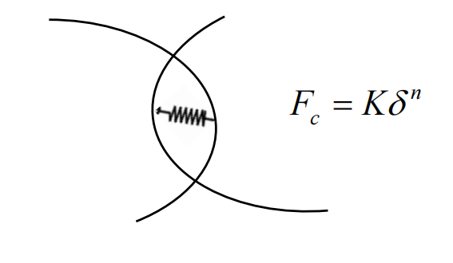

碰撞一般都以碰撞对形式出现，碰撞对的两个物体分别为物体$\alpha$、物体$\beta$，碰撞点在全局坐标系的坐标向量分别为$\boldsymbol{u}^{\alpha}$、$\boldsymbol{u}^{\beta}$,物体$\beta$面的法向向量在全局坐标系中为$\boldsymbol{n}^{\beta}$,则广义碰撞力为：

$$
\begin{Bmatrix}
\boldsymbol{F}
\end{Bmatrix}=K\delta^{n}\begin{Bmatrix}
\boldsymbol{n}^{\beta}\\
2{R^{\alpha}}^{T}(u^{\alpha}\times\boldsymbol{n}^{\beta})\\
-\boldsymbol{n}^{\beta}\\
-2{R^{\beta}}^{T}(u^{\beta}\times\boldsymbol{n}^{\beta})
\end{Bmatrix}
$$

#### 有限元接触方法
&ensp;&ensp;在有限元中，接触碰撞问题中的接触面被里离散为一系列接触节点和单元，通过描述这些节点单元间的约束关系来对接触碰撞进行模拟，接触碰撞界面间的约束处理方法主要包括罚函数和拉格朗日乘子法。

  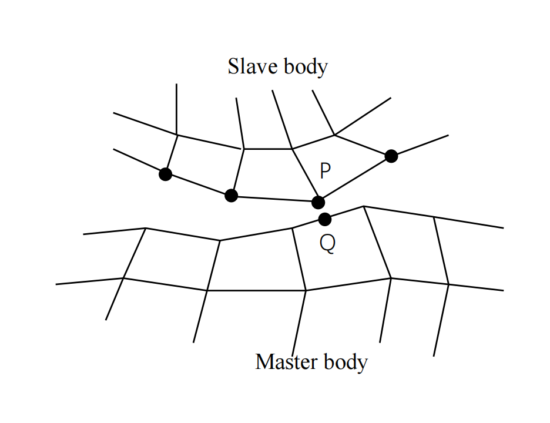

##### Decoupled nonsmooth generalized-$\alpha$ time integration scheme

1:Inputs:initial values $q_{0}$ and $v_{0}$

2:Compute consistent value of $\dot{\tilde{v_{0}}}$

3:$a_{0}=\dot{\tilde{v_{0}}}$

4:for $n=0$ to $n_{final}-1$ do

5:&nbsp;&nbsp;&nbsp;&nbsp;$\dot{\tilde{v_{0}}}_{n+1}=0$,$\tilde{\lambda}_{n+1}^{\bar{U}}=0$,$v_{n+1}=0$

6:&nbsp;&nbsp;&nbsp;&nbsp;$\Lambda_{n+1}=0$,$U_{n+1}=0$,$W_{n+1}=0$

7:&nbsp;&nbsp;&nbsp;&nbsp;$a_{n+1}=\frac{1}{1-\alpha_{m}}(\alpha_{f}\dot{\tilde{v_{n}}}-\alpha_{m}a_{n})$

8:&nbsp;&nbsp;&nbsp;&nbsp;$v_{n+1}=\tilde{v}_{n+1}=v_{n}+h(1-\gamma)a_{n}+h\gamma a_{n+1}$

9:&nbsp;&nbsp;&nbsp;&nbsp;$q_{n+1}=q_{n}+hv_{n}+h^{2}(0.5-\beta)a_{n}+h^2\beta a_{n+1}$

10:&nbsp;&nbsp;&nbsp;&nbsp;Step1(smooth motion):

11:&nbsp;&nbsp;&nbsp;&nbsp;for $i=1$ to $i_{max}$ do

12:&nbsp;&nbsp;&nbsp;&nbsp;&nbsp;&nbsp;&nbsp;&nbsp;Compute residual $r^{s}$

13:&nbsp;&nbsp;&nbsp;&nbsp;&nbsp;&nbsp;&nbsp;&nbsp;if $\|r^{s}\|<tol$,then break end if

14:&nbsp;&nbsp;&nbsp;&nbsp;&nbsp;&nbsp;&nbsp;&nbsp;Compute the iteration matrix $S_{t}^{s}$

15:&nbsp;&nbsp;&nbsp;&nbsp;&nbsp;&nbsp;&nbsp;&nbsp;$\Delta x^{s}=-(S_{t}^{s})^{-1}r^{s}$

16:&nbsp;&nbsp;&nbsp;&nbsp;&nbsp;&nbsp;&nbsp;&nbsp;$\tilde{v}_{n+1}=\tilde{v}_{n+1}+\Delta \tilde{v}$

17:&nbsp;&nbsp;&nbsp;&nbsp;&nbsp;&nbsp;&nbsp;&nbsp;$\dot{\tilde{v}}_{n+1}=\dot{\tilde{v}}_{n+1}+\frac{1-\alpha_{m}}{(1-\alpha_{f})\gamma h}\Delta \tilde{v}$

18:&nbsp;&nbsp;&nbsp;&nbsp;&nbsp;&nbsp;&nbsp;&nbsp;$q_{n+1}=q_{n+1}+\frac{h\beta}{\gamma}\Delta \tilde{v}$

19:&nbsp;&nbsp;&nbsp;&nbsp;&nbsp;&nbsp;&nbsp;&nbsp;$\tilde{\lambda}_{n+1}^{\bar{U}}=\tilde{\lambda}_{n+1}^{\bar{U}}+\Delta \tilde{\lambda}^{\bar{U}}$

20:&nbsp;&nbsp;&nbsp;&nbsp;end for

21:&nbsp;&nbsp;&nbsp;&nbsp;Step 2(projection on position constraints):

22:&nbsp;&nbsp;&nbsp;&nbsp;for $i=1$ to $i_{max}$ do

23:&nbsp;&nbsp;&nbsp;&nbsp;&nbsp;&nbsp;&nbsp;&nbsp;Compute residual $r^{p}$

24:&nbsp;&nbsp;&nbsp;&nbsp;&nbsp;&nbsp;&nbsp;&nbsp; if $\|r^{p}\|\le tol$ then break;end if

25:&nbsp;&nbsp;&nbsp;&nbsp;&nbsp;&nbsp;&nbsp;&nbsp;Compute $S_{t}^{p}$

26:&nbsp;&nbsp;&nbsp;&nbsp;&nbsp;&nbsp;&nbsp;&nbsp;$\Delta x^{p}=-(S_{t}^{p})^{-1}r^{p}$

27:&nbsp;&nbsp;&nbsp;&nbsp;&nbsp;&nbsp;&nbsp;&nbsp;$U_{n+1}=U_{n+1}+\Delta U$

28:&nbsp;&nbsp;&nbsp;&nbsp;&nbsp;&nbsp;&nbsp;&nbsp;$q_{n+1}=q_{n+1}+\Delta U$

29:&nbsp;&nbsp;&nbsp;&nbsp;&nbsp;&nbsp;&nbsp;&nbsp;
$v_{n+1}=v_{n+1}+\Delta v$

30:&nbsp;&nbsp;&nbsp;&nbsp;&nbsp;&nbsp;&nbsp;&nbsp;end for

31:&nbsp;&nbsp;&nbsp;&nbsp;Step3(projection on velocity constraints):

32:&nbsp;&nbsp;&nbsp;&nbsp;for $i=1$ to $i_{max}$ do

33:&nbsp;&nbsp;&nbsp;&nbsp;&nbsp;&nbsp;&nbsp;&nbsp;Compute residual $r^{v}$

34:&nbsp;&nbsp;&nbsp;&nbsp;&nbsp;&nbsp;&nbsp;&nbsp; if $\|r^{v}\|\le tol$ then break;end if

35:&nbsp;&nbsp;&nbsp;&nbsp;&nbsp;&nbsp;&nbsp;&nbsp;Compute $S_{t}^{v}$

34:&nbsp;&nbsp;&nbsp;&nbsp;&nbsp;&nbsp;&nbsp;&nbsp;$\Delta x^{v}=-(S_{t}^{v})^{-1}r^{v}$

35:&nbsp;&nbsp;&nbsp;&nbsp;&nbsp;&nbsp;&nbsp;&nbsp;$W_{n+1}=W_{n+1}+\Delta W$

36:&nbsp;&nbsp;&nbsp;&nbsp;&nbsp;&nbsp;&nbsp;&nbsp;$v_{n+1}=\tilde{v}_{n+1}+W_{n+1}$

37:&nbsp;&nbsp;&nbsp;&nbsp;&nbsp;&nbsp;&nbsp;&nbsp;
$\Lambda_{n+1}=\Lambda_{n+1}+\Delta\Lambda$

38:&nbsp;&nbsp;&nbsp;&nbsp;&nbsp;&nbsp;&nbsp;&nbsp;end for

39:&nbsp;&nbsp;&nbsp;&nbsp;&nbsp;&nbsp;&nbsp;&nbsp;$a_{n+1}=a_{n+1}+\frac{1-\alpha_{f}}{1-\alpha_{m}}\dot{\tilde{v}}_{n+1}$

40:end for

### 柔性体建模
#### 柔性体上任意一点位移与速度的描述-浮动坐标系法
位移

$$
\begin{aligned}
\boldsymbol{r}_{P} &= \boldsymbol{r}_{o}+(\boldsymbol{u}+\boldsymbol{u}_{f}) \\
&= {\begin{Bmatrix}\boldsymbol{\mathit{r}}_{o}\end{Bmatrix}}^{T}\begin{Bmatrix}\boldsymbol{\mathit{i}}_{o}\end{Bmatrix}+({\begin{Bmatrix}\boldsymbol{\mathit{u}}\end{Bmatrix}}^{T}+{\begin{Bmatrix}\boldsymbol{\mathit{u}}_{f}\end{Bmatrix}}^{T})\begin{Bmatrix}\boldsymbol{\mathit{i}}_{b}\end{Bmatrix}
\end{aligned}
$$

在全局坐标系中为：

$$
\boldsymbol{r}_{P}=\begin{Bmatrix}\boldsymbol{\mathit{r}}_{o}\end{Bmatrix}+\begin{bmatrix}A\end{bmatrix}(\begin{Bmatrix}\boldsymbol{\mathit{u}}\end{Bmatrix}+\begin{Bmatrix}\boldsymbol{\mathit{u}}_{f}\end{Bmatrix})
$$

速度

$$
\dot{\boldsymbol{r}}_{P} = \dot{\boldsymbol{r}}_{o}+\boldsymbol{\omega}\times(\boldsymbol{u}+\boldsymbol{u}_{f})+\dot{\boldsymbol{u}}_{f}
$$

用欧拉四元数表示为：

$$
\begin{aligned}
\dot{\boldsymbol{r}}_{P} &= \begin{Bmatrix}\dot{\boldsymbol{\mathit{r}}}_{o}\end{Bmatrix}+\begin{bmatrix}A\end{bmatrix}(-2(\begin{bmatrix}\tilde{u}\end{bmatrix}+\begin{bmatrix}\tilde{u_{f}}\end{bmatrix})\begin{bmatrix}L\end{bmatrix}\begin{Bmatrix}\dot{\Lambda}\end{Bmatrix}+\begin{Bmatrix}\dot{u}_{f}\end{Bmatrix}) \\
 &= \begin{bmatrix}\boldsymbol{I}_{3\times3} & -2A(\tilde{u}+\tilde{u_{f}})L&A\end{bmatrix}\begin{Bmatrix}\dot{r}_{o}\\\dot{\Lambda}\\\dot{u}_{f}\end{Bmatrix}
\end{aligned}
$$

假设该点的质量为$dm$,则其动能为：

$$
\begin{aligned}
dE_{k} &= \frac{1}{2}dm\begin{Bmatrix}\dot{r}_{P}\end{Bmatrix}^{T}\begin{Bmatrix}\dot{r}_{P}\end{Bmatrix} \\
&=  \\
\frac{1}{2}dm\begin{Bmatrix}\dot{r}_{o}\\\dot{\Lambda}\\\dot{u}_{f}\end{Bmatrix}^{T}\begin{bmatrix}\boldsymbol{I}_{3\times3} \\ 2L^{T}(\tilde{u}+\tilde{u_{f}})A^{T} \\ A^{T}\end{bmatrix}\begin{bmatrix}\boldsymbol{I}_{3\times3} & -2A(\tilde{u}+\tilde{u_{f}})L&A\end{bmatrix}\begin{Bmatrix}\dot{r}_{o}\\\dot{\Lambda}\\\dot{u}_{f}\end{Bmatrix}
\end{aligned}
$$

对于柔性体$\gamma$,用有限元对实体进行离散，以8节点等参元为例，各个节点在浮动坐标系中的坐标为

$$
\boldsymbol{r}_{\gamma}=\begin{Bmatrix}\begin{aligned}x_{\gamma}^{i} \\ y_{\gamma}^{i} \\ z_{\gamma}^{i}\end{aligned}
\end{Bmatrix}
$$

其中，$i=1,2,\cdots ,8$为节点编号。

单元内任何一点的坐标可以表示为：

$$
\begin{aligned}
x_{\gamma} &= \sum_{i=1}^{8}N_{i}x_{\gamma}^{i} \\
y_{\gamma} &= \sum_{i=1}^{8}N_{i}y_{\gamma}^{i} \\
z_{\gamma} &= \sum_{i=1}^{8}N_{i}z_{\gamma}^{i} \\

\end{aligned}
$$

单元内任意一点相对于浮动坐标系的位移也可以用相同的方式离散为：

$$
\begin{aligned}
u_{x} &= \sum_{i=1}^{8}N_{i}u_{x}^{i} \\
u_{y} &= \sum_{i=1}^{8}N_{i}u_{y}^{i} \\
u_{z} &= \sum_{i=1}^{8}N_{i}u_{z}^{i} \\

\end{aligned}
$$

用矩阵表示为：

$$
\begin{aligned}
u_{f} &= \begin{Bmatrix}u_{x} \\ u_{y} \\ u_{z}\end{Bmatrix} \\
&= \begin{bmatrix}N_{1}\quad 0 \quad 0\quad\cdots \quad N_{8}\quad 0 \quad 0 \\0\quad N_{1}\quad0\quad\cdots \quad 0 \quad N_{8}\quad 0 \\ 0 \quad 0 \quad N_{1}\quad\cdots \quad 0 \quad 0 \quad N_{8}\end{bmatrix}\begin{Bmatrix}u_x^{1}\\u_{y}^{1}\\u_{z}^{1}\\.\\.\\.\\u_{x}^{8}\\u_{y}^{8}\\u_{z}^{8}\end{Bmatrix}
\end{aligned}
$$

则动能方程可以改写为：

$$
\begin{aligned}
dE_{k} &= \frac{1}{2}\rho\begin{Bmatrix}\dot{r}_{o}\\\dot{\Lambda}\\\dot{q}_{f}\end{Bmatrix}^{T}\begin{bmatrix}\boldsymbol{I}_{3\times3} \\ 2L^{T}(\tilde{u}+\tilde{u_{f}})A^{T} \\ S^{T}_{24\times3}A^{T}\end{bmatrix}\begin{bmatrix}\boldsymbol{I}_{3\times3} & -2A(\tilde{u}+\tilde{u_{f}})L&AS_{3\times24}\end{bmatrix}\begin{Bmatrix}\dot{r}_{o}\\\dot{\Lambda}\\\dot{q}_{f}\end{Bmatrix}\,\mathrm{d}V
\end{aligned}
$$

柔性体的动能为：

$$
\begin{aligned}
E_{k} &= \sum_{i=1}^{NE}E_{ele}^{i} \\
&= \sum_{i=1}^{NE}\iiint_{V_{ele}}dE_{k} \\
 &= \frac{1}{2}\sum_{i=1}^{NE}\iiint_{V_{ele}}\rho\begin{Bmatrix}\dot{r}_{o}\\\dot{\Lambda}\\\dot{q}_{f}\end{Bmatrix}^{T}\begin{bmatrix}\boldsymbol{I}_{3\times3} & -2A(\tilde{u}+\tilde{u_{f}})L&AS_{3\times24}\\
2L^{T}(\tilde{u}+\tilde{u_{f}})A^{T} & 4L^{T}(\tilde{u}+\tilde{u_{f}})(\tilde{u}+\tilde{u_{f}})L & 2L^{T}(\tilde{u}+\tilde{u_{f}})S_{3\times24}\\
S_{24\times3}^{T}A^{T}& -2S_{24\times3}^{T}(\tilde{u}+\tilde{u_{f}})L& S_{24\times3}^{T}S_{3\times24}\end{bmatrix}\begin{Bmatrix}\dot{r}_{o}\\\dot{\Lambda}\\\dot{q}_{f}\end{Bmatrix}dVdV_{ele} \\
 &= \frac{1}{2}\sum_{i=1}^{NE}\begin{Bmatrix}
\dot{r}_{o}\\\dot{\Lambda}\\\dot{q}_{f}
\end{Bmatrix}^{T}\begin{bmatrix}m_{RR} & m_{R\theta} & m_{Rf}\\m_{\theta R} & m_{\theta\theta} &m_{\theta f}\\m_{fR} & m_{f\theta} & m_{ff}\end{bmatrix}\begin{Bmatrix}\dot{r}_{o}\\\dot{\Lambda}\\\dot{q}_{f}\end{Bmatrix}
\end{aligned}
$$

### 液压系统建模

#### Basic structure of hydraulic servo-systems
液压伺服系统的基本构成包括：

-. hydraulic power supply

-. control elements(valves,sensors,etc.)

-. actuating elements(cylinder and/or motors)

-. other elements

  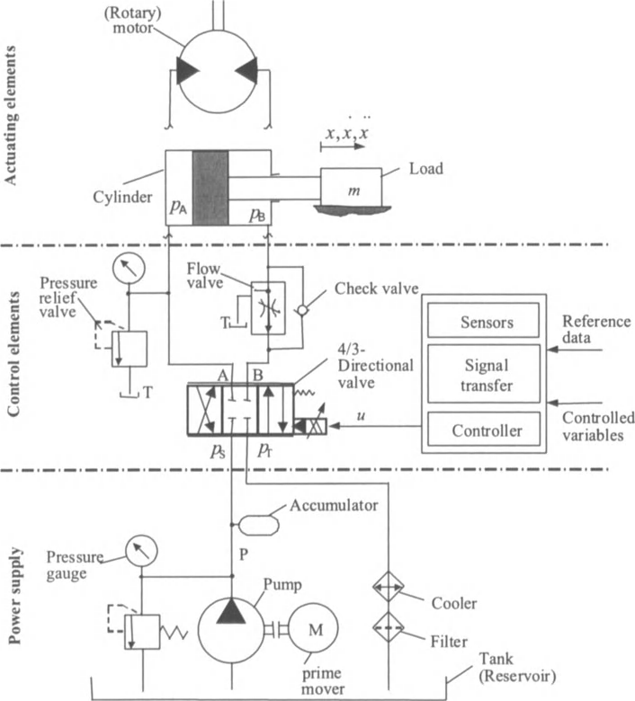

#### 液压伺服系统分类

-. 阀控制系统

-. 泵/马达控制系统

-. 负载调节系统

#### 控制
Hydraulic servo-systems, in-general, are used to control one or more of the following actuator output variables: direction,velocity,acceleration,deceleration,position of force against a resisting load.

  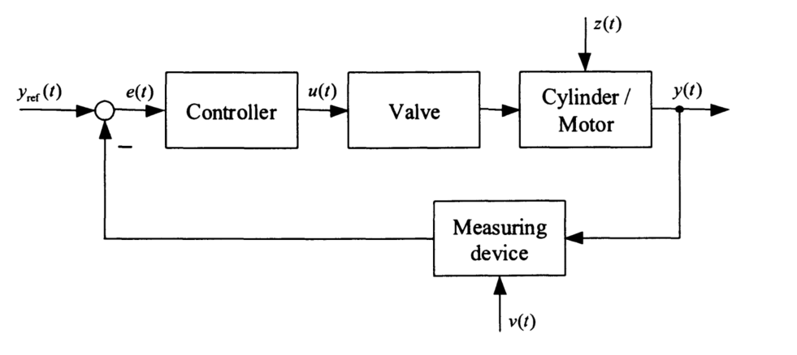

#### 连续性方程

$$
\sum \dot{m}_{in}-\sum \dot{m}_{out}=\rho\dot{V} +V\dot{\rho}
$$

密度与压力的关系：

$$
\begin{aligned}
\rho &= \rho_{i}+\frac{\rho}{E}p \\
E &= -V_{0}(\frac{\partial p}{\partial V})_{\theta}
\end{aligned}
$$

#### 溢流阀
&nbsp;&nbsp;溢流阀是通过阀口的溢流，使被控制系统或回路的压力维持恒定，实现调压、稳压、限压的功能。

$$
\begin{aligned}
m_{e}\ddot{x}+F_{f}(\dot{x})+K_{s}x+F_{ax}(x,ps) &= A_{ss}p_{c}-F_{0} \\
\dot{p_{c}} &= \frac{V_{t}}{E^{\prime}}(\alpha_{d}A_{re}\operatorname{sign}(p_{c}-p_{s})\sqrt{\frac{2}{\rho}|p_{c}-p_{s}|}-A_{ss}\dot{x}) \\
\dot{p_{s}} &= \frac{V_{c}}{E^{\prime}}(Q_{pu}-Q_{L}-\alpha_{d}A_{re}\operatorname{sign}(p_{c}-p_{s})\sqrt{\frac{2}{\rho}|p_{c}-p_{s}|}- \\
C_{L}p_{s}+\alpha_{d}A_{mo}(x)\operatorname{sign}(p_{s}-p_{T})\sqrt{\frac{2}{\rho}|p_{s}-p_{T}|})
\end{aligned}
$$

式中，$m_{e}$为阀芯与弹簧的质量（1/3的弹簧质量），$V_{t}$ is the total volume of the chamber where pressure is controlled, $F_{r}$为摩擦力，$x$为阀芯位移，$K_{s}$为弹簧刚度，$F_{ax}$为轴向flow force,$p_{c}$为压力，$F_{0}$为弹簧预压力，$\alpha_{d}$为流量系数，$A_{re}$为节流孔的面积，$Q_{pu}$为泵的流量，$C_{L}$为泄露系数，$A_{mo}$为主阀的面积，$E^{\prime}$为有效体积模量。

$$
A_{mo}=n_{0}(\frac{d_{0}^{2}}{4}\cos^{-1}(1-\frac{2x}{d_{0}})-(\frac{d_{0}}{2}-x)(x(d_{0}-x))^{\frac{1}{2}})
$$

  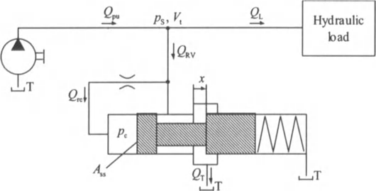

 

#### 液压缸

1. 连续性方程

$$
\begin{aligned}
Q_{A}-Q_{Li} &= \dot{V_{A}}+\frac{V_{A}}{E^{\prime}(p_{A})}\dot{p_{A}} \\
Q_{B}+Q_{Li} &= \dot{V_{B}}+\frac{V_{B}}{E^{\prime}(p_{B})}\dot{p_{B}}
\end{aligned}
$$

其中，$V_{A}$为无杆腔体积，$V_{B}$为有杆腔的体积，$Q_{Li}$为内部泄漏流量（从A腔流向B腔为正）：$Q_{Li}=C_{Li}(p_{B}-p_{A})$。
式中，两腔的体积计算公式为：

$$
\begin{aligned}
V_{A} &= V_{A0}+x_{p}A_{p} \\
V_{B} &= V_{B0}-x_{p}\alpha A_{p}
\end{aligned}
$$

假设初始状态液压杆位于中间位置，两腔的体积相等。

2. 推力方程

$$
F=(p_{A}-\alpha p_{B})A_{p}
$$

其中，$p$为液压腔的压力，该力同时作用在液压杆与液压缸上，大小相等，方向相反，作用在液压杆上的力的方向以Rod.MarkerI的Z方向为正方向。

#### 定量泵
定量泵是泵轴转动一周，泵所排出的液体体积固定不变的一种液压泵。
1. 不考虑泄露的流量方程

$$
Q=Vn
$$

其中，$Q$为流量，$V$为排量、单位$m^{3}/rev$,$n$为泵轴转速、单位$rev/s$。

note:在多体动力学计算中，转速的单位为$rad/s$，需要做转换。

##### 飞机液压控制典型回路
###### 飞机液压舵机
###### 飞机操纵系统典型回路
1. 副翼操纵系统回路

2. 升降舵操纵系统回路

3. 方向舵操纵系统回路

###### 飞机刹车系统典型回路
1. 正常刹车系统回路

2. 备用（应急）刹车系统回路

3. 防滞刹车系统回路

4. 自动刹车系统回路

###### 起落架系统典型回路
1. 起落架收放系统回路

2. 飞机转弯系统回路

###### 发动机反推系统典型回路

### DAE方程的Generalized-$\alpha$方法
#### 算法描述与求解流程
约束机械系统的动力学方程的一般形式为：

$$
\begin{aligned}
M(q)\ddot{q}+\Phi_{q}^{T}\sigma+\Phi_{\dot{q}}^{T}{\sigma}_{\dot{q}} &= f(q,\dot{q},t) \\
\Phi(q,\dot{q},t) &= 0
\end{aligned}
$$

引入辅助变量$a$,满足下述关系：

$$
\begin{aligned}
(1-\alpha_{m})a_{n+1}+\alpha_{m}a_{n} &= (1-\alpha_{f})\ddot{q}_{n+1}+\alpha_{f}\ddot{q}_{n} \\
a_{0} &= \ddot{q}_{0}
\end{aligned}
$$

位移与速度的插值公式为：

$$
\begin{aligned}
q_{n+1} &= q_{n}+h\dot{q}_{n}+h^{2}(\frac{1}{2}-\beta)a_{n}+h^{2}\beta a_{n+1} \\
\dot{q}_{n+1} &= \dot{q}_{n}+h(1-\gamma)a_{n}+h\gamma a_{n+1}
\end{aligned}
$$

得到如下的关系：

$$
\begin{aligned}
\frac{\partial \ddot{q}_{n+1}}{\partial q_{n+1}} &= \frac{1-\alpha_{m}}{h^{2}\beta(1-\alpha_{f})} \\
\frac{\partial \dot{q}_{n+1}}{\partial q_{n+1}} &= \frac{\gamma}{h\beta}
\end{aligned}
$$

在平衡位置附近展开

$$
\begin{aligned}
\begin{bmatrix}M\end{bmatrix}\Delta \ddot{q}+\frac{\partial}{\partial q}(\begin{bmatrix}M\end{bmatrix}\begin{Bmatrix}\ddot{q}\end{Bmatrix})\Delta q+\frac{\partial}{\partial q}(\Phi_{q}^{T}\sigma)\Delta q+\Phi_{q}^{T}\Delta\sigma-g_{q}\Delta q-g_{\dot{q}}\Delta \dot{q} \\
 &= g-\begin{bmatrix}M\end{bmatrix}\ddot{q}-\Phi_{q}^{T}\sigma
\end{aligned}
$$

$$
M(q)\ddot{q}={(M(q)\ddot{q})}_{0}+\frac{\partial}{\partial \lambda_{0}}(M(q)\ddot{q})\Delta \lambda_{0}+\frac{\partial}{\partial \lambda_{1}}(M(q)\ddot{q})\Delta \lambda_{1}+\frac{\partial}{\partial \lambda_{2}}(M(q)\ddot{q})\Delta \lambda_{2}+\frac{\partial}{\partial \lambda_{3}}(M(q)\ddot{q})\Delta \lambda_{3}
$$

$$
\begin{aligned}
\Phi_{q}^{T}\sigma &= (\Phi_{q}^{T}\sigma)_{0} \\
&quad {}+ \begin{bmatrix}\frac{\partial}{\partial x}(\Phi_{q}^{T}\sigma)&\frac{\partial}{\partial y}(\Phi_{q}^{T}\sigma)&\frac{\partial}{\partial z}(\Phi_{q}^{T}\sigma)&\cdots &\frac{\partial}{\partial \lambda_{3}}(\Phi_{q}^{T}\sigma)\end{bmatrix}\begin{Bmatrix}\Delta x\\\Delta y\\\Delta z \\\Delta \lambda_{0}\\\Delta \lambda_{1}\\\Delta \lambda_{2}\\\Delta \lambda_{3}\\\end{Bmatrix} \\
&quad {}+ \frac{\gamma}{h\beta}\begin{bmatrix}\frac{\partial}{\partial \dot{x}}(\Phi_{q}^{T}\sigma)&\frac{\partial}{\partial \dot{y}}(\Phi_{q}^{T}\sigma)&\frac{\partial}{\partial \dot{z}}(\Phi_{q}^{T}\sigma)&\cdots &\frac{\partial}{\partial \dot{\lambda_{3}}}(\Phi_{q}^{T}\sigma)\end{bmatrix}\begin{Bmatrix}\Delta x\\\Delta y\\\Delta z \\\Delta \lambda_{0}\\\Delta \lambda_{1}\\\Delta \lambda_{2}\\\Delta \lambda_{3}\\\end{Bmatrix} \\
&quad {}+ \Phi_{q}^{T}\Delta \sigma
\end{aligned}
$$

$$
\begin{aligned}
\Phi_{\dot{q}}^{T}\sigma_{\dot{q}} &= (\Phi_{\dot{q}}^{T}\sigma_{\dot{q}})_{0}+\frac{\partial}{\partial x}(\Phi_{\dot{q}}^{T}\sigma_{\dot{q}})\Delta x+\frac{\partial}{\partial y}(\Phi_{\dot{q}}^{T}\sigma_{\dot{q}})\Delta y+\frac{\partial}{\partial z}(\Phi_{\dot{q}}^{T}\sigma_{\dot{q}})\Delta z+\cdots +\frac{\partial}{\partial \lambda_{3}}(\Phi_{\dot{q}}^{T}\sigma_{\dot{q}})\Delta \lambda_{3} \\
&= (\Phi_{\dot{q}}^{T}\sigma_{\dot{q}})_{0}+\begin{bmatrix}\frac{\partial}{\partial x}(\Phi_{\dot{q}}^{T}\sigma_{\dot{q}})&\frac{\partial}{\partial y}(\Phi_{\dot{q}}^{T}\sigma_{\dot{q}})&\frac{\partial}{\partial z}(\Phi_{\dot{q}}^{T}\sigma_{\dot{q}})&\cdots &\frac{\partial}{\partial \lambda_{3}}(\Phi_{\dot{q}}^{T}\sigma_{\dot{q}})\end{bmatrix}\begin{Bmatrix}\Delta x\\\Delta y\\\Delta z \\\Delta \lambda_{0}\\\Delta \lambda_{1}\\\Delta \lambda_{2}\\\Delta \lambda_{3}\\\end{Bmatrix}
\end{aligned}
$$

假设第n步方程已经平衡，对于$n+1$步，

$$
\begin{aligned}
\begin{bmatrix}
\beta^{\prime}M+\frac{\partial}{\partial q}(M(q)\ddot{q})+\frac{\partial}{\partial q}(\Phi_{q}^{T}\sigma)+\frac{\partial}{\partial q}(\Phi_{\dot{q}}^{T}\sigma_{\dot{q}})-\frac{\partial f}{\partial q}-\gamma^{\prime}\frac{\partial f}{\partial\dot{q}}&&\Phi_{q}^{T}\\\Phi_{q}&&0
\end{bmatrix} \\
 &= \begin{Bmatrix}
\Delta q\\
\Delta\sigma
\end{Bmatrix} \\
&= \begin{Bmatrix}
-M(q)\ddot(q)-\Phi_{q}^{T}\sigma-\Phi_{\dot{q}}^{T}\sigma_{\dot{q}}+f(q,\dot{q},t)
\\
-\Phi
\end{Bmatrix} \\
&= -\begin{Bmatrix}
r^{q}
\\
r^{\sigma}
\end{Bmatrix}
\end{aligned}
$$

迭代求解的步骤如下：

$$
\begin{aligned}
\ddot{\boldsymbol{q}}_{n+1} &= 0 \\
\boldsymbol{q}_{n+1} &= \boldsymbol{q}_{n}+h\dot{q}_{n}+h^{2}(\frac{1}{2}-\beta)\boldsymbol{a}_{n} \\
\dot{\boldsymbol{q}}_{n+1} &= \dot{\boldsymbol{q}}_{n}+h(1-\gamma)\boldsymbol{a}_{n} \\
\sigma_{n+1} &= 0 \\
\boldsymbol{a}_{n+1} &= \frac{1}{1-\alpha_{m}}(\alpha_{f}\ddot{\boldsymbol{q}}-\alpha_{m}\boldsymbol{a}_{n}) \\
\boldsymbol{q}_{n+1} &= \boldsymbol{q}_{n+1}+h^2\beta\boldsymbol{a}_{n+1} \\
\dot{q}_{n+1} &= \dot{q}_{n+1}+h\gamma a_{n+1} \\
\text{for norm(residual)>tol:} \\
\begin{Bmatrix}\Delta q\\\Delta\lambda\end{Bmatrix} &= -S_{t}^{-1}\begin{Bmatrix}r^{q}\\r^{\sigma}\end{Bmatrix} \\
q_{n+1} &= q_{n+1}+\Delta{q} \\
\dot{q}_{n+1} &= \dot{q}_{n+1}+\frac{\gamma}{h\beta}\Delta q \\
\ddot{q}_{n+1} &= q_{n+1}+\frac{1-\alpha_{m}}{h^2\beta(1-\alpha_{f})}\Delta q \\
\sigma_{n+1} &= \sigma_{n+1}+\Delta\sigma
\end{aligned}
$$

迭代收敛后，

$$
a=a+\frac{1-\alpha_{f}}{1-\alpha_{m}}\ddot{q}_{n+1}
$$

&emsp;&emsp;对于非完整约束：

$$
\Phi(q,\dot{q},t)=0
$$

&emsp;&emsp;在平衡位置附近展开：

$$
\begin{aligned}
\Phi &= \Phi_{0}+\frac{\partial \Phi}{\partial q}\Delta q+\frac{\partial \Phi}{\partial \dot{q}}\Delta\dot{q} \\
&= \Phi_{0}+\frac{\partial \Phi}{\partial q}\Delta q+\frac{\gamma}{h\beta}\frac{\partial \Phi}{\partial \dot{q}}\Delta q \\
&= \Phi_{0}+[\frac{\partial \Phi}{\partial q}+\frac{\gamma}{h\beta}\frac{\partial \Phi}{\partial \dot{q}}]\Delta q \\
&= 0
\end{aligned}
$$

迭代矩阵$S_{t}$需要更新为：

$$
S_{t}=\begin{bmatrix}
Z&\Phi_{q}^{T}&\Phi_{\dot{q}}^{T}\\\Phi_{q}+\frac{\gamma}{h\beta}\Phi_{\dot{q}}&0&0
\end{bmatrix}
$$

式中，

$$
Z=\beta^{\prime}M+\frac{\partial}{\partial q}(M(q)\ddot{q})+\frac{\partial}{\partial q}(\Phi_{q}^{T}\sigma)+\frac{\partial}{\partial q}(\Phi_{\dot{q}}^{T}\sigma_{\dot{q}})-\frac{\partial f}{\partial q}-\gamma^{\prime}\frac{\partial f}{\partial\dot{q}}
$$

对于小的计算步长，迭代矩阵$S_{t}$会变成严重的病态，可以用以下的缩放方法：

$$
\begin{aligned}
\bar{S}_{t} &= D_{L}S_{t}D_{R} \\
D_{L} &= \begin{bmatrix}I\beta h&&0\\0&&I\end{bmatrix} \\
D_{R} &= \begin{bmatrix}I&&0\\0&&\frac{1}{\beta h^{2}}I\end{bmatrix} \\
\bar{S}_{t}\bar{X} &= -D_{L}\begin{Bmatrix}
r^{q}\\
r^{\lambda}
\end{Bmatrix} \\
\begin{Bmatrix}\Delta q\\\Delta\lambda\end{Bmatrix} &= D_{R}\bar{X}
\end{aligned}
$$

#### 收敛准则
The convergence norm should be selected from the following four types:
- DISPLACEMENT: The convergence norm is based on the incremental displacements;the convergence criterion is:

$$
\frac{\Delta u^{T}\operatorname{diag}(K)\Delta u}{L_{ref}} \leq \epsilon_{conv}
$$

- FORCES: The convergence norm is based on the out of balance forces;the convergence criterion is:

$$
\frac{\Delta F^{T}[\operatorname{diag}(K)]^{-1}\Delta F}{F_{ref}}\leq\epsilon_{conv}
$$

- ENERGY_LIKE: The convergence norm is based on an energy like dot product; the convergence criterion is:

$$
\frac{\Delta F^{T}\Delta u}{E_{ref}}\leq\epsilon_{conv}
$$

-TRUE ENERGY:the convergence norm is the true energy of the equation of motion normalized by the energy reference level;the convergence criterion is:

$$
\frac{E-W}{E_{ref}}\leq\epsilon_{conv}
$$

Where E is the total mechanical energy of the system and W the total work done by the externally applied forces and dissipative mechanism presen in th system.
#### Scaling of constraint equation
A scaling factor is used to normalize the constraint equations of the proble.There are two ways of specifying this scaling factor:

1 Select a constant value for the constraint scaling factor.This simple approach works fine in most cases. It is adopted in the current version software, and the default value is 1e6;

2 Select values for average stiffness and mass terms of the the structure $k_{ave}$ and $m_{ave}$, respectively. The scaling factor is then computed at each time step as $k_{ave}+m_{ave}/\Delta t^{2}$. This approach is preferred when very small time steps are occur during the simulation, such as in contact problems,for instance.
#### Integrated simulation of mechatronic systems
遵循控制工程的约定，输入为$u$,输出为$y$,系统的状态变量为$x$,则有：

$$
\begin{aligned}
\dot{x} &= f^{s}(u,x,t) \\
y &= f^{o}(u,x,t) \\
u &= L^{im}w^{m}+L^{io}y
\end{aligned}
$$

The sensor measurements $w^{m}$ are associated with displacements,velocities and accelerations:

$$
w^{m} = L^{mq}q+L^{m\dot{q}}\dot{q}+L^{m\ddot{q}}\ddot{q}
$$

Input variables:

$$
u = L^{iq}q+L^{i\dot{q}}\dot{q}+L^{i\ddot{q}}\ddot{q}+L^{io}y
$$

含控制的约束机械系统的动力学方程的一般形式为：

$$
\begin{aligned}
M(q)\ddot{q}+\Phi_{q}^{T}\sigma-Ly &= f(q,\dot{q},t)+g(y,t) \\
k\Phi(q,\dot{q},t) &= 0 \\
\dot{x}-f^{s}(u,x,t) &= 0 \\
y-f^{0}(u,x,t) &= 0 \\
u-L^{iq}q-L^{i\dot{q}}\dot{q}-L^{i\ddot{q}}\ddot{q}-L^{io}y &= 0
\end{aligned}
$$

式中，第一个方程为机械系统的动力学方程，第二个方程为约束,第三个方程为状态方程，第四个方程为输出，第五个方程为输入与输出以及机械系统变量的关系表达式。

引入辅助变量$y^{a}$:

$$
(1-\alpha_{f})y^{a}_{n+1}+\alpha_{f}y_{n}^{a}=(1-\alpha_{m})\ddot{q}_{n+1}+\alpha_{m}\ddot{q}_{n}
$$

为了统一处理状态变量与位移，引入辅助变量$z$:

$$
z(t)=\int_{0}^{t}x(\tau)d\tau
$$

使得$\dot{z}=x$,$\ddot{z}=\dot{x}$

状态变量的插值公式：

$$
x_{n+1}=x_{n}+h(1-\theta)\dot{x}_{n}+h\theta\dot{x}_{n+1}
$$

残差公式：

$$
\begin{aligned}
(1-\delta_{m})\dot{x}_{n+1}+\delta_{m}\dot{x}_{n}-(1-\delta_{f})f^{s}_{n+1}-\delta_{f}f^{s}_{n} &= 0 \\
-(1-\alpha_{m})L^{o\ddot{q}}_{n+1}-\alpha_{m}L^{o\ddot{q}}_{n}+(1-\delta_{f})(y_{n+1}-f^{o}_{n+1})+\delta_{f}(y_{n}-f^{o}_{n}) &= 0
\end{aligned}
$$

参数选择：

$$
\begin{aligned}
\delta_{m} &= \alpha_{m} \\
\delta_{f} &= \alpha_{f} \\
\theta &= \gamma
\end{aligned}
$$

离散化方程为：

$$
\begin{aligned}
(1-\alpha_{m})(M\ddot{q})_{n+1}+\alpha_{m}(M\ddot{q})_{n}+(1-\alpha_{f})g_{n+1}^{\star}+\alpha_{f}g_{n}^{\star} &= 0 \\
(1-\alpha_{f})k\Phi_{n+1}+\alpha_{f}k\Phi_{n} &= 0 \\
(1-\alpha_{m})\ddot{z}_{n+1}+\alpha_{m}\ddot{z}_{n}-(1-\alpha_{f})f_{n+1}^{s}-\alpha_{f}f_{n}^{s} &= 0 \\
(1-\alpha_{m})L^{o\ddot{q}}\ddot{q}_{n+1}-\alpha_{m}\ddot{q}_{n}+(1-\alpha_{f})(y_{n+1}-f_{n+1}^{o})+\alpha_{f}(y_{n}-f_{n}^{o}) &= 0 \\
q_{n+1} &= q_{n}+h\dot{q}_{n}+h^{2}(\frac{1}{2}-\beta)\ddot{q}_{n}+h\gamma \ddot{q}_{n+1} \\
z_{n+1} &= z_{n}+h\dot{z}_{n}+h^{2}(\frac{1}{2}-\beta)\ddot{z}_{n}+h^{2}\beta \ddot{z}_{n+1} \\
\dot{q}_{n+1} &= \dot{q}_{n}+h(1-\gamma)\ddot{q}_{n}+h\gamma \ddot{q}_{n+1} \\
\dot{z}_{n+1} &= \dot{z}_{n}+h(1-\gamma)\ddot{z}_{n}+h\gamma \ddot{z}_{n+1}
\end{aligned}
$$

其中$g^{\star} = k\Phi_{q}^{T}\lambda-g$.

每个time step中迭代的初始：

$$
\begin{aligned}
\ddot{q}^{0}_{n+1} &= 0 \\
\ddot{z}^{0}_{n+1} &= 0
\end{aligned}
$$

iteration process:

$$
\begin{aligned}
\Delta u &= L^{iq}\Delta q+L^{i\dot{q}}\Delta \dot{q}+L^{io} \Delta y \\
&= (L^{iq}+\frac{\gamma}{h \beta}L^{i\dot{q}})\Delta q+L^{io}\Delta y
\end{aligned}
$$

$$
S_{t}\begin{bmatrix}
\Delta q\\
\Delta \lambda\\
\Delta z\\
\Delta y
\end{bmatrix}=-\begin{bmatrix}
res_{k}^{q}\\
res_{k}^{\Phi}\\
res_{k}^{s}\\
res_{k}^{o}
\end{bmatrix}
$$

$$
\begin{aligned}
(1-\alpha_{m})\Delta\ddot{z}-(1-\alpha_{f})\frac{\partial f^{s}}{\partial u}(L^{iq}\Delta q+L^{i\dot{q}}\Delta \dot{q}+L^{io}\Delta y)-(1-\alpha_{f})\frac{\partial f^{s}}{\partial x}\Delta \dot{z} &= -res_{k}^{s} \\
-(1-\alpha_{m})L^{o\ddot{q}}\Delta \ddot{q}_{n+1}+(1-\alpha_{f})\Delta y-(1-\alpha_{f})\frac{\partial f^{o}}{\partial u}(L^{iq}\Delta q+L^{i\dot{q}}\Delta \dot{q}+L^{io}\Delta y)-(1-\alpha_{f})\frac{\partial f^{o}}{\partial x}\Delta \dot{z} &= -res_{k}^{o}
\end{aligned}
$$

写成矩阵形式：

$$
\begin{aligned}
\begin{bmatrix}
-(1-\alpha_{f})f_{u}^{s}L^{iq}-(1-\alpha_{f})\frac{\gamma}{\beta h}f_{u}^{s}L^{i\dot{q}}&0&(1-\alpha_{m})\frac{1}{\beta h^{2}}I-(1-\alpha_{f})\frac{\gamma}{\beta h}f_{x}^{s}&-(1-\alpha_{f})f_{u}^{s}L^{io}\\
-(1-\alpha_{f})f_{u}^{o}L^{iq}-(1-\alpha_{f})\frac{\gamma}{\beta h}f_{u}^{o}L^{i\dot{q}}-(1-\alpha_{m})\frac{1}{\beta h^{2}}L^{o\ddot{q}}&0&-(1-\alpha_{f})\frac{\gamma}{\beta h}f_{x}^{o}&(1-\alpha_{f})(I-f_{u}^{o}L^{io})
\end{bmatrix}\begin{Bmatrix}
\Delta q\\
\Delta \lambda\\
\Delta z\\
\Delta y
\end{Bmatrix} \\
 &= -\begin{Bmatrix}
(1-\alpha_{m})\ddot{z}_{n+1}+\alpha_{m}\ddot{z}_{n}-(1-f_{s})f_{n+1}^{s}-\alpha_{f}f^{s}_{n}\\
-(1-\alpha_{m})L^{o\ddot{q}}\ddot{q}_{n+1}-\alpha_{m}L^{o\ddot{q}}\ddot{q}_{n}+(1-\alpha_{f})(y_{n+1}-f_{n+1}^{o})+\alpha_{f}(y_{n}-f_{n}^{o})
\end{Bmatrix}
\end{aligned}
$$

  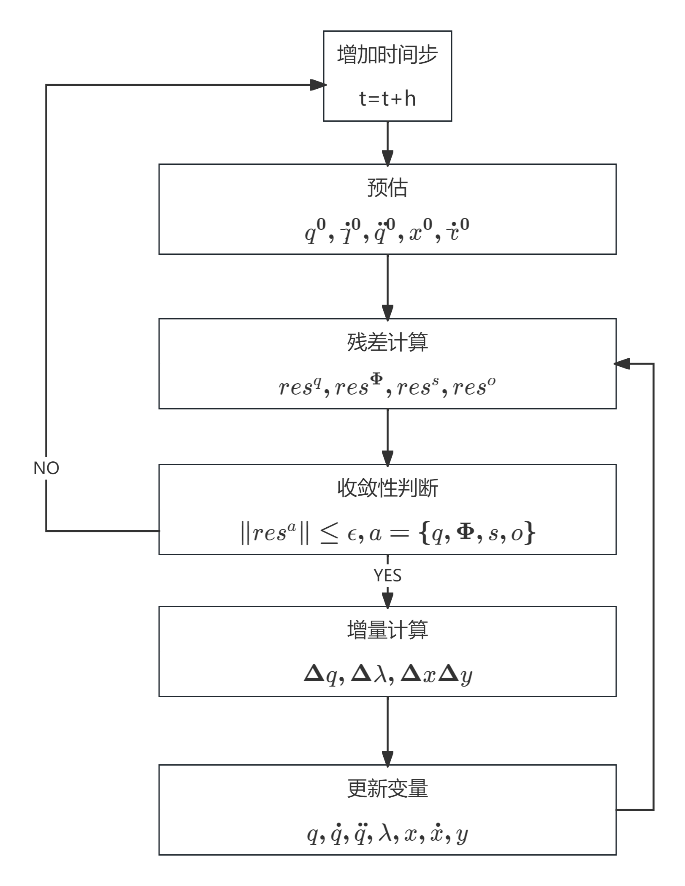

#### 程序开发过程中的一些实现考虑
1. 在迭代求解过程中，对于刚体，其广义坐标为长度为 $8$ 的向量，分别对应 $3$ 个移动分量、$4$ 个转动分量（欧拉四元数）、$1$ 个拉格朗日乘子；对于有限元柔性体，其广义坐标为长度为 $8+3N_{\mathrm{nodes}}$ 的向量，分别对应连体坐标系的 $3$ 个移动分量、$4$ 个转动分量（欧拉四元数）、$3N_{\mathrm{nodes}}$ 个变形分量、$1$ 个拉格朗日乘子；刚体与柔性体的 index 均从 $0$ 开始。

$$
\begin{aligned}
S_{t} &= \begin{bmatrix}
S_{t}^{rigid}& \\
 & S_{t}^{flexible}
\end{bmatrix} \\
&= \begin{bmatrix}
S_{t}^{rigid,1}& & & & \\
0&\ddots& & & \\
0& &S_{t}^{rigid,n_{1}}& & \\
0&\cdots& &S_{t}^{flexible,1}& & \\
0&\cdots& & &\ddots& \\
0&\cdots& & &\cdots&S_{t}^{flexible,n_{2}}
\end{bmatrix}
\end{aligned}
$$

2. 约束产生的雅可比矩阵：加在后面
### 附录

$$
\begin{aligned}
u &= \begin{Bmatrix}u_{1}\\u_{2}\\u_{3}\end{Bmatrix} \\
\tilde{u} &= \begin{bmatrix}0 & -u_{3} &u_{2}\\u_{3} & 0 & -u_{1}\\-u_{2} & u_{1} & 0\end{bmatrix} \\
\tilde{u}\tilde{u} &= \begin{bmatrix}0 & -u_{3} &u_{2}\\u_{3} & 0 & -u_{1}\\-u_{2} & u_{1} & 0\end{bmatrix}\begin{bmatrix}0 & -u_{3} &u_{2}\\u_{3} & 0 & -u_{1}\\-u_{2} & u_{1} & 0\end{bmatrix} \\
&= \begin{bmatrix}-u_{3}^{2}-u_{2}^{2}&u_{2}u_{1}&u_{3}u_{1}\\u_{1}u_{2}&-u_{3}^{2}-u_{1}^{2}&u_{2}u_{3}\\u_{1}u_{3}&u_{2}u_{3}&-u_{1}^{2}-u_{2}^{2}\end{bmatrix}
\end{aligned}
$$

$$
\begin{aligned}
\dot{\tilde{u}}\tilde{u} &= \begin{bmatrix}0 & -\dot{u}_{3} &\dot{u}_{2}\\\dot{u}_{3} & 0 & -\dot{u}_{1}\\-\dot{u}_{2} & \dot{u}_{1} & 0\end{bmatrix}\begin{bmatrix}0 & -u_{3} &u_{2}\\u_{3} & 0 & -u_{1}\\-u_{2} & u_{1} & 0\end{bmatrix} \\
&= \begin{bmatrix}-u_{3}\dot{u}_{3}-u_{2}\dot{u}_{2}&\dot{u}_{2}u_{1}&\dot{u}_{3}u_{1}\\\dot{u}_{1}u_{2}&-u_{3}\dot{u}_{3}-u_{1}\dot{u}_{1}&u_{2}\dot{u}_{3}\\\dot{u}_{1}u_{3}&\dot{u}_{2}u_{3}&-u_{1}\dot{u}_{1}-u_{2}\dot{u}_{2}\end{bmatrix}
\end{aligned}
$$

$$
\begin{aligned}
\tilde{u}\dot{\tilde{u}} &= \begin{bmatrix}0 & -u_{3} &u_{2}\\u_{3} & 0 & -u_{1}\\-u_{2} & u_{1} & 0\end{bmatrix}\begin{bmatrix}0 & -\dot{u}_{3} &\dot{u}_{2}\\\dot{u}_{3} & 0 & -\dot{u}_{1}\\-\dot{u}_{2} & \dot{u}_{1} & 0\end{bmatrix} \\
&= \begin{bmatrix}-u_{3}\dot{u}_{3}-u_{2}\dot{u}_{2}&\dot{u}_{1}u_{2}&\dot{u}_{1}u_{3}\\\dot{u}_{2}u_{1}&-u_{3}\dot{u}_{3}-u_{1}\dot{u}_{1}&u_{3}\dot{u}_{2}\\\dot{u}_{3}u_{1}&\dot{u}_{3}u_{2}&-u_{1}\dot{u}_{1}-u_{2}\dot{u}_{2}\end{bmatrix}
\end{aligned}
$$

$$
\begin{aligned}
\dot{u}{u}^{T} &= \begin{Bmatrix}\dot{u}_{1}\\\dot{u}_{2}\\\dot{u}_{3}\end{Bmatrix}\begin{bmatrix}u_{1}&u_{2}&u_{3}\end{bmatrix} \\
&= \begin{bmatrix}\dot{u}_{1}u_{1}&\dot{u}_{1}u_{2}&\dot{u}_{1}u_{3}\\\dot{u}_{2}u_{1}&\dot{u}_{2}u_{2}&\dot{u}_{2}u_{3}\\\dot{u}_{3}u_{1}&\dot{u}_{3}u_{2}&\dot{u}_{3}u_{3}\end{bmatrix}
\end{aligned}
$$

$$
\begin{aligned}
{u}\dot{u}^{T} &= \begin{Bmatrix}u_{1}\\u_{2}\\u_{3}\end{Bmatrix}\begin{bmatrix}\dot{u}_{1}&\dot{u}_{2}&\dot{u}_{3}\end{bmatrix} \\
&= \begin{bmatrix}\dot{u}_{1}u_{1}&\dot{u}_{2}u_{1}&\dot{u}_{3}u_{1}\\\dot{u}_{1}u_{2}&\dot{u}_{2}u_{2}&\dot{u}_{3}u_{2}\\\dot{u}_{1}u_{3}&\dot{u}_{2}u_{3}&\dot{u}_{3}u_{3}\end{bmatrix}
\end{aligned}
$$

$$
\begin{aligned}
\boldsymbol{\omega} &= \begin{Bmatrix}\omega_{1}\\\omega_{2}\\\omega_{3}\end{Bmatrix} \\
\tilde{u} &= \begin{bmatrix}0 & -\omega_{3} &\omega_{2}\\\omega_{3} & 0 & -\omega_{1}\\-\omega_{2} & \omega_{1} & 0\end{bmatrix}
\end{aligned}
$$

$$
\begin{aligned}
\begin{bmatrix}0 & -\omega_{3} &\omega_{2}\\\omega_{3} & 0 & -\omega_{1}\\-\omega_{2} & \omega_{1} & 0\end{bmatrix}\begin{bmatrix}J_{1} & 0 &0\\0 & J_{2} & 0\\0 & 0 & J_{3}\end{bmatrix}\begin{Bmatrix}\omega_{1}\\\omega_{2}\\\omega_{3}\end{Bmatrix} &= \begin{bmatrix}0 & -\omega_{3}J_{2} &\omega_{2}J_{3}\\J_{1}\omega_{3} & 0 & -\omega_{1}J_{3}\\-J_{1}\omega_{2} & \omega_{1}J_{2} & 0\end{bmatrix}\begin{Bmatrix}\omega_{1}\\\omega_{2}\\\omega_{3}\end{Bmatrix} \\
&= \begin{Bmatrix}\omega_{2}\omega_{3}(J_{3}-J_{2})\\\omega_{1}\omega_{3}(J_{1}-J_{3})\\\omega_{1}\omega_{2}(J_{2}-J_{1})\end{Bmatrix}
\end{aligned}
$$

$$
\begin{aligned}
\begin{Bmatrix}\Delta b\end{Bmatrix} &= \frac{\partial}{\partial\lambda_{0}}\begin{Bmatrix}b_{1}\\b_{2}\\b_{3}\\b_{4}\end{Bmatrix}\Delta\lambda_{0}+\frac{\partial}{\partial\lambda_{1}}\begin{Bmatrix}b_{1}\\b_{2}\\b_{3}\\b_{4}\end{Bmatrix}\Delta\lambda_{1}+\frac{\partial}{\partial\lambda_{2}}\begin{Bmatrix}b_{1}\\b_{2}\\b_{3}\\b_{4}\end{Bmatrix}\Delta\lambda_{2}+\frac{\partial}{\partial\lambda_{3}}\begin{Bmatrix}b_{1}\\b_{2}\\b_{3}\\b_{4}\end{Bmatrix}\Delta\lambda_{3} \\
&= \begin{bmatrix}\frac{\partial b_{1}}{\partial\lambda_{0}}&\frac{\partial b_{1}}{\partial\lambda_{1}}&\frac{\partial b_{1}}{\partial\lambda_{2}}&\frac{\partial b_{1}}{\partial\lambda_{3}}\\\frac{\partial b_{2}}{\partial\lambda_{0}}&\frac{\partial b_{2}}{\partial\lambda_{1}}&\frac{\partial b_{2}}{\partial\lambda_{2}}&\frac{\partial b_{2}}{\partial\lambda_{3}}\\\frac{\partial b_{3}}{\partial\lambda_{0}}&\frac{\partial b_{3}}{\partial\lambda_{1}}&\frac{\partial b_{3}}{\partial\lambda_{2}}&\frac{\partial b_{3}}{\partial\lambda_{3}}\\\frac{\partial b_{4}}{\partial\lambda_{0}}&\frac{\partial b_{4}}{\partial\lambda_{1}}&\frac{\partial b_{4}}{\partial\lambda_{2}}&\frac{\partial b_{4}}{\partial\lambda_{3}}\end{bmatrix}\begin{Bmatrix}\Delta\lambda_{0}\\\Delta\lambda_{1}\\\Delta\lambda_{2}\\\Delta\lambda_{3}\end{Bmatrix}
\end{aligned}
$$

$$
{\arccos(x)}^{\prime}=-\frac{1}{\sqrt{1-x^2}}
$$

数值求导公式

(1). 一阶导数的五点微分公式

$$
f^{\prime}(x_{0})=\frac{-25f(x_{0})+48f(x_{0}+h)-36f(x_{0}+2h)+16f(x_{0}+3h)-3f(x_{0}+4h)}{12h}
$$

(2). 二阶导数的五点微分公式

$$
f^{\prime\prime}(x_{0})=\frac{35f(x_{0})-104f(x_{0}+h)+114f(x_{0}+2h)-56f(x_{0}+3h)+11f(x_{0}+4h)}{12h^{2}}
$$

数值积分公式

(1). 复化Simpson积分公式

$$
\begin{aligned}
\int_{a}^{b}f(x)\,\mathrm{d}x &= \frac{h}{3}[f(a)+f(b)+2\sum_{k=1}^{m-1}f(x_{2k})+2\sum_{k=1}^{m}f(x_{2k-1})] \\
n &= 2m
\end{aligned}
$$

  

